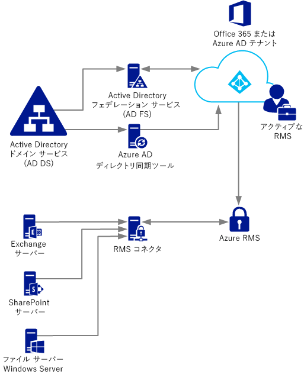
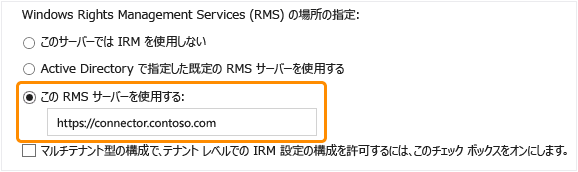

# Azure Rights Management コネクタを展開する
ここでは、Microsoft Rights Management (RMS) コネクタの詳細情報と、RMS コネクタを使用して既存のオンプレミス デプロイメントで情報を保護する方法について説明します。対象となる環境は、Microsoft Exchange Server または Microsoft SharePoint Server を使用するオンプレミス デプロイメント、また、Windows Server を実行しているファイル サーバーでファイル サーバー リソース マネージャーのファイル分類インフラストラクチャ (FCI) 機能を使用するオンプレミス デプロイメントです。

> [!TIP]
> スクリーンショットで例示される包括的なシナリオの例は、「[Azure Active Directory Rights Management の概要](../Topic/What_is_Azure_Rights_Management_.md)」トピックの[Windows Server およびファイル分類インフラストラクチャを実行しているファイル サーバー上のファイルの自動的な保護](../Topic/What_is_Azure_Rights_Management_.md#BKMK_Example_FCI)セクションをご覧ください。

## <a name="OverviewConnector"></a>Microsoft Rights Management コネクタの概要
Microsoft Rights Management (RMS) コネクタを使用すると、既存のオンプレミス サーバーで Information Rights Management (IRM) 機能とクラウドベースの Microsoft Rights Management サービス (Azure RMS) を迅速に使用できるようになります。 この機能により、IT 担当者およびユーザーは、組織の内外にあるドキュメントや画像を簡単に保護することができます。追加のインフラストラクチャをインストールしたり、他の組織との間に信頼関係を確立したりする必要はありません。 ハイブリッド シナリオでは、一部のユーザーがオンライン サービスに接続する場合も、このコネクタを使用することができます。 たとえば、ユーザーのメールボックスの中に Exchange Online を使用するものと、Exchange Server を使用するものがあるとします。 RMS コネクタをインストールすると、すべてのユーザーが Azure RMS を使用して電子メールと添付ファイルを保護し、使用できるようになります。2 つのデプロイメント構成の間で、情報はシームレスに保護されます。

RMS コネクタはコンパクトなサービスであり、Windows Server 2012 R2、Windows Server 2012、または Windows Server 2008 R2 を実行しているサーバーにオンプレミスでインストールできます。 コネクタは、物理コンピューター上だけでなく、Azure IaaS VM などの仮想マシン上でも実行できます。 コネクタをインストールして構成すると、オンプレミス サーバーとクラウド サービスとの間の通信インターフェイス (リレー) として動作します。

Azure RMS の自分のテナント キーを管理する場合 (Bring Your Own Key または BYOK シナリオ)、そのキーを使用する RMS コネクタとオンプレミス サーバーには、テナント キーを含むハードウェア セキュリティ モジュール (HSM) に対するアクセス権がありません。 これは、テナント キーを使用するすべての暗号操作は、オンプレミスではなく、Azure RMS で実行されるためです。



RMS コネクタでサポートされるオンプレミス サーバーは、Exchange Server と SharePoint Server、また、Windows Server を実行しておりファイル分類インフラストラクチャ (フォルダー内の Office ドキュメントを分類してポリシーを適用します) を使用するファイル サーバーです。 ファイル分類を使用してすべてのファイルの種類を保護する場合は、RMS コネクタを使用せずに、代わりに、[RMS 保護コマンドレット](https://msdn.microsoft.com/library/azure/mt433195.aspx)を使用してください。

> [!NOTE]
> サポートされているオンプレミス サーバーのバージョンについては、「[Azure RMS をサポートするアプリケーション](../Topic/Requirements_for_Azure_Rights_Management.md#BKMK_SupportedApplications)」の「[Azure Rights Management の要件](../Topic/Requirements_for_Azure_Rights_Management.md)」セクション内にある「Azure RMS をサポートするオンプレミス サーバー」を参照してください。

以降のセクションの手順に従って、RMS コネクタの導入を計画し、インストールおよび構成を行うことができます。 その後、インストール後の構成を完了すると、ご使用のサーバーでコネクタを使用できるようになります。

-   [RMS コネクタの前提条件](../Topic/Deploying_the_Azure_Rights_Management_Connector.md#BKMK_Prereqs)

-   **手順 1.**  [RMS コネクタのインストール](../Topic/Deploying_the_Azure_Rights_Management_Connector.md#BKMK_InstallingConnector)

-   **手順 2:**  [資格情報の入力](../Topic/Deploying_the_Azure_Rights_Management_Connector.md#EnteringCredentials)

-   **手順 3:**  [RMS コネクタを使用するサーバーの承認](../Topic/Deploying_the_Azure_Rights_Management_Connector.md#AuthorizingServers)

-   **手順 4 :**  [負荷分散と高可用性の構成](../Topic/Deploying_the_Azure_Rights_Management_Connector.md#ConfiguringConnector)

-   省略可能: [HTTPS を使用するための RMS コネクタの構成](../Topic/Deploying_the_Azure_Rights_Management_Connector.md#BKMK_ConfiguringHTTPS)

-   省略可能: [Web プロキシ サーバーを使用するための RMS コネクタの構成](../Topic/Deploying_the_Azure_Rights_Management_Connector.md#BKMK_ConfiguringWebProxy)

-   省略可能: [管理用コンピューターへの RMS コネクタ管理ツールのインストール](../Topic/Deploying_the_Azure_Rights_Management_Connector.md#BKMK_InstallingStandaloneTool)

-   **手順 5.**  [RMS コネクタを使用するためのサーバーの構成](../Topic/Deploying_the_Azure_Rights_Management_Connector.md#ConfiguringServers)

    -   [コネクタを使用するための Exchange サーバーの構成](../Topic/Deploying_the_Azure_Rights_Management_Connector.md#BKMK_ExchangeServer)

    -   [コネクタを使用するための SharePoint サーバーの構成](../Topic/Deploying_the_Azure_Rights_Management_Connector.md#BKMK_ConfiguringSharePoint)

    -   [コネクタを使用するためのファイル分類インフラストラクチャ用ファイル サーバーの構成](../Topic/Deploying_the_Azure_Rights_Management_Connector.md#BKMK_FileServer)

-   [次の手順](../Topic/Deploying_the_Azure_Rights_Management_Connector.md#BKMK_NextSteps)

## <a name="BKMK_Prereqs"></a>RMS コネクタの前提条件
RMS コネクタをインストールする前に、次の要件を満たしていることを確認してください。

|要件|詳細情報|
|------|--------|
|Rights Management (RMS) サービスがアクティブ化されている|[Rights Management をアクティブにする](../Topic/Activating_Azure_Rights_Management.md)|
|Active Directory フォレストと Azure Active Directory 間のディレクトリ同期|RMS をアクティブ化した後に、Azure Active Directory を構成して Active Directory データベース内のユーザーおよびグループを使用できるようにする必要があります。 **Important:** RMS コネクタが動作するためには、テスト ネットワークに対してもこのディレクトリ同期手順を実行する必要があります。 Office 365 および Azure Active Directory では、Azure Active Directory で手動作成したアカウントを使用できますが、このコネクタでは、Azure Active Directory のアカウントが Active Directory ドメイン サービスと同期している必要があります。手動によるパスワードの同期では不十分です。<br />詳細については、次のリソースを参照してください。<br /><br />-   [Azure AD テナントを構成する手順](http://technet.microsoft.com/library/hh967611.aspx)<br />-   [DirSync を使用して AAD とのディレクトリ同期を有効化する手順](http://technet.microsoft.com/library/hh967642.aspx)|
|省略可能ですが、推奨されます:<br /><br />-   オンプレミス Active Directory と Azure Active Directory の間でのフェデレーションの有効化|オンプレミス ディレクトリと Azure Active Directory の間で ID フェデレーションを有効にすることができます。 この構成により、RMS サービスへのシングル サインオンを使用して、よりシームレスなユーザー エクスペリエンスを提供できます。 シングル サインオンを使用できない場合、ユーザーは、権限で保護されたコンテンツを使用する前に資格情報の入力を求められます。<br /><br />Active Directory ドメイン サービスと Azure Active Directory の間で、Active Directory フェデレーション サービス (AD FS) を使用したフェデレーションを構成する手順については、Windows Server ライブラリの「[チェックリスト:AD FS を使用してシングル サインオンを実装および管理する](http://technet.microsoft.com/library/jj205462.aspx)」をご覧ください。|
|RMS コネクタをインストールする 2 台以上のメンバー コンピューター:<br /><br /><ul><li>次のいずれかのオペレーティング システムが搭載されている 64 ビットの物理または仮想コンピューター:<br /><br /><ul><li>Windows Server 2012 R2</li><li>Windows Server 2012</li><li>Windows Server 2008 R2</li></ul></li><li>1 GB 以上の RAM</li><li>64 GB 以上のディスク領域</li><li>1 つ以上のネットワーク インターフェイス</li><li>認証が不要な、ファイアウォール (または Web プロキシ) 経由のインターネット アクセス</li><li>所属するフォレストまたはドメインが、RMS コネクタを使用する Exchange または SharePoint サーバーが含まれている組織内の他のフォレストと信頼関係にある</li></ul>|フォールト トレランスと高可用性を構成するには、RMS コネクタを 2 台以上のコンピューターにインストールする必要があります。 **Tip:** Outlook Web Access、または Exchange ActiveSync IRM を使用するモバイル デバイスを使用しており、Azure RMS で保護されているメールと添付ファイルへのアクセスを維持する必要がある場合、負荷分散されたコネクタ サーバー グループをデプロイして高可用性を確保することをお勧めします。<br />専用サーバーでコネクタを実行する必要はありませんが、コネクタを使用するサーバーとは別のコンピューターにインストールする必要があります。 **Important:** Exchange Server または SharePoint Server が実行されているコンピューター、およびファイル分類インフラストラクチャ用に構成されたファイル サーバーには、コネクタをインストールしないでください。そうしないと、これらのサービスの機能を Azure RMS で使用できなくなります。 また、このコネクタをドメイン コントローラーにインストールしないでください。|

## <a name="BKMK_InstallingConnector"></a>RMS コネクタのインストール
前のセクションで前提条件を確認したら、次の手順を使用して RMS コネクタをインストールします。

1.  RMS コネクタを実行するコンピューター (2 つ以上) を決定します。 このコンピューターは、前のセクションに一覧表示された最小限の仕様を満たしている必要があります。

    > [!NOTE]
    > テナント (Office 365 テナントまたは Azure AD テナント) ごとに 1 つの RMS コネクタをインストールします (複数のサーバーにインストールして高可用性を確保します)。 Active Directory RMS とは異なり、RMS コネクタを各フォレストにインストールする必要はありません。

2.  [Microsoft ダウンロード センター](http://go.microsoft.com/fwlink/?LinkId=314106)から RMS コネクタのソース ファイルをダウンロードします。

    RMS コネクタをインストールするには、RMSConnectorSetup.exe をダウンロードしてください。

    さらに

    -   後で 32 ビット コンピューターからコネクタを構成する場合、RMSConnectorAdminToolSetup_x86.exe もダウンロードします。

    -   RMS コネクタのサーバー構成ツールを使用してオンプレミス サーバーのレジストリ設定を自動構成する場合は、GenConnectorConfig.ps1 もダウンロードします。

3.  RMS コネクタをインストールするコンピューター上で、**RMSConnectorSetup.exe** を管理者権限で実行します。

4.  [Microsoft Rights Management コネクタ セットアップ] の [ようこそ] ページで、[**Microsoft Rights Management コネクタをコンピューターにインストールする**] を選択して [**次へ**] をクリックします。

5.  RMS コネクタのライセンス条項を読んで同意したら、[**次へ**] をクリックします。

続行するには、RMS コネクタを構成するためのアカウントとパスワードを入力します。

## <a name="EnteringCredentials"></a>資格情報の入力
RMS コネクタを構成する前に、RMS コネクタを構成するのに十分な特権を持つアカウントの資格情報を入力する必要があります。

さらに、[オンボーディング コントロール](https://technet.microsoft.com/library/jj658941.aspx)を実装済みの場合は、指定するアカウントにコンテンツを保護する権限があることをご確認ください。たとえば、コンテンツの保護機能の使用を "IT 部門" グループに限り許可している場合、ここで指定するアカウントがそのグループのメンバーである必要があります。そうでない場合は、次のエラー メッセージが表示されます。**管理サービスおよび組織の場所を検出する試みが失敗しました。組織に対して Microsoft Rights Management サービスが有効になっていることをご確認ください。**

次のいずれかの特権を持つアカウントを使用できます。

-   **Office 365 テナント管理者**:Office 365 テナントのグローバル管理者であるアカウント。

-   **Azure Rights Management グローバル管理者**:Azure RMS テナントの管理者特権を持つアカウントです。

-   **Microsoft RMS コネクタ管理者**:Azure Active Directory のアカウントで、組織の RMS コネクタをインストールおよび管理する権限が付与されています。

    > [!NOTE]
    > Microsoft RMS コネクタ管理者のアカウントを使用する場合は、最初に次の手順を実行して、RMS コネクタの管理者ロールを割り当てる必要があります。
    > 
    > 1.  RMS コネクタをインストールしたコンピューターに、Rights Management 用の Windows PowerShell をダウンロードしてインストールします。 詳細については、「[Azure Rights Management 用 Windows PowerShell をインストールする](../Topic/Installing_Windows_PowerShell_for_Azure_Rights_Management.md)」を参照してください。
    > 
    >     [**管理者として実行**] コマンドで Windows PowerShell を起動し、[Connect-AadrmService](https://msdn.microsoft.com/library/azure/dn629415.aspx) コマンドを使用して Azure RMS サービスに接続します。
    > 
    >     ```
    >     Connect-AadrmService                   //provide Office 365 tenant administrator or Azure RMS global administrator credentials
    >     ```
    > 2.  次のいずれか 1 つのパラメーターを使用して、[Add-AadrmRoleBasedAdministrator](https://msdn.microsoft.com/library/azure/dn629417.aspx) コマンドを実行します。
    > 
    >     ```
    >     Add-AadrmRoleBasedAdministrator -EmailAddress <email address> -Role "ConnectorAdministrator"
    >     ```
    > 
    >     ```
    >     Add-AadrmRoleBasedAdministrator -ObjectId <object id> -Role "ConnectorAdministrator"
    >     ```
    > 
    >     ```
    >     Add-AadrmRoleBasedAdministrator -SecurityGroupDisplayName <group Name> -Role "ConnectorAdministrator"
    >     ```
    >     たとえば、次のように入力します。**Add-AadrmRoleBasedAdministrator -EmailAddress melisa@contoso.com -Role " ConnectorAdministrator "**
    > 
    >     これらのコマンドでは ConnectorAdministrator ロールを使用しますが、GlobalAdministrator ロールをここで使用することもできます。

RMS コネクタのインストール プロセスでは、すべての前提条件ソフトウェアが検証されてインストールされます。また、インターネット インフォメーション サービス (IIS) が存在しない場合はインストールされ、その後、コネクタ ソフトウェアがインストールされて構成されます。 さらに、Azure RMS の構成を準備するために以下が作成されます。

-   コネクタを使用して Azure RMS と通信することが許可されているサーバーの空テーブル。 後で、このテーブルにサーバーを追加します。

-   Azure RMS での操作を承認するコネクタ用の一連のセキュリティ トークン。 Azure RMS からダウンロードされ、ローカル コンピューター上のレジストリにインストールされます。 これらのトークンは、データ保護アプリケーション プログラム (DPAPI) およびローカル システム アカウントの資格情報を使用して保護されます。

ウィザードの最終ページで、次の操作を実行して [**完了**] をクリックします。

-   最初のコネクタをインストールした場合は、現時点で [**コネクタ管理者コンソールを起動してサーバーを承認する**] を選択しないでください。 このオプションは、2 つ目 (または最後) の RMS コネクタをインストールした後に選択します。 代わりに、少なくとも 1 つの他のコンピューターで、ウィザードをもう一度実行してください。 2 つ以上のコネクタをインストールする必要があります。

-   2 つ目 (または最後) のコネクタをインストールしたら、[**コネクタ管理者コンソールを起動してサーバーを承認する**] を選択します。

> [!TIP]
> この時点で、検証テストを実行して、RMS コネクタ用の Web サービスが機能しているかどうかを確認できます。
> 
> -   Web ブラウザーから **http://&lt;connectoraddress&gt;/_wmcs/certification/servercertification.asmx** に接続します。*&lt;connectoraddress&gt;* は、RMS コネクタがインストールされているサーバーのアドレスまたは名前に置き換えてください。 接続に成功すると、**ServerCertificationWebService** ページが表示されます。

RMS コネクタをアンインストールする必要がある場合は、ウィザードを再実行してアンインストール オプションを選択します。

## <a name="AuthorizingServers"></a>RMS コネクタを使用するサーバーの承認
2 台以上のコンピューターに RMS コネクタをインストールしたら、RMS コネクタを使用するサーバーとサービスを承認することができます。 たとえば、Exchange Server 2013 や SharePoint Server 2013 を実行しているサーバーがあるとします。

これらのサーバーを定義するには、RMS コネクタ管理ツールを実行して、許可されているサーバーの一覧にエントリを追加します。 このツールは、Microsoft Rights Management コネクタ セットアップ ウィザードの最終ページで [**コネクタ管理コンソールを起動してサーバーを承認する**] を選択して実行するか、またはウィザードとは別に実行することができます。

これらのサーバーを承認するときは、次の考慮事項に注意してください。

-   追加するサーバーには特別な特権が付与されます。 コネクタの構成で Exchange Server ロールとして指定したすべてのアカウントに、Azure RMS の[スーパー ユーザー ロール](https://technet.microsoft.com/library/mt147272.aspx)が付与されます。これにより、それらのアカウントはこの RMS テナントのすべてのコンテンツにアクセスすることができます。 スーパー ユーザー機能は、この時点で必要に応じて自動的に有効になります。 特権の昇格によるセキュリティ上のリスクを回避するため、組織の Exchange サーバーで使用されているアカウントのみを指定するように注意します。 SharePoint サーバーまたは FCI を使用するファイル サーバーとして構成されているすべてのサーバーには、通常のユーザー特権が付与されます。

-   複数のサーバーを 1 つのエントリとして追加するには、Active Directory のセキュリティ グループや配布グループ、または複数のサーバーで使用されているサービス アカウントを指定します。 この構成を使用すると、サーバーのグループは同じ RMS 証明書を共有し、グループに属するすべてのサーバーは、グループ内の各サーバーが保護しているコンテンツの所有者と見なされます。 管理オーバーヘッドを最小限に抑えるため、個々のサーバー単位ではなく、この単一グループ構成を使用して組織の Exchange サーバーまたは SharePoint サーバー ファームを承認することを推奨します。

[**コネクタの使用が許可されているサーバー**] ページで、[**追加**] をクリックします。

### <a name="BKMK_AddServer"></a>許可されたサーバーの一覧へのサーバーの追加
[**コネクタの使用をサーバーに許可**] ページで、承認するオブジェクトの名前を入力するか、または承認するオブジェクトを参照して指定します。

正しいオブジェクトを承認することが重要です。 サーバーでコネクタを使用するには、オンプレミス サービス (Exchange や SharePoint など) を実行するアカウントを選択して承認する必要があります。 たとえば、構成済みのサービス アカウントとしてサービスが実行されている場合、そのサービス アカウントの名前を一覧に追加します。 ローカル システムとしてサービスが実行されている場合は、コンピューター オブジェクトの名前 (SERVERNAME$ など) を追加します。 ベスト プラクティスとして、これらのアカウントが含まれるグループを作成し、個々のサーバー名の代わりにそのグループを指定することを推奨します。

それぞれのサーバーの役割に関する追加情報を次に示します。

-   Exchange を実行するサーバー:セキュリティ グループを指定する必要があり、既定のグループ (**Exchange サーバー**) を使用できます。このグループは Exchange によって自動的に作成され、フォレスト内のすべての Exchange サーバーが保持されています。

-   SharePoint を実行するサーバー:

    -   SharePoint 2010 サーバーが (サービス アカウントを使用しないで) ローカル システムとして実行するように構成されている場合は、Active Directory ドメイン サービスにセキュリティ グループを手動で作成し、この構成でのサーバーのコンピューター名オブジェクトを、このグループに追加します。

    -   SharePoint サーバーがサービス アカウントを使用するように構成されている場合は (SharePoint 2010 の場合は推奨される方法、SharePoint 2013 の場合は唯一のオプション)、次のようにします。

        1.  SharePoint サーバーの全体管理サービスを実行するサービス アカウントを追加して、SharePoint を管理者コンソールから構成できるようにします。

        2.  SharePoint アプリケーション プール用に構成されているアカウントを追加します。

        > [!TIP]
        > これらの 2 つのアカウントが異なる場合は、管理オーバーヘッドを最小限に抑えるために、両方のアカウントを含む単一グループを作成することを検討してください。

-   ファイル分類インフラストラクチャを使用するファイル サーバーの場合、関連するサービスはローカル システム アカウントとして実行されるため、ファイル サーバーのコンピューター アカウント (SERVERNAME$ など)、またはこれらのコンピューター アカウントを含むグループを承認する必要があります。

一覧へのサーバーの追加が完了したら、[**閉じる**] をクリックします。

次に、RMS コネクタがインストールされているサーバーの負荷分散を構成する必要があります (未構成の場合)。また、これらのサーバーと承認されたサーバーの間の接続に HTTPS を使用するかどうかを検討します。

## <a name="ConfiguringConnector"></a>負荷分散と高可用性の構成
RMS コネクタの 2 つ目または最後のインスタンスをインストールしたら、コネクタ URL のサーバー名を定義して負荷分散システムを構成します。

コネクタ URL のサーバー名には、管理している名前空間内で任意の名前を指定できます。 たとえば、DNS システムに **rmsconnector.contoso.com** のエントリを作成し、負荷分散システムの IP アドレスを使用するように構成できます。 この名前に特別な要件はありません。また、コネクタ サーバー自体での構成は不要です。 Exchange サーバーと SharePoint サーバーがインターネット経由でコネクタと通信する場合を除き、この名前はインターネット上で解決する必要はありません。

> [!IMPORTANT]
> コネクタを使用するように Exchange サーバーまたは SharePoint サーバーを構成した後は、この名前を変更しないことをお勧めします。名前を変更すると、これらのサーバーですべての IRM 構成を消去し、再構成する必要があります。

DNS で名前を作成して IP アドレスを構成したら、そのアドレスに対する負荷分散を構成し、トラフィックを複数のコネクタ サーバーに振り分けます。 このためには、Windows Server のネットワーク負荷分散 (NLB) 機能など、IP ベースの任意のロード バランサーを使用できます。 詳細については、「[負荷分散展開ガイド](http://technet.microsoft.com/library/cc754833%28v=WS.10%29.aspx)」を参照してください。

次の設定を使用して、NLB クラスターを構成します。

-   ポート:80 (HTTP) または 443 (HTTPS)

    HTTP または HTTPS のどちらを使用するかについては、次のセクションを参照してください。

-   アフィニティ:None

-   分散方法:Equal

(RMS コネクタ サービスを実行しているサーバーの) 負荷分散システム用に定義したこの名前は、組織の RMS コネクタ名です。この名前は、後で Azure RMS を使用するオンプレミス サーバーを構成するときに使用します。

## <a name="BKMK_ConfiguringHTTPS"></a>HTTPS を使用するための RMS コネクタの構成
> [!NOTE]
> この構成手順は省略可能ですが、セキュリティ強化のために推奨されます。

RMS コネクタでの TLS や SSL の使用は任意ですが、セキュリティによる保護が必要な HTTP ベースのサービスではこれらを使用することを推奨します。 この構成では、コネクタを使用する Exchange および SharePoint サーバーに対してコネクタを実行しているサーバーを認証します。 さらに、これらのサーバーからコネクタに送信されるすべてのデータは暗号化されます。

RMS コネクタで TLS の使用を有効にするには、RMS コネクタを実行する各サーバーに、コネクタで使用する名前が含まれるサーバー認証証明書をインストールします。 たとえば、DNS で定義した RMS コネクタ名が **rmsconnector.contoso.com** の場合、証明書サブジェクトの共通名に **rmsconnector.contoso.com** が含まれるサーバー認証証明書をデプロイします。 または、証明書の別名に DNS 値として **rmsconnector.contoso.com** を指定します。 証明書にサーバーの名前を含める必要はありません。 その後 IIS で、この証明書を既定の Web サイトにバインドします。

HTTPS オプションを使用する場合は、コネクタを実行するすべてのサーバーに有効なサーバー認証証明書が存在し、Exchange および SharePoint サーバーが信頼するルート CA にその証明書がチェーンされていることを確認してください。 さらに、コネクタ サーバーの証明書を発行した証明機関 (CA) が証明書失効リスト (CRL) を公開している場合、Exchange および SharePoint サーバーはこの CRL をダウンロードできる必要があります。

> [!TIP]
> 次の情報およびリソースを使用して、サーバー認証証明書を要求してインストールし、その証明書を IIS の既定の Web サイトにバインドできます。
> 
> -   Active Directory 証明書サービス (AD CS) とエンタープライズ証明機関 (CA) を使用してこれらのサーバー認証証明書を展開する場合は、Web サーバー証明書テンプレートを複製して使用することができます。 この証明書テンプレートでは、証明書のサブジェクト名で [**要求に含まれる**] オプションを使用しています。これにより、証明書を要求する際に、証明書のサブジェクト名またはサブジェクトの別名に RMS コネクタ名の FQDN を指定できます。
> -   スタンドアロン CA を使用する場合や、この証明書を別の会社から購入している場合は、TechNet の「[Web サーバー (IIS)](http://technet.microsoft.com/library/cc731977%28v=ws.10%29.aspx)」ドキュメント ライブラリにある「[インターネット サーバー証明書を構成する (IIS 7)](http://technet.microsoft.com/library/cc753433%28v=ws.10%29.aspx)」を参照してください。
> -   証明書を使用するように IIS を構成するには、TechNet の「[Web サーバー (IIS)](http://technet.microsoft.com/library/cc731692.aspx)」ドキュメント ライブラリにある「[サイトにバインドを追加する (IIS 7)](http://technet.microsoft.com/library/cc753433%28v=ws.10%29.aspx)」を参照してください。

## <a name="BKMK_ConfiguringWebProxy"></a>Web プロキシ サーバーを使用するための RMS コネクタの構成
コネクタ サーバーが配置されているネットワークがインターネットに直接接続されておらず、インターネットに発信アクセスを行うために Web プロキシ サーバーの手動構成が必要な場合、これらのサーバーのレジストリで RMS コネクタを構成する必要があります。

#### Web プロキシ サーバーを使用するように RMS コネクタを構成するには

1.  RMS コネクタが実行されている各サーバーで、レジストリ エディター (Regedit など) を開きます。

2.  **HKEY_LOCAL_MACHINE\SOFTWARE\Microsoft\AADRM\Connector** に移動します。

3.  文字列値 **ProxyAddress** を追加し、この値のデータを **http://&lt;MyProxyDomainOrIPaddress&gt;:&lt;MyProxyPort&gt;** に設定します。

    例: **http://proxyserver.contoso.com:8080**

4.  レジストリ エディターを閉じて、サーバーを再起動するか、または IISReset コマンドを実行して IIS を再起動します。

## <a name="BKMK_InstallingStandaloneTool"></a>管理用コンピューターへの RMS コネクタ管理ツールのインストール
RMS コネクタがインストールされていないコンピューターで RMS コネクタ管理ツールを実行するには、次の要件を満たす必要があります。

-   次のいずれかの OS を搭載している物理または仮想コンピューター: Windows Server 2012 または Windows Server 2012 R2 (すべてのエディション)、Windows Server 2008 R2 または Windows Server 2008 R2 Service Pack 1 (すべてのエディション)、Windows 8.1、Windows 8、または Windows 7。

-   1 GB 以上の RAM。

-   64 GB 以上のディスク領域。

-   1 つ以上のネットワーク インターフェイス。

-   ファイアウォール (または Web プロキシ) 経由でのインターネット アクセス。

RMS コネクタ管理ツールをインストールするには、次のファイルを実行します。

-   32 ビット コンピューターの場合:RMSConnectorAdminToolSetup_x86.exe

-   64 ビット コンピューターの場合:RMSConnectorSetup.exe

これらのファイルをまだダウンロードしていない場合は、[Microsoft ダウンロード センター](http://go.microsoft.com/fwlink/?LinkId=314106)から入手できます。

## <a name="ConfiguringServers"></a>RMS コネクタを使用するためのサーバーの構成
RMS コネクタのインストールと構成が完了したら、Rights Management を使用し、コネクタを使って Azure RMS に接続するオンプレミス サーバーを構成することができます。 つまり、次のサーバーを構成します。

-   Exchange 2013 の場合:クライアント アクセス サーバーおよびメールボックス サーバー

-   Exchange 2010 の場合:クライアント アクセス サーバーおよびハブ トランスポート サーバー

-   SharePoint の場合:フロントエンド SharePoint Web サーバー (全体管理サーバーをホストするサーバーを含みます)

-   ファイル分類インフラストラクチャの場合:ファイル リソース マネージャーをインストールした Windows Server コンピューター

この構成にはレジストリの設定が必要です。 これには 2 つの方法があります。

|構成オプション|長所|短所|
|-----------|------|------|
|Microsoft RMS コネクタ用のサーバー構成ツールを使用した自動構成|レジストリを直接編集する必要はありません。 スクリプトを使用して自動構成されます。<br /><br />Windows PowerShell コマンドレットを実行して Microsoft RMS の URL を取得する必要はありません。<br /><br />ツールをローカルで実行すると、必須コンポーネントが自動的に確認されます (ただし、自動修復されることはありません)。|ツールを実行する際は、RMS コネクタが既に実行されているサーバーに接続する必要があります。|
|レジストリの編集による手動構成|RMS コネクタが実行されているサーバーに接続する必要はありません。|管理オーバーヘッドが増大し、間違いが発生しやすくなります。<br /><br />Microsoft RMS の URL を取得する必要があります。このために Windows PowerShell コマンドを実行する必要があります。<br /><br />すべての必須コンポーネントを常にユーザー自身で確認する必要があります。|
> [!IMPORTANT]
> いずれの場合でも、前提条件を手動でインストールし、Rights Management を使用するように Exchange、SharePoint、およびファイル分類インフラストラクチャを構成する必要があります。

ほとんどの場合、Microsoft RMS コネクタ用のサーバー構成ツールを使用した自動構成が推奨されます。手動構成よりも効率良く確実に構成できるためです。

Exchange または SharePoint を実行しており、AD RMS を使用するように構成済みの場合、これらのサーバーの構成を変更した後に再起動する必要があります。 Rights Management 用に初めて構成する場合は、サーバーを再起動する必要はありません。 ファイル分類インフラストラクチャを使用するようにファイル サーバーを構成している場合、構成の変更後に、必ず再起動する必要があります。

#### Microsoft RMS コネクタ用のサーバー構成ツールの使用方法

1.  Microsoft RMS コネクタ用のサーバー構成ツールのスクリプト (GenConnectorConfig.ps1) をまだダウンロードしていない場合は、[Microsoft ダウンロード センター](http://go.microsoft.com/fwlink/?LinkId=314106)からダウンロードできます。

2.  ツールを実行するコンピューターに GenConnectorConfig.ps1 ファイルを保存します。 ツールをローカルで実行する場合、これは RMS コネクタと通信するように構成したサーバーである必要があります。 そうでない場合は、任意のコンピューターに保存できます。

3.  ツールの実行方法を決定します。

    -   **ローカル**:ツールは、RMS コネクタと通信するように構成されたサーバーから対話的に実行できます。 この方法は、テスト環境のような 1 回限りの構成に便利です。

    -   **ソフトウェア展開**:ツールを実行して生成したレジストリ ファイルを、ソフトウェア展開をサポートするシステム管理アプリケーション (System Center Configuration Manager など) を使用して、関連する 1 つ以上のサーバーに展開できます。

    -   **グループ ポリシー**:ツールを実行して生成したスクリプトを、構成対象のサーバーにグループ ポリシー オブジェクトを作成できる管理者に渡します。 このスクリプトを実行すると、構成対象の各サーバー タイプに 1 つのグループ ポリシー オブジェクトが作成されます。その後、管理者は関連するサーバーにそのグループ ポリシーを割り当てることができます。

    > [!NOTE]
    > このツールを使用して、このセクションの最初に記載されている、RMS コネクタと通信するサーバーを構成します。 このツールは、RMS コネクタを実行するサーバーで実行しないでください。

4.  [**管理者として実行**] オプションを使用して Windows PowerShell を起動し、Get-help コマンドを使用して、選択した構成方法でのツールの使用方法を確認します。

    ```
    Get-help .\GenConnectorConfig.ps1 -detailed
    ```

スクリプトを実行するには、組織の RMS コネクタの URL を入力する必要があります。 プロトコルのプレフィックス (HTTP:// または HTTPS://) に続いて、コネクタの負荷分散アドレス用に DNS で定義したコネクタ名を入力してください。 たとえば、https://connector.contoso.com のように入力します。 ツールは、この URL を使用して RMS コネクタが実行されているサーバーに接続し、必要な構成を作成するために使用されるその他のパラメーターを取得します。

> [!IMPORTANT]
> このツールを実行する場合、RMS コネクタ サービスを実行する単一のサーバー名ではなく、組織の負荷分散された RMS コネクタ名を指定する必要があります。

各サービス タイプに固有の情報については、次のセクションを参照してください。

-   [コネクタを使用するための Exchange サーバーの構成](../Topic/Deploying_the_Azure_Rights_Management_Connector.md#BKMK_ExchangeServer)

-   [コネクタを使用するための SharePoint サーバーの構成](../Topic/Deploying_the_Azure_Rights_Management_Connector.md#BKMK_ConfiguringSharePoint)

-   [コネクタを使用するためのファイル分類インフラストラクチャ用ファイル サーバーの構成](../Topic/Deploying_the_Azure_Rights_Management_Connector.md#BKMK_FileServer)

> [!NOTE]
> コネクタを使用するようにサーバーを構成すると、そのサーバーのローカルにインストールされたクライアント アプリケーションで RMS が動作しない場合があります。 この問題が発生するのは、アプリケーションが RMS を直接使用せずにコネクタを使用しようとする (これはサポートされていません) ことが原因です。
> 
> また、Exchange サーバーのローカルに Office 2010 がインストールされている場合、コネクタを使用するようにサーバーを構成すると、そのコンピューターからクライアント アプリケーションの IRM 機能が動作する場合がありますが、これはサポートされていません。
> 
> いずれの場合も、コネクタを使用するように構成されていない別のコンピューターにクライアント アプリケーションをインストールする必要があります。 そうすれば、クライアント アプリケーションで RMS が直接使用されるようになります。

### <a name="BKMK_ExchangeServer"></a>コネクタを使用するための Exchange サーバーの構成
次の Exchange ロールは RMS コネクタと通信します。

-   Exchange 2013 の場合:クライアント アクセス サーバーおよびメールボックス サーバー

-   Exchange 2010 の場合:クライアント アクセス サーバーおよびハブ トランスポート サーバー

RMS コネクタを使用するには、サーバーで実行されている Exchange が、次のいずれかのソフトウェア バージョンである必要があります。

-   Exchange 2013 累積更新プログラム 3 を適用した Exchange Server 2013

-   Exchange 2010 Service Pack 3 ロールアップ更新プログラム 6 を適用した Exchange Server 2010

さらに、RMS 暗号化モード 2 のサポートが含まれる RMS クライアントのバージョンをサーバーにインストールする必要があります。 Windows Server 2008 でサポートされている最小バージョンは修正プログラムに含まれており、「[Windows Server 2008 R2 および Windows Server 2008 の AD RMS では、RSA キーの長さが 2048 ビットに増加しました](http://support.microsoft.com/kb/2627272)」からダウンロードできます。 Windows Server 2008 R2 用の最小バージョンは、「[Windows 7 または Windows Server 2008 R2 の AD RMS では、RSA キーの長さが 2048 ビットに増加しました](http://support.microsoft.com/kb/2627273)」からダウンロードできます。 Windows Server 2012 と Windows Server 2012 R2 は、暗号化モード 2 をネイティブでサポートしています。

> [!IMPORTANT]
> これらのバージョン、またはより新しいバージョンの Exchange および RMS クライアントがインストールされていない場合、コネクタを使用するように Exchange を構成することはできません。 続行する前に、これらのバージョンがインストールされていることを確認してください。

##### コネクタを使用するように Exchange サーバーを構成するには

1.  RMS コネクタと通信する Exchange サーバー ロールで、次のいずれかを実行します。

    -   Microsoft RMS コネクタのサーバー構成ツールを実行します。 詳細については、このトピックの「[Microsoft RMS コネクタ用のサーバー構成ツールの使用方法](../Topic/Deploying_the_Azure_Rights_Management_Connector.md#BKMK_HowToRunTheTool)」を参照してください。

        たとえば、ツールをローカルで実行し、Exchange 2013 を実行しているサーバーを構成します。

        ```
        .\GenConnectorConfig.ps1 -ConnectorUri https://rmsconnector.contoso.com -SetExchange2013
        ```

    -   次のセクションにある表を使用してレジストリを手動で編集し、サーバーにレジストリ設定を追加します。

2.  Exchange の IRM 機能を有効化します。 詳細については、Exchange ライブラリの「[Information Rights Management の手順](https://technet.microsoft.com/library/dd351212%28v=exchg.150%29.aspx)」を参照してください。

次のセクションの表は、サーバーのレジストリ設定を手動で追加または確認し、RMS コネクタを使用するようにサーバーを構成する場合にのみ使用してください。 これらの表を使用する手順を次に示します。

-   *MicrosoftRMSURL* は、組織の Microsoft RMS サービスの URL です。 この値を見つけるには、次の操作を実行します。

    1.  Azure RMS 用の [Get-AadrmConfiguration](http://msdn.microsoft.com/library/windowsazure/dn629410.aspx) コマンドレットを実行します。 Azure RMS 用の Windows PowerShell モジュールをまだインストールしていない場合は、「[Azure Rights Management 用 Windows PowerShell をインストールする](../Topic/Installing_Windows_PowerShell_for_Azure_Rights_Management.md)」を参照してください。

    2.  出力から、**LicensingIntranetDistributionPointUrl** の値を確認します。

        例:**LicensingIntranetDistributionPointUrl   : https://5c6bb73b-1038-4eec-863d-49bded473437.rms.na.aadrm.com/_wmcs/licensing**

    3.  この値から、**/_wmcs/licensing** 文字列を削除します。 残りの文字列が Microsoft RMS の URL です。 この例では、Microsoft RMS の URL は次の値になります。

        **https://5c6bb73b-1038-4eec-863d-49bded473437.rms.na.aadrm.com**

-   *ConnectorFQDN* は、DNS で定義したコネクタの負荷分散名です。 例: **rmsconnector.contoso.com**。

-   オンプレミス サーバーとの通信に HTTPS を使用するようにコネクタを構成している場合は、コネクタの URL に HTTPS プレフィックスを使用してください。 詳細については、このトピックの「[HTTPS を使用するための RMS コネクタの構成](../Topic/Deploying_the_Azure_Rights_Management_Connector.md#BKMK_ConfiguringHTTPS)」セクションを参照してください。 Microsoft RMS の URL では常に HTTPS が使用されます。

#### Exchange 2013 のレジストリ設定の表

|レジストリ パス|型|値|データ|
|------------|-----|-----|-------|
|HKEY_LOCAL_MACHINE\Software\Microsoft\MSDRM\ServiceLocation\Activation|Reg_SZ|既定|https://*MicrosoftRMSURL/_wmcs/certification*|
|HKEY_LOCAL_MACHINE\Software\Microsoft\MSDRM\ServiceLocation\EnterprisePublishing|Reg_SZ|既定|https://MicrosoftRMSURL/_wmcs/Licensing|
|HKEY_LOCAL_MACHINE\SOFTWARE\Microsoft\ExchangeServer\v15\IRM\CertificationServerRedirection|Reg_SZ|https://*MicrosoftRMSURL*|Exchange サーバーから RMS コネクタへの通信で HTTP または HTTPS のどちらを使用しているかによって、次のいずれかの形式を使用します。<br /><br />-   http://*ConnectorFQDN*<br />-   https://*ConnectorFQDN*|
|HKEY_LOCAL_MACHINE\SOFTWARE\Microsoft\ExchangeServer\v15\IRM\LicenseServerRedirection|Reg_SZ|https://*MicrosoftRMSURL*|Exchange サーバーから RMS コネクタへの通信で HTTP または HTTPS のどちらを使用しているかによって、次のいずれかの形式を使用します。<br /><br />-   http://*ConnectorFQDN*<br />-   https://*ConnectorFQDN*|

#### Exchange 2010 のレジストリ設定の表

|レジストリ パス|型|値|データ|
|------------|-----|-----|-------|
|HKEY_LOCAL_MACHINE\Software\Microsoft\MSDRM\ServiceLocation\Activation|Reg_SZ|既定|https://*MicrosoftRMSURL*/_wmcs/certification|
|HKEY_LOCAL_MACHINE\Software\Microsoft\MSDRM\ServiceLocation\EnterprisePublishing|Reg_SZ|既定|https://*MicrosoftRMSURL*/_wmcs/Licensing|
|HKEY_LOCAL_MACHINE\SOFTWARE\Microsoft\ExchangeServer\v14\IRM\CertificationServerRedirection|Reg_SZ|https://*MicrosoftRMSURL*|Exchange サーバーから RMS コネクタへの通信で HTTP または HTTPS のどちらを使用しているかによって、次のいずれかの形式を使用します。<br /><br />-   http://*ConnectorFQDN*<br />-   https://*ConnectorFQDN*|
|HKEY_LOCAL_MACHINE\SOFTWARE\Microsoft\ExchangeServer\v14\IRM\LicenseServerRedirection|Reg_SZ|https://*MicrosoftRMSURL*|Exchange サーバーから RMS コネクタへの通信で HTTP または HTTPS のどちらを使用しているかによって、次のいずれかの形式を使用します。<br /><br />-   http://*ConnectorFQDN*<br />-   https://*ConnectorFQDN*|

### <a name="BKMK_ConfiguringSharePoint"></a>コネクタを使用するための SharePoint サーバーの構成
次の SharePoint ロールは RMS コネクタと通信します。

-   フロントエンド SharePoint Web サーバー (全体管理サーバーをホストするサーバーを含みます)

RMS コネクタを使用するには、サーバーで実行されている SharePoint が、次のいずれかのソフトウェア バージョンである必要があります。

-   SharePoint Server 2013

-   SharePoint Server 2010

また、SharePoint 2013 サーバーでは、MSIPC クライアント 2.1 のバージョン 1.0.622.34 ～ 1.0.10907.0 が実行されている必要があります。

> [!WARNING]
> MSIPC 2.1 クライアントには複数のバージョンがあるので、この記事で参照されているバージョンを必ずインストールしてください。
> 
> クライアントのバージョンは、MSIPC.dll のバージョン番号を調べることで確認できます。このファイルは **\Program Files\Active Directory Rights Management Services Client 2.1** にあります。 プロパティ ダイアログ ボックスに、MSIPC 2.1 クライアントのバージョン番号が表示されます。

SharePoint 2010 が実行されているサーバーには、RMS 暗号化モード 2 のサポートが含まれる MSDRM クライアントのバージョンがインストールされている必要があります。 Windows Server 2008 でサポートされている最小バージョンは修正プログラムに含まれており、「[Windows Server 2008 R2 および Windows Server 2008 の AD RMS では、RSA キーの長さが 2048 ビットに増加しました](http://support.microsoft.com/kb/2627272)」からダウンロードできます。Windows Server 2008 R2 用の最小バージョンは、「[Windows 7 または Windows Server 2008 R2 の AD RMS では、RSA キーの長さが 2048 ビットに増加しました](http://support.microsoft.com/kb/2627273)」からダウンロードできます。 Windows Server 2012 と Windows Server 2012 R2 は、暗号化モード 2 をネイティブでサポートしています。

##### コネクタを使用するように SharePoint サーバーを構成するには

1.  RMS コネクタと通信する SharePoint サーバーで、次のいずれかを実行します。

    -   Microsoft RMS コネクタのサーバー構成ツールを実行します。 詳細については、このトピックの「[Microsoft RMS コネクタ用のサーバー構成ツールの使用方法](../Topic/Deploying_the_Azure_Rights_Management_Connector.md#BKMK_HowToRunTheTool)」を参照してください。

        たとえば、ツールをローカルで実行し、SharePoint 2013 を実行しているサーバーを構成します。

        ```
        .\GenConnectorConfig.ps1 -ConnectorUri https://rmsconnector.contoso.com -SetSharePoint2013
        ```

    -   SharePoint 2013 を使用している場合は、次のセクションにある表を使用してレジストリを手動で編集し、サーバーにレジストリ設定を追加します。

2.  SharePoint で IRM を有効にします。 詳細については、SharePoint ライブラリの「[Information Rights Management を構成する (SharePoint Server 2010)](https://technet.microsoft.com/library/hh545607%28v=office.14%29.aspx)」をご覧ください。

    これらの手順に従う場合は、コネクタを使用するように SharePoint を構成する際に [**この RMS サーバーを使用する**] を指定し、構成した負荷分散コネクタ URL を入力する必要があります。 プロトコルのプレフィックス (HTTP:// または HTTPS://) に続いて、コネクタの負荷分散アドレス用に DNS で定義したコネクタ名を入力してください。 たとえば、コネクタの名前が https://connector.contoso.com である場合、構成は次の図のようになります。

    

    SharePoint ファームで IRM が有効になったら、各ライブラリの [**ライブラリの設定**] ページにある [**Information Rights Management**] オプションを使用して、個々のライブラリで IRM を有効にできます。

    > [!IMPORTANT]
    > SharePoint でコネクタを使用して RMS にアクセスするには、対応するアカウントを RMS コネクタ管理ツールで承認する必要があります。 この手順をまだ完了していない場合は、このトピックの「[RMS コネクタを使用するサーバーの承認](../Topic/Deploying_the_Azure_Rights_Management_Connector.md#AuthorizingServers)」を参照してください。

次のセクションの表は、SharePoint 2013 を実行するサーバーのレジストリ設定を手動で追加または確認する場合にのみ使用してください。

#### SharePoint 2013 のレジストリ設定の表
この表を使用する手順は次のとおりです。

-   *MicrosoftRMSURL* は、組織の Microsoft RMS サービスの URL です。 この値を見つけるには、次の操作を実行します。

    1.  Azure RMS 用の [Get-AadrmConfiguration](http://msdn.microsoft.com/library/windowsazure/dn629410.aspx) コマンドレットを実行します。 Azure RMS 用の Windows PowerShell モジュールをまだインストールしていない場合は、「[Azure Rights Management 用 Windows PowerShell をインストールする](../Topic/Installing_Windows_PowerShell_for_Azure_Rights_Management.md)」を参照してください。

    2.  出力から、**LicensingIntranetDistributionPointUrl** の値を確認します。

        例:**LicensingIntranetDistributionPointUrl   : https://5c6bb73b-1038-4eec-863d-49bded473437.rms.na.aadrm.com/_wmcs/licensing**

    3.  この値から、**/_wmcs/licensing** 文字列を削除します。 残りの文字列が Microsoft RMS の URL です。 この例では、Microsoft RMS の URL は次の値になります。

        **https://5c6bb73b-1038-4eec-863d-49bded473437.rms.na.aadrm.com**

-   *ConnectorFQDN* は、DNS で定義したコネクタの負荷分散名です。 例: **rmsconnector.contoso.com**。

-   オンプレミス サーバーとの通信に HTTPS を使用するようにコネクタを構成している場合は、コネクタの URL に HTTPS プレフィックスを使用してください。 詳細については、このトピックの「[HTTPS を使用するための RMS コネクタの構成](../Topic/Deploying_the_Azure_Rights_Management_Connector.md#BKMK_ConfiguringHTTPS)」セクションを参照してください。 Microsoft RMS の URL では常に HTTPS が使用されます。

|レジストリ パス|型|値|データ|
|------------|-----|-----|-------|
|HKEY_LOCAL_MACHINE\SOFTWARE\Microsoft\MSIPC\ServiceLocation\LicensingRedirection|Reg_SZ|https://*MicrosoftRMSURL*/_wmcs/licensing|SharePoint サーバーから RMS コネクタへの通信で HTTP または HTTPS のどちらを使用しているかによって、次のいずれかの形式を使用します。<br /><br />-   http://*ConnectorFQDN*/_wmcs/licensing<br />-   https://*ConnectorFQDN*/_wmcs/licensing|
|HKEY_LOCAL_MACHINE\SOFTWARE\Microsoft\MSIPC\ServiceLocation\EnterpriseCertification|Reg_SZ|既定|SharePoint サーバーから RMS コネクタへの通信で HTTP または HTTPS のどちらを使用しているかによって、次のいずれかの形式を使用します。<br /><br />-   http://*ConnectorFQDN*/_wmcs/certification<br />-   https://*ConnectorFQDN*/_wmcs/certification|
|HKEY_LOCAL_MACHINE\SOFTWARE\Microsoft\MSIPC\ServiceLocation\EnterprisePublishing|Reg_SZ|既定|SharePoint サーバーから RMS コネクタへの通信で HTTP または HTTPS のどちらを使用しているかによって、次のいずれかの形式を使用します。<br /><br />-   http://*ConnectorFQDN*/_wmcs/licensing<br />-   https://*ConnectorFQDN*/_wmcs/licensing|

### <a name="BKMK_FileServer"></a>コネクタを使用するためのファイル分類インフラストラクチャ用ファイル サーバーの構成
RMS コネクタとファイル分類インフラストラクチャを使用して Office ドキュメントを保護する場合は、ファイル サーバーで次のいずれかのオペレーティング システムが実行されている必要があります。

-   Windows Server 2012 R2

-   Windows Server 2012

##### コネクタを使用するようにファイル サーバーを構成するには

1.  ファイル分類インフラストラクチャ用に構成され、RMS コネクタと通信するファイル サーバーで、次のいずれかを実行します。

    -   Microsoft RMS コネクタのサーバー構成ツールを実行します。 詳細については、このトピックの「[Microsoft RMS コネクタ用のサーバー構成ツールの使用方法](../Topic/Deploying_the_Azure_Rights_Management_Connector.md#BKMK_HowToRunTheTool)」を参照してください。

        たとえば、ツールをローカルで実行し、FCI を実行しているファイル サーバーを構成します。

        ```
        .\GenConnectorConfig.ps1 -ConnectorUri https://rmsconnector.contoso.com -SetFCI2012
        ```

    -   次のセクションにある表を使用してレジストリを手動で編集し、サーバーにレジストリ設定を追加します。

2.  RMS Encryption を使用してドキュメントを保護する分類ロールとファイル管理タスクを作成し、自動的に RMS ポリシーを適用するように RMS テンプレートを指定します。 詳細については、Windows Server ドキュメント ライブラリの「[ファイル サーバー リソース マネージャーの概要](http://technet.microsoft.com/library/hh831701.aspx)」を参照してください。

次のセクションの表は、ドキュメントを保護するために、ファイル分類インフラストラクチャを使用するファイル サーバーのレジストリ設定を手動で追加または確認する場合にのみ使用してください。

#### ファイル サーバーとファイル分類インフラストラクチャのレジストリ設定の表
この表を使用する手順は次のとおりです。

-   *ConnectorFQDN* は、DNS で定義したコネクタの負荷分散名です。 例: **rmsconnector.contoso.com**。

-   オンプレミス サーバーとの通信に HTTPS を使用するようにコネクタを構成している場合は、コネクタの URL に HTTPS プレフィックスを使用してください。 詳細については、このトピックの「[HTTPS を使用するための RMS コネクタの構成](../Topic/Deploying_the_Azure_Rights_Management_Connector.md#BKMK_ConfiguringHTTPS)」セクションを参照してください。 Microsoft RMS の URL では常に HTTPS が使用されます。

|レジストリ パス|型|値|データ|
|------------|-----|-----|-------|
|HKEY_LOCAL_MACHINE\SOFTWARE\Microsoft\MSDRM\ServiceLocation\EnterprisePublishing|Reg_SZ|既定|http://*ConnectorFQDN*/_wmcs/licensing|
|HKEY_LOCAL_MACHINE\SOFTWARE\Microsoft\MSDRM\ServiceLocation\Activation|Reg_SZ|既定|http://*ConnectorFQDN*/_wmcs/certification|

## <a name="BKMK_NextSteps"></a>次のステップ
RMS コネクタのインストールと構成が完了し、RMS コネクタを使用するようにサーバーが構成されました。IT 管理者とユーザーは、Azure RMS を使用して電子メール メッセージとドキュメントを保護し、使用することができます。 ユーザーがこの処理を実行しやすいように、RMS 共有アプリケーションをデプロイします。これによって、Office 用のアドオンがインストールされ、ファイル エクスプローラーに新しい右クリック オプションが追加されます。 詳細については、「[Rights Management 共有アプリケーション管理者ガイド](http://technet.microsoft.com/library/%20dn339003%28v=ws.10%29.aspx)」を参照してください。

また、RMS コネクタの監視や組織での Azure RMS 使用状況の監視を行うために、次の機能を使用することを検討してください。

-   組み込みの **Microsoft Rights Management コネクタ** パフォーマンス カウンター

-   [RMS Analyzer ツール](https://www.microsoft.com/en-us/download/details.aspx?id=46437)。RMS コネクタ オプションを使用し、コネクタの正常性を監視し、構成問題を特定します。

-   [Azure Rights Management の利用状況をログに記録して分析する](../Topic/Logging_and_Analyzing_Azure_Rights_Management_Usage.md)

[Azure Rights Management の展開ロードマップ](../Topic/Azure_Rights_Management_Deployment_Roadmap.md)を参照して、[!INCLUDE[aad_rightsmanagement_1](../Token/aad_rightsmanagement_1_md.md)] をユーザーと管理者にロールアウトする前に他の構成手順を実行する必要があるかどうかを確認することができます。 他の構成手順を実行する必要がない場合は、「[Azure Rights Management を使用する](../Topic/Using_Azure_Rights_Management.md)」で運用ガイダンスを参照し、組織での展開を正常に完了するのに役立ててください。

## 参照
[Azure Rights Management を構成する](../Topic/Configuring_Azure_Rights_Management.md)

