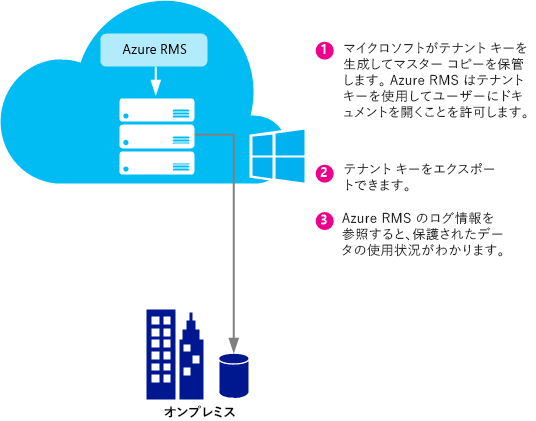
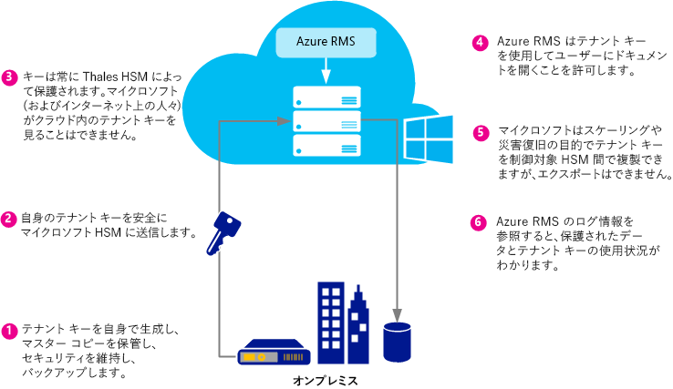
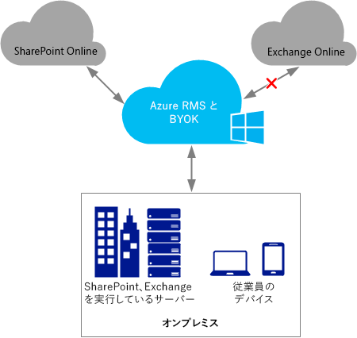

# Azure Rights Management テナント キーを計画して実装する
このトピックの情報は、Azure RMS での Rights Management サービス (RMS) テナント キーに関する計画作成および管理に役立ちます。 たとえば、マイクロソフトがテナント キーを管理する (既定値) のではなく、組織に該当する特定の規制に準拠するために、ユーザーが自分でテナント キーを管理する必要がある場合があります。  ユーザーでのテナント キーの管理は、Bring Your Own Key (BYOK) とも呼ばれます。

> [!NOTE]
> RMS テナント キーはサーバー ライセンサー証明書 (SLC) キーとも呼ばれます。 Azure RMS では、Azure RMS をサブスクライブする組織ごとに 1 つ以上のキーが保持されます。 組織で RMS に対して使用されるキー (ユーザー キー、コンピューター キー、ドキュメント暗号化キーなど) は、すべて暗号化されて RMS テナント キーにチェーンされます。

**概要:** 次の表は、推奨されるテナント キー トポロジのクイック ガイドとしてご使用ください。 詳細については、別のセクションで説明します。

マイクロソフト管理のテナント キーを使用して Azure RMS をデプロイする場合、後で BYOK に変更することができます。 ただし現時点では、Azure RMS テナント キーを BYOK からマイクロソフト管理に変更することはできません。

|ビジネスの要件|推奨テナント キー トポロジ|
|-----------|------------------|
|特殊なハードウェアを必要としない Azure RMS を短時間でデプロイする場合|マイクロソフト管理|
|Azure RMS を使用して、Exchange Online で完全な IRM 機能が必要な場合|マイクロソフト管理|
|キーはユーザーによって作成され、ハードウェア セキュリティ モジュール (HSM) で保護されます|BYOK<br /><br />現時点では、この構成を使用すると Exchange Online での IRM 機能には制限があります。 詳細については、「[BYOK の料金と制限事項](../Topic/Planning_and_Implementing_Your_Azure_Rights_Management_Tenant_Key.md#BKMK_Pricing)」セクションを参照してください。|
次のセクションでは、使用するテナント キー トポロジの選択、テナント キーのライフサイクルの理解、BYOK (Bring Your Own Key) の実装方法、およびその後の手順について説明します。

-   [テナント キー トポロジを選択する:Microsoft による管理 (既定) または自主管理 (BYOK)](../Topic/Planning_and_Implementing_Your_Azure_Rights_Management_Tenant_Key.md#BKMK_ChooseTenantKey)

-   [BYOK の料金と制限事項](../Topic/Planning_and_Implementing_Your_Azure_Rights_Management_Tenant_Key.md#BKMK_Pricing)

-   [BYOK (Bring Your Own Key) の実装](../Topic/Planning_and_Implementing_Your_Azure_Rights_Management_Tenant_Key.md#BKMK_ImplementBYOK)

-   [次の手順](../Topic/Planning_and_Implementing_Your_Azure_Rights_Management_Tenant_Key.md#BKMK_NextSteps)

## <a name="BKMK_ChooseTenantKey"></a>テナント キー トポロジを選択する:Microsoft による管理 (既定) または自主管理 (BYOK)
組織に最適なテナント キー トポロジを決定します。 既定では、Azure RMS でテナント キーが生成され、テナント キー ライフサイクルのほとんどの側面が管理されます。 これは、管理オーバーヘッドが最も少なくて済むシンプルな方法です。 多くの場合、テナント キーの存在を意識することすらありません。 Azure RMS にサインアップすれば、それ以外のキー管理プロセスは Microsoft によって処理されます。

または、独自のテナント キーを作成してオンプレミスでマスター コピーを保持するなど、テナント キーを完全に制御する必要がある場合があります。 多くの場合、このシナリオは BYOK (Bring Your Own Key) と呼ばれます。 この方法では、次の状況が発生します。

1.  社内で IT ポリシーに沿ってテナント キーを作成します。

2.  そのテナント キーを社内のハードウェア セキュリティ モジュール (HSM) から Microsoft が所有し管理する HSM にセキュリティで保護した状態で転送します。 このプロセス全体で、テナント キーがハードウェア保護境界の外に置かれることはありません。

3.  テナント キーを Microsoft に転送するときは、Thales HSM により常時保護されます。 Microsoft は Thales と連携してテナント キーが Microsoft の HSM から抽出できないようにしています。

オプションとして、テナント キーの使用状況と使用時期を正確に把握するために Azure RMS のほぼリアルタイムの使用状況ログを使用することもできます。

> [!NOTE]
> 追加の保護措置として、Azure RMS では北米、EMEA (欧州、中東、およびアフリカ)、およびアジアのデータ センターで独立したセキュリティ ワールドを使用しています。 テナント キーを自主管理する場合、キーは、RMS テナントが登録されている地域のセキュリティ ワールドに関連付けられています。 たとえば、欧州のお客様のテナント キーを北米やアジアのデータセンターで使用することはできません。

## <a name="BKMK_OverviewLifecycle"></a>テナント キーのライフサイクル
Microsoft でテナント キーを管理することになった場合、キー ライフサイクル操作の大半を Microsoft で行います。 ただし、テナント キーを自主管理することになった場合、キー ライフサイクル操作の多くといくつかの追加の手順を自社で行う必要があります。

この 2 つの方法の概要と比較を次の図に示します。 最初の図から、Microsoft がテナント キーを管理するという既定構成では管理者のオーバーヘッドが非常に少ないことがわかります。



2 番目の図では、テナント キーを自主管理する場合に必要な追加の手順を示しています。



テナント キーを Microsoft で管理する場合、キーの生成に関する操作は不要です。以下のセクションをスキップして「[次の手順](../Topic/Planning_and_Implementing_Your_Azure_Rights_Management_Tenant_Key.md#BKMK_NextSteps)」に進むことができます。

テナント キーを自主管理する場合、詳細については以下のセクションを参照してください。

### Thales HSM と Microsoft の追加手順に関する詳細
Azure RMS では Thales HSM を使用してキーを保護します。

Thales e-Security は、金融サービス、ハイテク、製造業、政府、テクノロジ分野にデータ暗号化とサイバー セキュリティ ソリューションを提供する世界的リーダーです。 Thales のソリューションは 40 年にわたって企業や政府の情報を保護してきた実績があり、エネルギー/航空宇宙業界のトップ 5 社のうち 4 社、22 の NATO 加盟国で使用され、世界中の決済処理の 80% 超が保護されています。

Microsoft は Thales と共に HSM の最新技術の強化に取り組んできました。 このような強化により、キーの制御を保ったままホステッド サービスの一般的なメリットが得られるようになります。 具体的には、Microsoft がお客様の代わりに HSM を管理できます。 Azure RMS はクラウド サービスなので、組織での使用率の急上昇に応じてすぐにスケールアップします。 また、キーは Microsoft の HSM 内部で保護されています。お客様がキーを生成して Microsoft の HSM に転送するので、キーのライフサイクルを常に制御できます。

詳細については、Thales の Web サイトで [Thales HSM と Azure RMS に関するページ](http://www.thales-esecurity.com/msrms/cloud)を参照してください。

## <a name="BKMK_Pricing"></a>BYOK の料金と制限事項
IT 部門が管理する Azure サブスクリプションを持つ組織は無料で BYOK を使用でき、その使用状況をログに記録できます。 個人用 RMS を使用する組織は BYOK やログを構成するテナント管理者がいないので、これらの機能を使用できません。

> [!NOTE]
> 個人用 RMS の詳細については、「[個人用 RMS と Azure Rights Management](../Topic/RMS_for_Individuals_and_Azure_Rights_Management.md)」を参照してください。



BYOK とログは、Azure RMS と統合されたすべてのアプリケーションでシームレスに動作します。 これには SharePoint Online などのクラウド サービス、Exchange や SharePoint を実行し、RMS コネクタを使用して Azure RMS と連携するオンプレミス サーバー、Office 2013 などのクライアント アプリケーションが含まれます。 どのアプリケーションが Azure RMS のリクエストを作成するかにかかわらず、キー利用状況ログを取得できます。

例外が 1 つあります。現時点では、**Azure RMS BYOK には Exchange Online との互換性がありません**。  Exchange Online を使用する場合、Azure RMS のデプロイは既定のキー管理モードのままにして、キーの作成と管理をマイクロソフトで行うことをお勧めします。 こうすれば、たとえば Exchange Online が Azure RMS BYOK をサポートする場合など、後で BYOK に変更できます。 ただし、すぐに必要な場合は、Azure RMS を BYOK でデプロイして、Exchange Online 用の RMS 機能を制限付きで使用することもできます (保護されていない電子メールと保護されていない添付ファイルは引き続き完全に機能します)。

-   Outlook Web Access の保護された電子メールや保護された添付ファイルは表示できません。

-   Exchange ActiveSync IRM を使用するモバイル デバイス上の保護された電子メールは表示できません。

-   トランスポート復号化 (たとえば、マルウェアのスキャンなど)、およびジャーナルの復号化を行うことはできません。そのため、保護された電子メールと保護された添付ファイルはスキップされます。

-   IRM ポリシーを適用するトランスポート保護ルールとデータ損失防止 (DLP) を使用することはできません。そのため、これらの方法を使用して RMS 保護を適用することはできません。

-   サーバーベースで保護された電子メールが検索されます。そのため、保護された電子メールはスキップされます。

Exchange Online 用に制限された RMS 機能を使用して Azure RMS BYOK を使用する場合、RMS は Windows の Outlook および Mac の電子メール クライアント、および Exchange ActiveSync IRM を使用していないその他の電子メール クライアントで動作します。

AD RMS から Azure RMS に移行している場合は、信頼された発行ドメイン (TPD) として (これは Exchange 用語での BYOK で、Azure RMS BYOK とは別のものです)、キーを Exchange Online にインポートしています。 この場合、Exchange Online から TPD を削除して、テンプレートとポリシーの競合を防ぐ必要があります。 詳細については、Exchange Online コマンドレット ライブラリの「[Remove-RMSTrustedPublishingDomain](https://technet.microsoft.com/library/jj200720%28v=exchg.150%29.aspx)」を参照してください。

場合によっては、Exchange Online の Azure RMS BYOK の例外は、実際には問題にならないこともあります。 たとえば、BYOK とログ作成を必要とする組織は、データ アプリケーション (Exchange、SharePoint、Office) をオンプレミスで実行し、Azure RMS を使用するのは、オンプレミス AD RMS では簡単に使用できない機能 (他社とのコラボレーションやモバイル クライアントからのアクセスなど) を使用するためです。 BYOK とログ作成はこのシナリオで問題なく動作し、組織は Azure RMS サブスクリプションを完全に制御できます。

## <a name="BKMK_ImplementBYOK"></a>BYOK (Bring Your Own Key) の実装
このセクションでは、テナント キーの生成と管理を行う場合、つまり BYOK (Bring Your Own Key) シナリオについて説明します。

-   [BYOK の前提条件](../Topic/Planning_and_Implementing_Your_Azure_Rights_Management_Tenant_Key.md#BKMK_Preqs)

-   [テナント キーを生成して転送する – インターネット経由](../Topic/Planning_and_Implementing_Your_Azure_Rights_Management_Tenant_Key.md#BKMK_BYOK_Internet)

-   [テナント キーを生成して転送する – 持参](../Topic/Planning_and_Implementing_Your_Azure_Rights_Management_Tenant_Key.md#BKMK_BYOK_InPerson)

> [!IMPORTANT]
> [!INCLUDE[aad_rightsmanagement_1](../Token/aad_rightsmanagement_1_md.md)] の使用を開始していて (サービスがアクティブ) Office 2010 を実行するユーザーがいる場合は、以下の手順を実行する前に、Microsoft カスタマー サポート サービス (CSS) にお問い合わせください。 シナリオと要件により、制限事項があったり追加の手順を行うことで BYOK を使用することができます。
> 
> キーの処理に関して組織固有のポリシーがある場合も CSS にお問い合わせください。

### <a name="BKMK_Preqs"></a>BYOK の前提条件
次の表に BYOK (Bring Your Own Key) の前提条件を示します。

|要件|詳細情報|
|------|--------|
|Azure RMS をサポートするサブスクリプション|使用可能なサブスクリプションの詳細については、「[Azure Rights Management の要件](../Topic/Requirements_for_Azure_Rights_Management.md)」の「[Azure RMS をサポートするクラウド サブスクリプション](../Topic/Requirements_for_Azure_Rights_Management.md#BKMK_SupportedSubscriptions)」セクションを参照してください。|
|個人向け RMS または Exchange Online は使用しないでください。 または、Exchange Online を使用する場合は、この構成で BYOK を使用することには制限があることをご理解ください。|BYOK の現在の制限事項についての詳細は、このトピックの「[BYOK の料金と制限事項](../Topic/Planning_and_Implementing_Your_Azure_Rights_Management_Tenant_Key.md#BKMK_Pricing)」セクションを参照してください。 **Important:** 現在、BYOK には Exchange Online との互換性がありません。|
|Thales HSM、スマートカード、サポート ソフトウェア<br /><br />ソフトウェア キーとハードウェア キーを使用して、AD RMS から Azure RMS への移行を行う場合は、Thales ドライバーのバージョンが 11.62 以降である必要があります。|Thales ハードウェア セキュリティ モジュールにアクセスでき、Thales HSM の基本的な操作知識を持っている必要があります。 互換性のあるモジュールの一覧について、または HSM がない場合の購入方法については、[Thales ハードウェア セキュリティ モジュールのページ](http://www.thales-esecurity.com/msrms/buy)を参照してください。|
|テナント キーを物理的ではなくインターネット経由で米国レドモンドに送信したい場合:<br /><br />1.  Windows 7 以降の Windows オペレーティング システムと Thales nShield ソフトウェア バージョン 11.62 以降をインストールしたオフライン x64 ワークステーション。<br />    このワークステーションで Windows 7 が実行されている場合、[Microsoft .NET Framework 4.5 をインストールする](http://go.microsoft.com/fwlink/?LinkId=225702)必要があります。<br />2.  インターネットに接続し、Windows 7 以降の Windows オペレーティング システムをインストールしたワークステーション。<br />3.  空き容量が 16 MB 以上ある USB ドライブまたはポータブル ストレージ デバイス。|テナント キーをレドモンドまで持参する場合、この前提条件は不要です。<br /><br />セキュリティ上の理由から、最初のワークステーションはネットワークに接続しないことを推奨します。 ただし、これはプログラムを使用して適用できるものではありません。 **Note:** 次の手順では、このワークステーションを未接続ワークステーションと呼んでいます。<br />また、テナント キーが実稼働ネットワーク用である場合、ツールセットのダウンロードとテナント キーのアップロードには、別の予備のワークステーションを使用することを推奨します。 ただし、テスト目的では、最初の 1 つと同じワークステーションを使用することができます。 **Note:** 次の手順では、この予備のワークステーションをインターネット接続ワークステーションと呼んでいます。|
|省略可能: を保有する管理者が|テナント キーの使用状況 (および Rights Management の使用状況) のログを記録する場合、Azure のサブスクリプションと、ログの保存先として Azure の十分な容量が必要です。|
独自のテナント キーを生成して使用する手順は、インターネット経由で行うか、持参するかで異なります。

-   **インターネット経由:**この場合、ツールセットのダウンロードと使用、および Windows PowerShell コマンドレットなど、追加の構成手順が必要になります。 ただし、テナント キーを Microsoft の施設まで物理的に輸送する必要はありません。 セキュリティは次の方法で確保されます。

    -   オフライン ワークステーションからテナント キーを生成します。これにより攻撃を受ける可能性が小さくなります。

    -   テナント キーはキー交換のキー (KEK) で暗号化されます。これにより、Azure RMS HSM に送信されるまで暗号化された状態になります。 暗号化されたテナント キーのみが、元のワークステーションから移動します。

    -   ツールでテナント キーのプロパティを設定し、テナント キーを Azure RMS セキュリティ ワールドに関連付けます。 このため、Azure RMS HSM がテナント キーを受信して暗号化を解除すると、これらの HSM のみがそのテナント キーを使用できます。 テナント キーをエクスポートすることはできません。 この関連付けは Thales HSM により適用されます。

    -   テナント キーの暗号化に使用されるキー交換のキー (KEK) は、Azure RMS HSM 内部で生成され、エクスポートすることはできません。 HSM では、KEK の明確なバージョンを HSM 外部に示すことはありません。 また、ツールセットには、KEK がエクスポート不可能であることと Thales によって製造された真正の HSM 内部で生成されたことを示す、Thales からの証明書が含まれています。

    -   ツールセットには、Azure RMS セキュリティ ワールドも Thales によって製造された真正の HSM で生成されたことを示す、Thales からの証明書が含まれています。 これにより、Microsoft が真正のハードウェアを使用していることが証明されます。

    -   Microsoft では地域別に独立した KEK と独立したセキュリティ ワールドを使用します。これにより、テナント キーが暗号化された地域内のデータ センターのみでテナント キーを使用できることが保証されます。 たとえば、欧州のお客様のテナント キーを北米やアジアのデータ センターで使用することはできません。

    > [!NOTE]
    > テナント キーは、暗号化されていてアクセス制御レベル権限で保護されているので、信頼されないコンピューターとネットワークを経由して安全に移動できます。このため、テナント キーはお客様の HSM と Microsoft の Azure RMS 用 HSM 内でのみ使用可能になります。 ツールセットで提供されるスクリプトを使用してセキュリティ対策を確認できます。また、Thales 側の動作の詳細については、次を参照してください。「[Hardware Key management in the RMS Cloud](https://www.thales-esecurity.com/knowledge-base/white-papers/hardware-key-management-in-the-rms-cloud)」。

-   **持参:**これを行うには、マイクロソフト カスタマー サポート サービス (CSS) に連絡して Azure RMS 用のキーの転送を予約する必要があります。 米国ワシントン州レドモンドにある Microsoft のオフィスまでお越しいただき、テナント キーを Azure RMS セキュリティ ワールドに転送する必要があります。

### <a name="BKMK_BYOK_Internet"></a>テナント キーを生成して転送する – インターネット経由
Microsoft の施設まで移動してテナント キーを持参するのではなく、インターネット経由で転送する場合は、以下の手順を行います。

-   [インターネット接続ワークステーションを準備する](../Topic/Planning_and_Implementing_Your_Azure_Rights_Management_Tenant_Key.md#BKMK_InternetPrepareWorkstation)

-   [未接続ワークステーションを準備する](../Topic/Planning_and_Implementing_Your_Azure_Rights_Management_Tenant_Key.md#BKMK_DisconnectedPrepareWorkstation)

-   [テナント キーの生成](../Topic/Planning_and_Implementing_Your_Azure_Rights_Management_Tenant_Key.md#BKMK_InternetGenerate)

-   [テナント キーの転送を準備する](../Topic/Planning_and_Implementing_Your_Azure_Rights_Management_Tenant_Key.md#BKMK_InternetPrepareTransfer)

-   [テナント キーの Azure RMS への転送](../Topic/Planning_and_Implementing_Your_Azure_Rights_Management_Tenant_Key.md#BKMK_InternetTransfer)

#### <a name="BKMK_InternetPrepareWorkstation"></a>インターネット接続ワークステーションを準備する
インターネットに接続したワークステーションを準備するには、次の 3 つの手順を実行します。

-   [手順 1:Azure Rights Management 用に Windows PowerShell をインストールする](../Topic/Planning_and_Implementing_Your_Azure_Rights_Management_Tenant_Key.md#BKMK_PrepareInternetConnectedWorkstation1)

-   [手順 2:Azure Active Directory テナント ID を取得する](../Topic/Planning_and_Implementing_Your_Azure_Rights_Management_Tenant_Key.md#BKMK_PrepareInternetConnectedWorkstation2)

-   [手順 3:BYOK ツールセットをダウンロードする](../Topic/Planning_and_Implementing_Your_Azure_Rights_Management_Tenant_Key.md#BKMK_PrepareInternetConnectedWorkstation3)

##### <a name="BKMK_PrepareInternetConnectedWorkstation1"></a>手順 1: Azure Rights Management 用に Windows PowerShell をインストールする
インターネット接続ワークステーションから、Azure Rights Management 用の Windows PowerShell モジュールをダウンロードします。

> [!NOTE]
> この Windows PowerShell モジュールを既にダウンロードしている場合は、次のコマンドを実行してバージョン番号が最新の 2.1.0.0 であることを確認します。`(Get-Module aadrm -ListAvailable).Version`

インストール手順については、「[Azure Rights Management 用 Windows PowerShell をインストールする](../Topic/Installing_Windows_PowerShell_for_Azure_Rights_Management.md)」を参照してください。

##### <a name="BKMK_PrepareInternetConnectedWorkstation2"></a>手順 2: Azure Active Directory テナント ID を取得する
[**管理者として実行**] オプションを指定して Windows PowerShell を起動し、次のコマンドを実行します。

-   [Connect-AadrmService](http://msdn.microsoft.com/library/windowsazure/dn629415.aspx) コマンドレットを使用して Azure RMS サービスに接続します。

    ```
    Connect-AadrmService
    ```
    プロンプトが表示されたら、[!INCLUDE[aad_rightsmanagement_1](../Token/aad_rightsmanagement_1_md.md)] のテナント管理者資格情報を入力します (通常は、Azure Active Directory または Office 365 のグローバル管理者であるアカウントを使用します)。

-   [Get-AadrmConfiguration](http://msdn.microsoft.com/library/windowsazure/dn629410.aspx) コマンドレットを使用してテナントの構成を表示します。

    ```
    Get-AadrmConfiguration
    ```
    出力の先頭行にある GUID を保存します (BPOSId)。 これが Azure Active Directory テナント ID です。後で、アップロードするテナント キーを準備するときに必要になります。

-   [Disconnect-AadrmService](http://msdn.microsoft.com/library/windowsazure/dn629416.aspx) コマンドレットを使用して、Azure RMS サービスとの接続を解除します。キーをアップロードする準備ができるまで再接続しません。

    ```
    Disconnect-AadrmService
    ```

Windows PowerShell ウィンドウを閉じないでください。

##### <a name="BKMK_PrepareInternetConnectedWorkstation3"></a>手順 3: BYOK ツールセットをダウンロードする
Microsoft ダウンロード センターにアクセスし、ご利用の地域の [BYOK ツールセットをダウンロード](http://go.microsoft.com/fwlink/?LinkId=335781)します。

|地域|パッケージ名|
|------|----------|
|北米|AzureRMS-BYOK-tools-UnitedStates.zip|
|ヨーロッパ|AzureRMS-BYOK-tools-Europe.zip|
|アジア|AzureRMS-BYOK-tools-AsiaPacific.zip|
ツールセットの構成内容は次のとおりです。

-   キー交換のキー (KEK) パッケージ。名前の先頭に **BYOK-KEK-pkg-** が付きます。

-   セキュリティ ワールド パッケージ。名前の先頭に **BYOK-SecurityWorld-pkg-** が付きます。

-   Python スクリプト。名前は **verifykeypackage.py** です。

-   コマンド ライン実行可能ファイル (**KeyTransferRemote.exe**)、メタデータ ファイル (**KeyTransferRemote.exe.config**)、および関連 DLL。

-   Visual C++ 再頒布可能パッケージ。名前は **vcredist_x64.exe** です。

パッケージを USB ドライブまたはその他のポータブル ストレージにコピーします。

#### <a name="BKMK_DisconnectedPrepareWorkstation"></a>未接続ワークステーションを準備する
ネットワーク (インターネットまたは社内ネットワーク) に接続していないワークステーションを準備するには、次の 2 つの手順を実行します。

-   [手順 1:Thales HSM を設定した未接続ワークステーションを準備する](../Topic/Planning_and_Implementing_Your_Azure_Rights_Management_Tenant_Key.md#BKMK_PrepareDisconnectedWorkstation1)

-   [手順 2:未接続ワークステーションに BYOK ツールセットをインストールする](../Topic/Planning_and_Implementing_Your_Azure_Rights_Management_Tenant_Key.md#BKMK_PrepareDisconnectedWorkstation2)

##### <a name="BKMK_PrepareDisconnectedWorkstation1"></a>手順 1: Thales HSM を設定した未接続ワークステーションを準備する
未接続ワークステーションで Windows コンピューターに nCipher (Thales) サポート ソフトウェアをインストールし、そのコンピューターに Thales HSM をアタッチします。

Thales ツールがパス **(%nfast_home%\bin** および **%nfast_home%\python\bin**) 上にあるようにします。 たとえば、次のように入力します。

```
set PATH=%PATH%;”%nfast_home%\bin”;”%nfast_home%\python\bin”
```
詳細については、Thales HSM に付属のユーザー ガイドを参照するか、Thales の Web サイトの Azure RMS に関するページ ([http://www.thales-esecurity.com/msrms/cloud](http://www.thales-esecurity.com/msrms/cloud)) にアクセスしてください。

##### <a name="BKMK_PrepareDisconnectedWorkstation2"></a>手順 2: 未接続ワークステーションに BYOK ツールセットをインストールする
USB ドライブまたはその他のポータブル ストレージから BYOK ツールセット パッケージをコピーし、次を実行します。

1.  ダウンロードしたパッケージのファイルを任意のフォルダーに展開します。

2.  そのフォルダーから vcredist_x64.exe を実行します。

3.  指示に従って Visual Studio 2012 用の Visual C++ ランタイム コンポーネントをインストールします。

#### <a name="BKMK_InternetGenerate"></a>テナント キーの生成
未接続ワークステーションで次の 3 つの手順を実行して独自のテナント キーを生成します。

-   [手順 1:セキュリティ ワールドの作成](../Topic/Planning_and_Implementing_Your_Azure_Rights_Management_Tenant_Key.md#BKMK_InternetGenerate1)

-   [手順 2:ダウンロードしたパッケージを検証する](../Topic/Planning_and_Implementing_Your_Azure_Rights_Management_Tenant_Key.md#BKMK_InternetGenerate2)

-   [手順 3:新しいキーの作成](../Topic/Planning_and_Implementing_Your_Azure_Rights_Management_Tenant_Key.md#BKMK_InternetGenerate3)

##### <a name="BKMK_InternetGenerate1"></a>手順 1: セキュリティ ワールドの作成
コマンド プロンプトを起動し、Thales 社が提供する new-world プログラムを実行します。

```
new-world.exe --initialize --cipher-suite=DLf1024s160mRijndael --module=1 --acs-quorum=2/3
```
このプログラムによって、**セキュリティ ワールド** ファイルが %NFAST_KMDATA%\local\world に作成されます。この場所は、C:\ProgramData\nCipher\Key Management Data\local フォルダーに対応します。 クォーラムに別の値を使用することもできますが、この例では、空のカード 3 枚を挿入し、それぞれの暗証番号 (PIN) を入力するよう求められます。 次に、セキュリティ ワールド (指定したクォーラム) への管理アクセスを行うには、任意の 2 つのカードが必要になります。  これらのカードは、新しいセキュリティ ワールドの**管理者カード セット**になります。 この段階で、各 ACS カードのパスワードまたは PIN を指定することも、コマンドを使用して後でパスワードまたは PIN を追加することもできます。

> [!TIP]
> `nkminfo` コマンドを使用して HSM の現在の構成状態を確認することができます。

その後、次の手順を実行します。

1.  Thales 社が提供するドキュメントの説明に従って Thales CNG プロバイダーをインストールし、新しいセキュリティ ワールドを使用するように構成します。

2.  **%nfast_kmdata%\local** にあるワールド ファイルをバックアップします。 セキュリティ ワールド ファイル、管理者カード、およびカードの暗証番号 (PIN) を安全に保管し、1 人の人物が複数のカードにアクセスできないようにしてください。

##### <a name="BKMK_InternetGenerate2"></a>手順 2: ダウンロードしたパッケージを検証する
この手順は省略できますが、次の項目を検証できるので推奨しています。

-   ツールセットに含まれ、真正の Thales HSM から生成されたキー交換のキー。

-   ツールセットに含まれ、真正の Thales HSM から生成された Azure RMS セキュリティ ワールドのハッシュ。

-   キー交換のキーはエクスポート不可能かどうか。

> [!NOTE]
> ダウンロードしたパッケージを検証するには、HSM が接続されていて、電源がオンで、セキュリティ ワールド (先ほど作成したものなど) が設定されている必要があります。

###### ダウンロードしたパッケージを検証するには

1.  地域により次のいずれかを入力して verifykeypackage.py スクリプトを実行します。

    -   北アメリカ:

        ```
        python verifykeypackage.py -k BYOK-KEK-pkg-NA-1 -w BYOK-SecurityWorld-pkg-NA-1
        ```

    -   ヨーロッパ:

        ```
        python verifykeypackage.py -k BYOK-KEK-pkg-EU-1 -w BYOK-SecurityWorld-pkg-EU-1
        ```

    -   アジア:

        ```
        python verifykeypackage.py -k BYOK-KEK-pkg-AP-1 -w BYOK-SecurityWorld-pkg-AP-1
        ```

    > [!TIP]
    > Thales ソフトウェアには %NFAST_HOME%\python\bin に Python インタープリターが含まれています。

2.  検証が成功したことを示す次のメッセージが表示されることを確認します:**結果:成功**

このスクリプトでは署名者の Thales ルート キーまでのチェーンが検証されます。 このルート キーのハッシュはスクリプトに埋め込まれていて、値は **59178a47 de508c3f 291277ee 184f46c4 f1d9c639** です。 また、[Thales の Web サイト](http://www.thalesesec.com/)でも、別途この値を確認できます。

RMS テナント キーとなる新しいキーを作成する準備ができました。

##### <a name="BKMK_InternetGenerate3"></a>手順 3: 新しいキーの作成
Thales が提供する **generatekey** と **cngimport** プログラムを使用して、CNG キーを生成します。

キーを生成するには、次のコマンドを実行します。

```
generatekey --generate simple type=RSA size=2048 protect=module ident=contosokey plainname=contosokey nvram=no pubexp=
```
このコマンドを実行する際は、次の指示に従ってください。

-   キーのサイズは 2048 を推奨しますが、1024 ビットの RSA キーを保有しており、Azure RMS に移行している既存の AD RMS ユーザーのために 1024 もサポートしています。

-   **ident** と **plainname** の値 *contosokey* は、任意の文字列値に置き換えてください。 管理オーバーヘッドを最小限に抑えて、エラーが発生するリスクを減らすため、ident および plainname の両方に小文字のみを使用した同じ値を指定することを推奨します。

-   pubexp は、この例では空白 (既定値) になっていますが、特定の値を指定することもできます。 詳細については、Thales 社が提供するドキュメントを参照してください。

その後、次のコマンドを実行して、キーを CNG にインポートします。

```
cngimport --import -M --key=contosokey --appname=simple contosokey
```
このコマンドを実行する際は、次の指示に従ってください。

-   *contosokey* を「テナント キーの生成」セクションの「[手順 1:セキュリティ ワールドの作成](../Topic/Planning_and_Implementing_Your_Azure_Rights_Management_Tenant_Key.md#BKMK_InternetGenerate1)」で指定したのと同じ値に置き換えます。

-   キーがこのシナリオに適したものになるように、**-M** オプションを使用します。 指定しない場合、インポートされたキーは現在のユーザーに固有のキーになります。

このコマンドにより、トークン化されたキー ファイルが %NFAST_KMDATA%\local フォルダーに作成されます。キー ファイル名は **key_caping_** で始まり SID が続きます。 たとえば、**key_caping_machine--801c1a878c925fd9df4d62ba001b94701c039e2fb** です。 このファイルには暗号化されたキーが含まれています。

> [!TIP]
> `nkminfo –k` コマンドを使用して、キーの現在の構成状態を確認することができます。

このトークン化されたキー ファイルは、安全な場所にバックアップしてください。

> [!IMPORTANT]
> 後でキーを Azure RMS に転送する場合、Microsoft でこのキーをエクスポートして返すことはできないので、キーとセキュリティ ワールドのバックアップを作成して安全な場所に保管することがきわめて重要です。 キーのバックアップに関するガイダンスとベスト プラクティスについては、Thales 社に問い合わせてください。

これで、テナント キーを Azure RMS に転送する準備ができました。

#### <a name="BKMK_InternetPrepareTransfer"></a>テナント キーの転送を準備する
未接続ワークステーションで次の 4 つの手順を実行してテナント キーを準備します。

-   [手順 1:権限が制限されたキーのコピーを作成する](../Topic/Planning_and_Implementing_Your_Azure_Rights_Management_Tenant_Key.md#BKMK_InternetPrepareTransfer1)

-   [手順 2:キーの新しいコピーを検証する](../Topic/Planning_and_Implementing_Your_Azure_Rights_Management_Tenant_Key.md#BKMK_InternetPrepareTransfer2)

-   [手順 3:Microsoft のキー交換のキーを使用してキーを暗号化する](../Topic/Planning_and_Implementing_Your_Azure_Rights_Management_Tenant_Key.md#BKMK_InternetPrepareTransfer3)

-   [手順 4:キー転送パッケージをインターネット接続ワークステーションにコピーする](../Topic/Planning_and_Implementing_Your_Azure_Rights_Management_Tenant_Key.md#BKMK_InternetPrepareTransfer4)

##### <a name="BKMK_InternetPrepareTransfer1"></a>手順 1: 権限が制限されたキーのコピーを作成する
テナント キーの権限を制限するには、次の手順を実行します。

-   コマンド プロンプトで、地域に応じて次のいずれかを実行します。

    -   北アメリカ:

        ```
        KeyTransferRemote.exe -ModifyAcls -KeyAppName simple -KeyIdentifier contosokey -ExchangeKeyPackage BYOK-KEK-pkg-NA-1 -NewSecurityWorldPackage BYOK-SecurityWorld-pkg-NA-1
        ```

    -   ヨーロッパ:

        ```
        KeyTransferRemote.exe -ModifyAcls -KeyAppName simple -KeyIdentifier contosokey -ExchangeKeyPackage BYOK-KEK-pkg-EU-1 -NewSecurityWorldPackage BYOK-SecurityWorld-pkg-EU-1
        ```

    -   アジア:

        ```
        KeyTransferRemote.exe -ModifyAcls -KeyAppName simple -KeyIdentifier contosokey -ExchangeKeyPackage BYOK-KEK-pkg-AP-1 -NewSecurityWorldPackage BYOK-SecurityWorld-pkg-AP-1
        ```

このコマンドを実行するときに、*contosokey* を「テナント キーの生成」セクションの「[手順 1:セキュリティ ワールドの作成](../Topic/Planning_and_Implementing_Your_Azure_Rights_Management_Tenant_Key.md#BKMK_InternetGenerate1)」で指定したのと同じ値に置き換えます。

セキュリティ ワールド ACS カードの挿入が求められます。また、指定した場合は、パスワードまたは PIN も求められます。

コマンドの実行が完了すると、**結果:成功**と表示され、権限が制限されたテナント キーのコピーが、key_xferacId_*&lt;contosokey&gt;* という名前のファイルに保存されます。

##### <a name="BKMK_InternetPrepareTransfer2"></a>手順 2: キーの新しいコピーを検証する
オプションで、Thales ユーティリティを実行して新しいテナント キーの最小の権限を確認します。

-   aclprint.py:

    ```
    "%nfast_home%\bin\preload.exe" -m 1 -A xferacld -K contosokey "%nfast_home%\python\bin\python" "%nfast_home%\python\examples\aclprint.py"
    ```

-   kmfile-dump.exe:

    ```
    "%nfast_home%\bin\kmfile-dump.exe" "%NFAST_KMDATA%\local\key_xferacld_contosokey"
    ```

これらのコマンドを実行するときに、*contosokey* を「テナント キーの生成」セクションの「[手順 1:セキュリティ ワールドの作成](../Topic/Planning_and_Implementing_Your_Azure_Rights_Management_Tenant_Key.md#BKMK_InternetGenerate1)」で指定したのと同じ値に置き換えます。

##### <a name="BKMK_InternetPrepareTransfer3"></a>手順 3: Microsoft のキー交換のキーを使用してキーを暗号化する
地域に応じて次のいずれかのコマンドを実行します。

-   北アメリカ:

    ```
    KeyTransferRemote.exe -Package -KeyIdentifier contosokey -ExchangeKeyPackage BYOK-KEK-pkg-NA-1 -NewSecurityWorldPackage BYOK-SecurityWorld-pkg-NA-1 -TenantBposId GUID -KeyFriendlyName ContosoFirstkey
    ```

-   ヨーロッパ:

    ```
    KeyTransferRemote.exe -Package -KeyIdentifier contosokey -ExchangeKeyPackage BYOK-KEK-pkg-EU-1 -NewSecurityWorldPackage BYOK-SecurityWorld-pkg-EU-1 -TenantBposId GUID -KeyFriendlyName ContosoFirstkey
    ```

-   アジア:

    ```
    KeyTransferRemote.exe -Package -KeyIdentifier contosokey -ExchangeKeyPackage BYOK-KEK-pkg-AP-1 -NewSecurityWorldPackage BYOK-SecurityWorld-pkg-AP-1 -TenantBposId GUID -KeyFriendlyName ContosoFirstkey
    ```

このコマンドを実行する際は、次の指示に従ってください。

-   *contosokey* を、「テナント キーの生成」セクションの「[手順 1:セキュリティ ワールドの作成](../Topic/Planning_and_Implementing_Your_Azure_Rights_Management_Tenant_Key.md#BKMK_InternetGenerate1)」でキーの生成に使用した ID に置き換えます。

-   *GUID* を、「インターネット接続ワークステーションを準備する」セクションの「[手順 2:Azure Active Directory テナント ID を取得する](../Topic/Planning_and_Implementing_Your_Azure_Rights_Management_Tenant_Key.md#BKMK_PrepareInternetConnectedWorkstation2)」で取得した Azure Active Directory テナント ID に置き換えます。

-   *ContosoFirstKey* を出力ファイル名で使用するラベルに置き換えます。

このコマンドが正常に完了すると、**結果:成功** と表示され、現在のフォルダーに次のような名前の新しいファイルが作成されます:TransferPackage-*ContosoFirstkey*.byok

##### <a name="BKMK_InternetPrepareTransfer4"></a>手順 4:キー転送パッケージをインターネット接続ワークステーションにコピーする
USB ドライブまたはその他のポータブル ストレージを使用して、前の手順の出力ファイル (KeyTransferPackage-*ContosoFirstkey*.byok) をインターネット接続ワークステーションにコピーします。

> [!NOTE]
> ファイルには秘密キーが含まれているため、セキュリティ プラクティスを使用して保護します。

#### <a name="BKMK_InternetTransfer"></a>テナント キーの Azure RMS への転送
インターネット接続ワークステーションで、次の 3 つの手順を行って新しいテナント キーを Azure RMS に転送します。

-   [手順 1:Azure RMS に接続する](../Topic/Planning_and_Implementing_Your_Azure_Rights_Management_Tenant_Key.md#BKMK_InternetTransfer1)

-   [手順 2:キー パッケージをアップロードする](../Topic/Planning_and_Implementing_Your_Azure_Rights_Management_Tenant_Key.md#BKMK_InternetTransfer2)

-   [手順 3:テナント キーを必要に応じて列挙する](../Topic/Planning_and_Implementing_Your_Azure_Rights_Management_Tenant_Key.md#BKMK_InternetTransfer3)

##### <a name="BKMK_InternetTransfer1"></a>手順 1: Azure RMS に接続する
Windows PowerShell ウィンドウに戻り、次のように入力します。

1.  [!INCLUDE[aad_rightsmanagement_1](../Token/aad_rightsmanagement_1_md.md)] サービスに再接続します。

    ```
    Connect-AadrmService
    ```

2.  [Get-AadrmKeys](http://msdn.microsoft.com/library/windowsazure/dn629420.aspx) コマンドレットを使用して現在のテナント キーの構成を表示します。

    ```
    Get-AadrmKeys
    ```

##### <a name="BKMK_InternetTransfer2"></a>手順 2: キー パッケージをアップロードする
[Add-aadrmkey](http://msdn.microsoft.com/library/windowsazure/dn629418.aspx) コマンドレットを使用して、切断されたワークステーションからコピーしたキー転送パッケージをアップロードします。

```
Add-AadrmKey –KeyFile <PathToPackageFile> -Verbose
```
> [!WARNING]
> 操作を確認するメッセージが表示されます。 この操作は元に戻せないことを理解しておくことが重要です。 テナント キーをアップロードすると、このキーが自動的に組織のプライマリ テナント キーになり、ユーザーがドキュメントやファイルを保護する際はこのテナント キーを使用することになります。

アップロードに成功すると、次のメッセージが表示されます:**Rights Management サービスによってキーが正常に追加されました。**

変更内容が複製されてすべての [!INCLUDE[aad_rightsmanagement_1](../Token/aad_rightsmanagement_1_md.md)] データ センターに反映されるまで時間がかかることを見込んでおいてください。

##### <a name="BKMK_InternetTransfer3"></a>手順 3: テナント キーを必要に応じて列挙する
Get-AadrmKeys コマンドレットをもう一度使用してテナント キーの変更内容を表示します。いつでもテナント キーの一覧を表示できます。 表示されたテナント キーには、Microsoft で生成された最初のテナント キーと、お客様が追加した任意のテナント キーが含まれます。

```
Get-AadrmKeys
```
**Active** マークが付いたテナント キーは、現在組織でドキュメントやファイルの保護に使用しているキーです。

これで、インターネット経由での BYOK (Bring Your Own Key) に必要なすべての手順が完了したので、「[次の手順](../Topic/Planning_and_Implementing_Your_Azure_Rights_Management_Tenant_Key.md#BKMK_NextSteps)」に進むことができます。

### <a name="BKMK_BYOK_InPerson"></a>テナント キーを生成して転送する – 持参
テナント キーをインターネット経由で転送するのではなく、持参する場合は、以下の手順を行います。

-   [テナント キーの生成](../Topic/Planning_and_Implementing_Your_Azure_Rights_Management_Tenant_Key.md#BKMK_GenerateKey)

-   [テナント キーの Azure RMS への転送](../Topic/Planning_and_Implementing_Your_Azure_Rights_Management_Tenant_Key.md#BKMK_Transfer)

#### <a name="BKMK_GenerateKey"></a>テナント キーの生成
独自のテナント キーを生成するには、次の 3 つの手順を実行します。

-   [手順 1:Thales HSM を設定したワークステーションを準備する](../Topic/Planning_and_Implementing_Your_Azure_Rights_Management_Tenant_Key.md#BKMK_GenerateYourKey1)

-   [手順 2:セキュリティ ワールドの作成](../Topic/Planning_and_Implementing_Your_Azure_Rights_Management_Tenant_Key.md#BKMK_GenerateYourKey2)

-   [手順 3:新しいキーの作成](../Topic/Planning_and_Implementing_Your_Azure_Rights_Management_Tenant_Key.md#BKMK_GenerateYourKey3)

##### <a name="BKMK_GenerateYourKey1"></a>手順 1: Thales HSM を設定したワークステーションを準備する
Windows コンピューターに nCipher (Thales) サポート ソフトウェアをインストールします。 そのコンピューターに Thales HSM をアタッチします。 Thales ツールがパス上にあるようにします。 詳細については、Thales HSM に付属のユーザー ガイドを参照するか、または Thales 社の Web サイトの Azure RMS に関するページ ([http://www.thales-esecurity.com/msrms/cloud](http://www.thales-esecurity.com/msrms/cloud)) にアクセスしてください。

##### <a name="BKMK_GenerateYourKey2"></a>手順 2: セキュリティ ワールドの作成
コマンド プロンプトを起動し、Thales 社が提供する new-world プログラムを実行します。

```
new-world.exe --initialize --cipher-suite=DLf1024s160mRijndael --module=1 --acs-quorum=2/3
```
このプログラムによって、**セキュリティ ワールド** ファイルが %NFAST_KMDATA%\local\world に作成されます。この場所は、C:\ProgramData\nCipher\Key Management Data\local フォルダーに対応します。 クォーラムに別の値を使用することもできますが、この例では、空のカード 3 枚を挿入し、それぞれの暗証番号 (PIN) を入力するよう求められます。 この場合、任意の 2 枚のカードを使用すると、セキュリティ ワールドへのフル アクセスが可能になります。  これらのカードは、新しいセキュリティ ワールドの**管理者カード セット**になります。

その後、次の手順を実行します。

1.  Thales 社が提供するドキュメントの説明に従って Thales CNG プロバイダーをインストールし、新しいセキュリティ ワールドを使用するように構成します。

2.  セキュリティ ワールド ファイルをバックアップします。 セキュリティ ワールド ファイル、管理者カード、およびカードの暗証番号 (PIN) を安全に保管し、1 人の人物が複数のカードにアクセスできないようにしてください。

RMS テナント キーとなる新しいキーを作成する準備ができました。

##### <a name="BKMK_GenerateYourKey3"></a>手順 3: 新しいキーの作成
Thales が提供する **generatekey** と **cngimport** プログラムを使用して、CNG キーを生成します。

キーを生成するには、次のコマンドを実行します。

```
generatekey --generate simple type=RSA size=2048 protect=module ident=contosokey plainname=contosokey nvram=no pubexp=
```
このコマンドを実行する際は、次の指示に従ってください。

-   キーのサイズは 2048 を推奨しますが、1024 ビットの RSA キーを保有しており、Azure RMS に移行している既存の AD RMS ユーザーのために 1024 もサポートしています。

-   **ident** と **plainname** の値 *contosokey* は、任意の文字列値に置き換えてください。 管理オーバーヘッドを最小限に抑えて、エラーが発生するリスクを減らすため、ident および plainname の両方に小文字のみを使用した同じ値を指定することを推奨します。

-   pubexp は、この例では空白 (既定値) になっていますが、特定の値を指定することもできます。 詳細については、Thales 社が提供するドキュメントを参照してください。

その後、次のコマンドを実行して、キーを CNG にインポートします。

```
cngimport --import –M --key=contosokey --appname=simple contosokey
```
このコマンドを実行する際は、次の指示に従ってください。

-   *contosokey* を手順 1. で指定したのと同じ値に置き換えます。

-   キーがこのシナリオに適したものになるように、**-M** オプションを使用します。 指定しない場合、インポートされたキーは現在のユーザーに固有のキーになります。

このコマンドにより、トークン化されたキー ファイルが %NFAST_KMDATA%\local フォルダーに作成されます。キー ファイル名は **key_caping_** で始まり SID が続きます。 たとえば、**key_caping_machine--801c1a878c925fd9df4d62ba001b94701c039e2fb** です。 このファイルには暗号化されたキーが含まれています。

このトークン化されたキー ファイルは、安全な場所にバックアップしてください。

> [!IMPORTANT]
> 後でキーを Azure RMS に転送する場合、Microsoft はこのキーの復元不可能なコピーを持つことになります。 つまり、Microsoft で HSM からキーを取得することは不可能です。 これにより、テナント キーの排他的制御を維持することができます。 したがって、キーとセキュリティ ワールドのバックアップを安全に行うことがきわめて重要になります。 キーのバックアップに関するガイダンスとベスト プラクティスについては、Thales 社に問い合わせてください。

これで、テナント キーを Azure RMS に転送する準備ができました。

#### <a name="BKMK_Transfer"></a>テナント キーの Azure RMS への転送
独自のキーを生成した後は、使用する前に Azure RMS に転送する必要があります。 最高レベルのセキュリティを保つため、この転送作業では米国ワシントン州レドモンドにある Microsoft のオフィスまで実際に移動していただく必要があります。 このプロセスを完了するには、次の 3 つの手順を実行します。

-   [手順 1:キーを Microsoft に持参する](../Topic/Planning_and_Implementing_Your_Azure_Rights_Management_Tenant_Key.md#BKMK_TransferYourKey1)

-   [手順 2:キーを Window Azure RMS セキュリティ ワールドに転送する](../Topic/Planning_and_Implementing_Your_Azure_Rights_Management_Tenant_Key.md#BKMK_TransferYourKey2)

-   [手順 3:終了手続き](../Topic/Planning_and_Implementing_Your_Azure_Rights_Management_Tenant_Key.md#BKMK_TransferYourKey3)

###### 手順 1: キーを Microsoft に持参する

-   Microsoft カスタマーサポート サービス (CSS) に連絡して Azure RMS 用のキーの転送を予約します。 次のものをレドモンドの Microsoft に持参します。

    -   定足数の管理者カード。 前の「[手順 2:セキュリティ ワールドの作成](../Topic/Planning_and_Implementing_Your_Azure_Rights_Management_Tenant_Key.md#BKMK_GenerateYourKey2)」の手順に従った場合、3 枚中任意の 2 枚になります。

    -   管理者カードと PIN を携行する担当者。通常は 2 人 (カードごとに 1 人) です。

    -   USB ドライブ上のセキュリティ ワールド ファイル (%NFAST_KMDATA%\local\world)。

    -   USB ドライブ上のトークン化されたキー ファイル。

###### 手順 2: キーを Window Azure RMS セキュリティ ワールドに転送する

1.  転送するキーが Microsoft に到着してからの手順は次のとおりです。

    -   Microsoft がオフライン ワークステーションを提供します。このワークステーションには Thales HSM がアタッチされていて、Thales ソフトウェアがインストールされ、C:\Temp\Destination フォルダーに Azure RMS セキュリティ ワールドが事前に読み込まれています。

    -   このワークステーションで、持参した USB ドライブのセキュリティ ワールド ファイルとトークン化されたキー ファイルを C:\Temp\Source フォルダーに読み込みます。

    -   Azure RMS オペレーターが Thales ユーティリティを使用して Azure RMS セキュリティ ワールドにキーを安全に転送します。

    このプロセスは次のようになりますが、この例の key-xfer-im の最後のパラメーターは、トークン化されたキー ファイル名に置き換えられます。

    **C:\&gt; mk-reprogram.exe --owner c:\Temp\Destination add c:\Temp\Source**

    **C:\&gt; key-xfer-im.exe c:\Temp\Source c:\Temp\Destination --module c:\Temp\Source\key_caping_machine--801c1a878c925fd9df4d62ba001b94701c039e2fb**

2.  Mk-reprogram では、お客様と Azure RMS オペレーターに対して、それぞれの管理者カードの挿入と PIN の入力が求められます。 これらのコマンドを実行すると、Azure RMS セキュリティ ワールドにより保護されたキーを含むトークン化されたキー ファイルが C:\Temp\Destination に出力されます。

###### 手順 3: 終了手続き

-   お客様の立ち会いの下、Azure RMS オペレーターが次のことを行います。

    -   Microsoft が Thales 社と共同で開発したツールを実行して、次の 2 つの権限を削除します:キーを復元する権限、および権限を変更する権限。 これを行うと、キーのコピーは Azure RMS セキュリティ ワールドにロックされます。 Azure RMS オペレーターが管理者カードを持っていても、Thales HSM ではキーのプレーンテキスト コピーを復元できなくなります。

    -   結果のキー ファイルを USB ドライブにコピーし、後で Azure RMS サービスにアップロードします。

    -   HSM を工場出荷時の設定に戻し、ワークステーションをワイプしてクリーンな状態にします。

これで、持参型 BYOK (Bring Your Own Key) に必要なすべての手順が完了したので、組織に戻って次の手順に進むことができます。

## <a name="BKMK_NextSteps"></a>次の手順

1.  テナント キーの使用を開始します。

    -   まだの場合はこの段階で Rights Management をアクティブにして、組織が RMS の使用を開始できるようにする必要があります。 ユーザーはすぐにテナント キーの使用を開始します (Microsoft による管理または自主管理)。

        アクティブ化の詳細については、「[Rights Management をアクティブにする](../Topic/Activating_Azure_Rights_Management.md)」を参照してください。

    -   既に Rights Management をアクティブにしていてテナント キーを自主管理する場合、ユーザーは古いテナント キーから新しいテナント キーへと段階的に移行します。この段階的な移行が完了するまで数週間かかることがあります。 古いテナント キーで保護されていたドキュメントやファイルは、権限のあるユーザーが引き続きアクセスできます。

2.  使用状況のログを有効にすることを検討します。このログには RMS で実行されるすべてのトランザクションが記録されます。

    テナント キーを自主管理する場合、ログにはテナント キーの使用に関する情報が記録されます。 Excel で表示される次のログ ファイルの例を参照してください。[Request Types] の [**Decrypt**] と [**SignDigest**] は、テナント キーが使用されていることを示しています。

    

    使用状況のログの詳細については、「[Azure Rights Management の利用状況をログに記録して分析する](../Topic/Logging_and_Analyzing_Azure_Rights_Management_Usage.md)」を参照してください。

3.  テナント キーを維持管理します。

    詳細については、「[Azure Rights Management テナント キーに対する操作](../Topic/Operations_for_Your_Azure_Rights_Management_Tenant_Key.md)」を参照してください。

## 参照
[Azure Rights Management を構成する](../Topic/Configuring_Azure_Rights_Management.md)

