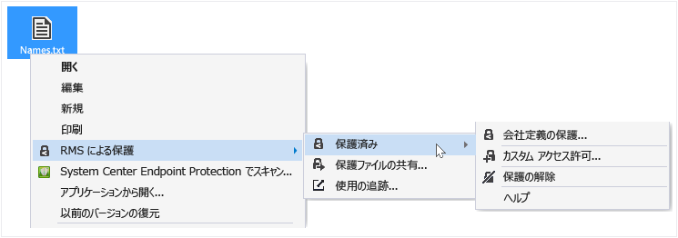
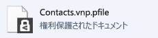

# Rights Management 共有アプリケーションを使用して、デバイス上のファイルを保護する (インプレースの保護)
インプレースのファイルを保護する場合は、元の保護されていないファイルを置き換えます。 次に、その場所にファイルを残したまま別のフォルダーやデバイスにコピーするか、ファイルのあるフォルダーを共有すると、ファイルは保護されたままになります。 エクスプ ローラーまたは Office アプリケーションから直接、電子メールで保護されたファイルを共有することをお勧めしますが、保護されたファイルを電子メール メッセージに添付することもできます (「[Rights Management 共有アプリケーションを使用して、電子メールで共有するファイルを保護する](../Topic/Protect_a_file_that_you_share_by_email_by_using_the_Rights_Management_sharing_application.md)」をご覧ください)。

> [!TIP]
> ファイルを保護しようとするとエラーが表示される場合は、「[Windows 用 Microsoft Rights Management 共有アプリケーションの FAQ](http://go.microsoft.com/fwlink/?LinkId=303971)」をご覧ください。

## デバイス上のファイルを保護するには (インプレースの保護)

1.  エクスプ ローラーで、保護するファイルを選びます。 右クリックして **[RMS による保護]** を選び、**[保護済み]** をクリックします。 例:

    

    > [!NOTE]
    > **[RMS による保護]** オプションが表示されない場合は、RMS 共有アプリケーションがコンピューターにインストールされていないか、コンピューターを再起動してインストールを完了させる必要がある場合があります。 RMS 共有アプリケーションをインストールする方法の詳細については、「[Rights Management 共有アプリケーションをダウンロードしてインストールする](../Topic/Download_and_install_the_Rights_Management_sharing_application.md)」をご覧ください。

2.  以下のいずれかを実行します。

    -   ポリシー テンプレートを選びます。これらは定義済みのアクセス許可で、通常、組織のユーザーに対してアクセスと使用を制限します。 たとえば、会社名が "Contoso, Ltd" の場合、**Contoso, Ltd - Confidential View Only** となります。 初めてこのコンピューターでファイルを保護する場合は、まず **[会社定義の保護]** を選び、テンプレートをダウンロードする必要があります。

        次回 [**インプレースの保護**] オプションをクリックすると、最大 10 個のテンプレートが表示されて選択できます。 使用可能なテンプレートが 10 個よりも多く、その中に使用したいテンプレートが表示されていない場合は、[**会社定義の保護**] をクリックして、すべてのテンプレートをダウンロードして表示します。

        ポリシー テンプレートを選ぶと、複数のファイルとフォルダーも保護できます。 1 つのフォルダーを選ぶと、そのフォルダー内のすべてのファイルが自動的に選択されて保護されますが、そのフォルダー内に新たに作成したファイルは自動的に保護されません。

    -   **[カスタム アクセス許可]** を選びます。テンプレートで必要なレベルの保護を指定できない場合や、保護オプションを自分で明示的に設定する場合は、このオプションを選びます。[[保護の追加] ダイアログ ボックス](http://technet.microsoft.com/library/dn574738.aspx)で、このファイルに必要なオプションを指定し、**[適用]** をクリックします。

3.  ファイルが保護されていることを確認するダイアログ ボックスがすぐに表示されると、エクスプローラーにフォーカスが戻ります。 選んだファイルやファイルが保護されるようになりました。 場合によっては (保護の追加によってファイル名の拡張子が変更される場合)、エクスプローラーの元のファイルが Rights Management の保護のロック アイコンの付いた新しいファイルに置き換えられます。 例:

    

後でファイルから保護を削除する必要がある場合は、「[Rights Management 共有アプリケーションの使用によるファイルからの保護の削除](../Topic/Remove_protection_from_a_file_by_using_the_Rights_Management_sharing_application.md)」をご覧ください。

## 例とその他の説明
Rights Management 共有アプリケーションの使用方法の例と操作手順については、Rights Management 共有アプリケーション ユーザー ガイドの次のセクションをご覧ください。

-   [RMS 共有アプリケーションの使用例](../Topic/Rights_Management_sharing_application_user_guide.md#BKMK_SharingExamples)

-   [作業内容](../Topic/Rights_Management_sharing_application_user_guide.md#BKMK_SharingInstructions)

## 参照
[Rights Management 共有アプリケーション ユーザー ガイド](../Topic/Rights_Management_sharing_application_user_guide.md)

