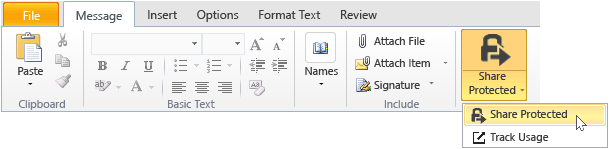

# Rights Management 共有アプリケーションを使用して、電子メールで共有するファイルを保護する
電子メールで共有しているファイルを保護すると、元のファイルの新しいバージョンが作成されます。 元のファイルは保護されない状態のままになり、新しいバージョンが保護されて、送信する電子メールに自動的に添付されます。

場合によっては (Microsoft Word、Excel、PowerPoint で作成されたファイルの場合)、RMS 共有アプリケーションは電子メール メッセージに添付するファイルの 2 つのバージョンを作成します。 2 つ目のバージョンのファイルは **.ppdf** ファイル名拡張子が付けられ、ファイルの PDF シャドウ コピーになります。 このバージョンのファイルにより、受信者は、その作成に使われたものと同じアプリケーションがインストールされていなくても、常にファイルを読み取ることができます。 これは、受信者が電子メールをモバイル デバイスで読んでいて、添付ファイルを表示したいときによくあるケースです。 ファイルを開くために必要なものは、RMS 共有アプリケーションだけです。 その場合、受信者は添付ファイルを読むことはできますが、RMS をサポートするアプリケーションを使用して他方のバージョンのファイルを開くまでは、添付ファイルを変更することができません。

組織で Azure RMS を使用している場合は、共有によって保護されているファイルを追跡できます。

-   これらの保護された添付ファイルをだれかが開こうとしたときに、電子メールを受け取るオプションを選択します。 ファイルにアクセスされるたびに、ファイルを開こうとしたユーザーとタイミング、およびそれらの試みが成功した (正常に認証された) かどうかが通知されます。

-   ドキュメント追跡サイトを使用します。 ドキュメント追跡サイトでファイルへのアクセスを取り消すことにより、ファイルの共有を停止することもできます。 詳細については、「[RMS 共有アプリケーションを使用してドキュメントを追跡および取り消す](../Topic/Track_and_revoke_your_documents_when_you_use_the_RMS_sharing_application.md)」を参照してください。

## Outlook の使用:電子メールで共有するファイルを保護するには

1.  電子メールメッセージを作成して、ファイルを添付します。 次に、[**メッセージ**] タブの [**RMS**] グループで、[**保護ファイルの共有**] をクリックし、もう一度 [**保護ファイルの共有**] をクリックします。

    

    このボタンが表示されない場合は、RMS 共有アプリケーションがコンピューターにインストールされていない、最新バージョンがインストールされていない、インストールを完了するためにコンピューターを再起動する必要がある、などの可能性があります。 共有アプリケーションをインストールする方法について詳しくは、「[Rights Management 共有アプリケーションをダウンロードしてインストールする](../Topic/Download_and_install_the_Rights_Management_sharing_application.md)」を参照してください。

2.  [[保護ファイルの共有] ダイアログボックス](http://technet.microsoft.com/library/dn574738.aspx) でこのファイルに必要なオプションを指定し、[**今すぐ送信**] をクリックします。

### 電子メールで共有するファイルを保護する他の方法
Outlook を使用して保護されたファイルを共有する以外に、以下の代替策を使用することもできます。

-   エクスプローラーから:この方法はすべてのファイルに機能します。

-   Office アプリケーションから:この方法は、Office アドインを使用することによって RMS 共有アプリケーションがサポートするアプリケーションで機能するため、リボンに [**RMS**] グループが表示されます。

##### エクスプローラーまたは Office アプリケーションの使用:電子メールで共有するファイルを保護するには

1.  次のいずれかのオプションを使用します。

    -   エクスプローラーの場合：ファイルを右クリックし、[**RMS による保護**] を選択して、[**保護ファイルの共有**] を選択します。

        

    -   Office アプリケーション、Word、Excel、PowerPoint の場合:まず、ファイルが保存されていることを確認します。 次に、[**ホーム**] タブの [**RMS**] グループで、[**保護ファイルの共有**] をクリックし、もう一度 [**保護ファイルの共有**] をクリックします。

        

    これらの保護用オプションが表示されない場合は、RMS 共有アプリケーションがコンピューターにインストールされていない、最新バージョンがインストールされていない、インストールを完了するためにコンピューターを再起動する必要がある、などの可能性があります。 共有アプリケーションをインストールする方法について詳しくは、「[Rights Management 共有アプリケーションをダウンロードしてインストールする](../Topic/Download_and_install_the_Rights_Management_sharing_application.md)」を参照してください。

2.  [[保護ファイルの共有] ダイアログボックス](http://technet.microsoft.com/library/dn574738.aspx)でこのファイルに必要なオプションを指定し、[**送信**] をクリックします。

3.  すぐにファイルが保護されていることを示すダイアログ ボックスが表示される場合があります。その後、添付ファイルが Microsoft RMS で保護されていて、ログインする必要があることを受信者に伝えるための自動的に作成された電子メール メッセージが表示されます。 受信者がログイン用のリンクをクリックすると、保護された添付ファイルを確実に開くことができる手順とリンクが表示されます。

    例:

    

    詳細: [自動的に作成される .ppdf ファイルとは](../Topic/Dialog_box_options_for_the_Rights_Management_sharing_application.md#BKMK_PPDF)

4.  省略可能:この電子メール メッセージの内容は任意に変更できます。 たとえば、メッセージの件名またはテキストを追加または変更できます。

    > [!WARNING]
    > この電子メール メッセージのユーザーを追加または削除できますが、それによって [**保護ファイルの共有**] ダイアログ ボックスで指定した添付ファイルのアクセス許可が変わることはありません。 それらのアクセス許可を変更するには、たとえば、新しいユーザーにファイルを開くアクセス許可を付与し、保存したり送信したりしないで電子メール メッセージを閉じてから、手順 1 に戻ります。

5.  電子メール メッセージを送信します。

## 例とその他の説明
Rights Management 共有アプリケーションの使用方法の例と操作手順については、Rights Management 共有アプリケーション ユーザー ガイドの次のセクションをご覧ください。

-   [RMS 共有アプリケーションの使用例](../Topic/Rights_Management_sharing_application_user_guide.md#BKMK_SharingExamples)

-   [作業内容](../Topic/Rights_Management_sharing_application_user_guide.md#BKMK_SharingInstructions)

## 参照
[Rights Management 共有アプリケーション ユーザー ガイド](../Topic/Rights_Management_sharing_application_user_guide.md)

