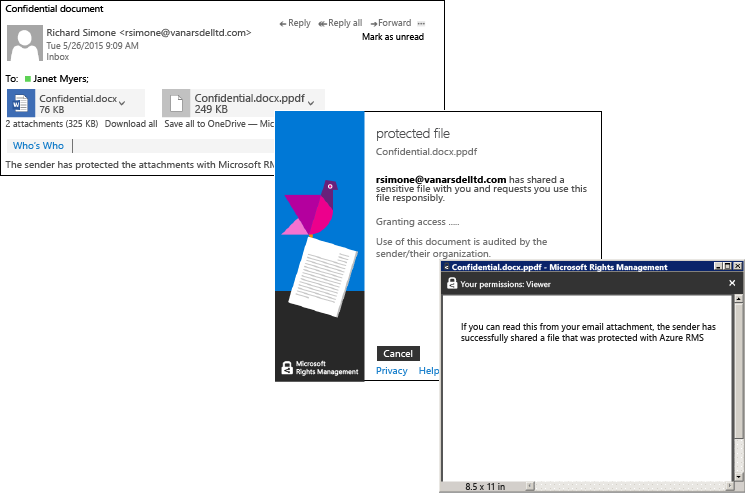

# Azure Rights Management のクイック スタート チュートリアル
このチュートリアルを使用すると、わずか 5 つの手順で、組織の Microsoft Azure Rights Management (Azure RMS) を簡単に試すことができます。かかる時間は、手順全体で 15 分未満です。 ここでは、サービスをアクティブ化し、機密性の高いドキュメントを別の組織のユーザーに安全に電子メールで送信します。さらに、そのドキュメントをユーザーが開いたかどうかを追跡します。 機密性の高いドキュメントを電子メールで送信するときには、転送時にドキュメントが暗号化されます。送信したドキュメントは、送信者が設定したアクセス許可を使って送信先のユーザーだけが読み取ることができます。

このチュートリアルは、IT 管理者やコンサルタントが組織向けの情報保護ソリューションとして Azure Rights Management を評価する際の支援を目的としたものです。 運用環境では、サービスをアクティブ化する手順は管理者が行い、ドキュメントを送信する手順はエンド ユーザーが行います。 別の組織のユーザーに機密性の高いドキュメントを安全に送信する際のシナリオの全容を示すために、このチュートリアルではどちらの手順も説明しています。 このチュートリアルに関してお困りのことがある場合には、[AskIPTeam](mailto:askipteam@microsoft.com?subject=Having%20problems%20with%20the%20Quick%20Start%20tutorial) まで電子メール メッセージをお送りください。サポートいたします。

このチュートリアルでは、以下のものが必要です。

-   Azure Rights Management をサポートするサブスクリプション。 これは、有料サブスクリプションまたは無料試用版のサブスクリプションです。 このチュートリアルの手順 5 で必要になるドキュメント追跡を使用する場合には、ご利用のサブスクリプションでドキュメント追跡がサポートされている必要があります。 サブスクリプション オプションの詳細と無料試用版へのリンクについては、「[Azure Rights Management の要件](../Topic/Requirements_for_Azure_Rights_Management.md)」トピックの「[Azure RMS をサポートするクラウド サブスクリプション](../Topic/Requirements_for_Azure_Rights_Management.md#BKMK_SupportedSubscriptions)」セクションを参照してください。

    ヒント:サブスクリプションの取得プロセスの完了までに時間がかかる可能性があるため、取得が必要な場合は、事前に済ませてください。

-   Office 365 管理センターまたは Azure クラシック ポータルにサインインするための管理者アカウント。これは、Rights Management サービスのアクティブ化に必要です。 このアカウントには、電子メール アドレスと、動作している電子メール サービス (たとえば、Exchange Online または Exchange Server) も必要です。

-   Windows (Windows 7 SP1 以降) を実行し、Office 2016、Office 2013 または Office 2010 がインストールされているコンピューター。

では、始めましょう。

## 手順 1.Rights Management サービスの有効化

Azure Rights Management をサポートするサブスクリプションを所有している場合でも、既定はサービスが無効になっています。 アクティブ化するには、Office 365 管理センターまたは Azure クラシック ポータルを使用します。

-   Azure Rights Management が含まれている Office 365 サブスクリプションを所有している場合、または所有している Office 365 サブスクリプションに Azure Rights Management が含まれていないものの、Azure RMS Premium 用のサブスクリプションを所有している場合には、**Office 365 管理センターを使用します**。

-   Office 365 サブスクリプションを所有していない場合には、**Azure クラシック ポータルを使用します**。

#### Office 365 管理センターから Rights Management をアクティブにするには

1.  [Office 365 ポータル](https://portal.office.com/)に移動して、職場または学校のアカウントでサインインします。

2.  Office 365 管理センターが自動的に表示されない場合は、左上のアプリケーション ランチャー アイコンを選択し、[**管理**] を選択します。**[管理]** タイルは、Office 365 管理者に対してのみ表示されます。

    > [!TIP]
    > 管理センターのヘルプについては、「[Office 365 管理センターについて - 管理者向けヘルプ](https://support.office.com/article/About-the-Office-365-admin-center-Admin-Help-58537702-d421-4d02-8141-e128e3703547)」を参照してください。

3.  左ペインで、**[サービス設定]** を展開します。

4.  [**Rights Management**] をクリックします。

5.  [**RIGHTS MANAGEMENT**] ページで、[**管理**] をクリックします。

6.  **[RIGHTS MANAGEMENT]** ページで、**[アクティブ化]** をクリックします。

7.  **[Rights Management をアクティブ化しますか?]** というメッセージが表示されたら、**[アクティブ化]** をクリックします。

"**Rights Management はアクティブ化されています**" というテキストと、非アクティブ化するオプションが表示されます (このページの手動更新が必要になる場合があります)。

この時点では、[**高度な機能**] をクリックしないでください。 クリックすると、Azure クラシック ポータルに移動し、テンプレートを構成できますが、今回のチュートリアルではその必要はありません。 このため、Office 365 管理センターを閉じてかまいません。

#### Azure ポータルから Rights Management をアクティブ化するには

1.  [Azure クラシック ポータル](http://go.microsoft.com/fwlink/p/?LinkID=275081)に移動して、サインインします。

2.  左ペインで、[**ACTIVE DIRECTORY**] をクリックします。

3.  [**Active Directory**] ページで、[**RIGHTS MANAGEMENT**] をクリックします。

4.  [!INCLUDE[aad_rightsmanagement_2](../Token/aad_rightsmanagement_2_md.md)] で管理するディレクトリを選択して、**[アクティブ化]** をクリックし、操作を確定します。

これで、[**Rights Management のステータス**] に [**アクティブ**] と表示され、[**アクティブ化**] オプションが [**非アクティブ化**] に置き換えられます。

ポータルでは Rights Management の他のオプションを構成できますが、このチュートリアルではその必要がないため、Azure クラシック ポータルを閉じてかまいません。

これで、この最初の手順に必要な操作は終わりました。 サービスがアクティブ化されたので、組織内のすべてのユーザーは、機密性の高い重要なドキュメントを保護できるようになりました。 運用環境では、初めのうちはこの機能を実行できるユーザーを制限しておき、段階的にロールアウトしていくこともできます。 ただし、このチュートリアルではその必要はありません。

このチュートリアルでは扱いませんが、運用環境のデプロイでは、カスタム テンプレートを構成することもできます。 テンプレートを使用すると、ファイルの保護が必要なときに、適切な設定をより簡単かつすばやく適用できるようになります。 Rights Management をアクティブ化すると、2 つの既定のテンプレートを自動的に取得します。独自のカスタム テンプレートを使えば、運用環境で既定のテンプレートを補完することができます。 ただ、このチュートリアルにはテンプレートは必要ありませんので、次の手順に進みます。

|必要な詳細情報|追加情報|
|-----------|--------|
|Rights Management をアクティブ化する方法と、サービスがアクティブ化された際にファイルの保護や電子メールの送信が可能なユーザーを制御する方法について   →|[Rights Management をアクティブにする](../Topic/Activating_Azure_Rights_Management.md)|
|既定のテンプレートの情報と、新しいカスタム テンプレートを作成する方法について   →|[Azure Rights Management のカスタム テンプレートを構成する](../Topic/Configuring_Custom_Templates_for_Azure_Rights_Management.md)|

## 手順 2:Rights Management 共有アプリケーションのインストール

Rights Management 共有アプリケーション ("RMS 共有アプリ" とも呼ばれます) は、Azure Rights Management の要件ではありませんが、Azure Rights Management をサポートするすべてのコンピューターとモバイル デバイスで利用することをお勧めします。 Office アドインをインストールすると、RMS 共有アプリケーションが Office アプリケーションと統合されるので、ユーザーは、リボンから直接ファイルや電子メールを簡単に保護できます。 RMS 共有アプリケーションでは、Azure Rights Management がネイティブでサポートしていないファイルに汎用的な保護を適用することで、すべてのファイルの種類を保護することもできます。また、ドキュメント追跡サイトにより、ユーザーが保護したドキュメントを追跡したり、取り消したりすることもできます。 このチュートリアルでは、後でドキュメント追跡サイトを使用します。

このアプリケーションは無料でダウンロードし、運用環境向けにスクリプト化してインストールできます。 このチュートリアルでは、ローカルにインストールします。

#### Rights Management 共有アプリケーションをダウンロードしてインストールするには

1.  Microsoft Web サイトの [Microsoft Rights Management](http://go.microsoft.com/fwlink/?LinkId=303970) ページに移動します。

2.  [**コンピューター**] セクションで、**Windows 用 RMS アプリケーション**のアイコンをクリックして、Microsoft Rights Management 共有アプリケーションをインストールする **Setup.exe** ファイルを保存します。

3.  ローカルにインストールする場合は、ダウンロードした Setup.exe ファイルの実行に管理者アカウントを使用する必要があります。 続行を確認するメッセージが表示されたら、[**はい**] をクリックします。

4.  [**Microsoft RMS のセットアップ**] ページで、[**次へ**] をクリックし、インストールが完了するまで待機します。

5.  インストールの完了時、再起動を求められた場合は [**再起動**] をクリックします。または [**閉じる**] をクリックしてインストールを完了します。

これで、指定したユーザーのみと共有する情報が含まれるファイルを保護できるようになりました。

|必要な詳細情報|追加情報|
|-----------|--------|
|Windows 用 Rights Management 共有アプリケーションのローカル インストールとユーザーの手順について   →|[Rights Management 共有アプリケーション ユーザー ガイド](http://technet.microsoft.com/library/dn339006.aspx)|
|Windows 用 Rights Management 共有アプリケーションのスクリプト化したインストールと技術情報の詳細について   →|[Rights Management 共有アプリケーション管理者ガイド](http://technet.microsoft.com/library/dn339003.aspx)|
|ネイティブの保護と汎用的な保護の違いを理解するには   →|[汎用的な保護と組み込みの (ネイティブ) 保護の違い](https://technet.microsoft.com/library/dn574738.aspx)|

## 手順 3:電子メールによる保護対象のドキュメントの送信

この手順では、まず Word を使用してドキュメントを保存します。このドキュメントは、保護対象であることがわかるようにして、**Confidential.docx** という名前を付けます。 このチュートリアルでは、ドキュメントの内容にどのようなテキストが含まれていても実際には問題はありませんが、承認された受信者がドキュメントを読んだことを簡単に確認できるようなテキストを含めることができます。 たとえば、次のようなテキストが考えられます。**電子メールの添付ファイルからこのテキストを読み取ることができた場合には、送信者が Azure RMS で保護したファイルを正常に共有できたことになります。**

これで、電子メールでこのドキュメントを安全に共有する準備ができました。

#### 電子メールで、ドキュメントを安全に共有するには

1.  Outlook を使用して、新しいメッセージを作成し、作成したファイルを添付します。

2.  [**宛先**] ボックスで、1 つ以上の仕事用の電子メール アドレスを入力します。 必ず **janetm@contoso.com** または **p.dover@fabrikam.com** のような仕事用の電子メール アドレスを指定してください。現時点では、Azure Rights Management は、自宅で使用するインターネット プロバイダーの個人用の電子メール アドレスをサポートしないためです。 Azure Rights Management を送信先のユーザーも使用しているかどうかを気にする必要はありません。

3.  「**機密ドキュメント**」のような件名を入力し、本文に「**この機密ドキュメントを読んでください。ただし、他の人とは共有しないでください。**」のような短いメッセージを入力します。

4.  次に、[**RMS**] グループの [**メッセージ**] タブで、[**保護ファイルの共有**] をクリックし、もう一度 [**保護ファイルの共有**] をクリックします。

5.  [**保護ファイルの共有**] ダイアログ ボックスで次の操作を実行します。

    1.  [**閲覧者 – 表示のみ**] を選択します。

        これにより、受信者はドキュメントを表示できるものの、編集したり、印刷したりすることはできなくなります。

    2.  [**他の人がこれらのドキュメントを開こうとしたときに電子メールを受け取る**] を選択します。

        受信者が添付ファイルを開こうとするたびに、電子メールの通知を受け取ります。また、受信者以外が開こうとした場合にも通知を受け取ります。これは、受信者が共同作業者に電子メールを転送した場合などが考えられます。 そのような場合には、アクセスが拒否された旨の通知を受け取ります。ユーザーの詳細を確認したうえで、そのユーザーが開くことができるドキュメントのコピーを送信するかどうかを決定できます。

    3.  [**これらのドキュメントへのアクセスをすぐに取り消せるようにする**] を選択します。

        このオプションを選択すると、受信者は添付ファイルを開くにあたり、必ずインターネットに接続していなければならなくなります。ただし、送信者が後からドキュメントを取り消した場合に、受信者がそのドキュメントを開こうとしても、開けなくすることができるという利点があります。 このオプションを選択しなかった場合には、受信者はインターネットに接続しなくてもドキュメントを開くことができます。ただし、送信者が後からドキュメントを取り消した場合に、取り消しが有効になるまで遅延が発生する可能性があるという欠点があります。

    4.  [**今すぐ送信**] をクリックします。

        ファイルが添付された電子メールは、指定した電子メール アドレスに送信されます。 電子メール メッセージ以外にも、受信者には Azure Rights Management によって保護された添付ドキュメントを読むための手順が表示されます。

保護されたドキュメントを送信したので、受信者に電子メールを受信するまで待って、受信したら開くよう依頼できます。 Outlook はまだ終了しないでください。最後の手順で添付ファイルを追跡する際に、もう一度 Outlook を使用します。

|必要な詳細情報|追加情報|
|-----------|--------|
|電子メールで共有するファイルを保護するためのすべての手順、および別の方法   →|[Rights Management 共有アプリケーションを使用して、電子メールで共有するファイルを保護する](https://technet.microsoft.com/library/dn574735.aspx)|
|[**保護ファイルの共有**] ダイアログ ボックスのオプションについて   →|[Rights Management 共有アプリケーションのダイアログ ボックス オプション](https://technet.microsoft.com/library/dn574738.aspx)|

## 手順 4 :電子メールで送信したドキュメントを開くよう受信者に依頼する

受信者は、電子メールの添付ファイルとして送信された保護対象のドキュメントを読むために、多くのデバイスを使用できます。 これらのデバイスには、iPad、iPhone、Android タブレットや携帯電話、Mac コンピューター、Windows コンピューターが含まれます。

送信した電子メール メッセージを読むよう受信者に依頼します。 受信者には電子メールのメッセージが表示されますが、その前に次のテキストが表示されます。

**送信者が Microsoft RMS で添付ファイルを保護しました。添付ファイルを開くには、** [サインイン](http://aka.ms/rms)
      **する必要があります。**

リンクをクリックすると、手順に移動し、RMS 共有アプリケーションをインストールして、必要に応じて無料アカウントにサインアップするよう指示されます。 無料アカウントでは、受信者に個人用 RMS のサブスクリプションが付与されます。これにより、組織が Azure RMS を所有していない場合でも、承認されたユーザーが、保護されたドキュメントを必ず読むことができます。 受信者は、これから説明する手順を使用して、保護された添付ファイルを読むことができます。

#### 保護されたドキュメントの添付ファイルを表示するには

1.  Azure Rights Management により Word 文書が保護されているため、電子メール メッセージには、2 つの添付ファイルがあります。 これらは、実際には 2 つのバージョンの同じファイルですが、ファイル名拡張子は異なります。 ファイル名拡張子 **.ppdf** が付いているバージョン (**Confidential.ppdf**) を開きます。

    [デバイスに Rights Management をサポートしているバージョンの Office](https://technet.microsoft.com/library/dn655136.aspx) がある場合、もう 1 つのバージョンのファイル (**Confidential.docx**) を開くことができます。よって、このファイルは Word で開きます。

2.  ユーザー名とパスワードの入力を求められたら、電子メールと添付ファイルの送信に使われた電子メール アドレスと同じ形式で自分のユーザー名を入力します。 たとえば、**janetm@contoso.com** や **p.dover@fabrikam.com** のようになります。 パスワードには、個人用 RMS にサインアップするときに指定したパスワードを入力します。 または、組織が Azure RMS を所有している場合は、通常の仕事用のパスワードを入力します。

ドキュメントが開いて、内容を読むことができます。 たとえば、次のような内容です。**電子メールの添付ファイルからこのテキストを読み取ることができた場合には、送信者が Azure RMS で保護したファイルを正常に共有できたことになります。**このテキストは、読み取り専用であるため、内容を変更することはできません。

場合によっては、元の電子メールの宛先に含まれていなかった他のユーザーに電子メールを転送するよう、受信者に依頼してみてもよいでしょう。 その他のユーザーが Azure Rights Management を所有する組織で作業していても、または独自に個人用 RMS サブスクリプションを適用していても、添付ファイルを開くことはできません。 これらのユーザーがユーザー名の入力を求められた時点で、ドキュメントへのアクセスが拒否されます。

これで、受信者が添付ファイルを開き、必要に応じて、他のユーザーに転送したので、このアクティビティを報告する電子メール通知を受け取ることができます。 ただし、電子メール メッセージは時間の経過と共に失われやすくなるため、ドキュメントにアクセスしたユーザーを追跡する優れた方法として、ドキュメント追跡サイトを使用できます。ドキュメント追跡サイトについては、最後の手順で説明しています。

|必要な詳細情報|追加情報|
|-----------|--------|
|Azure Rights Management によって保護されたファイルを表示するすべての手順   →|[Rights Management によって保護されたファイルを表示して使用する](https://technet.microsoft.com/library/dn574741.aspx)|
|無料のサブスクリプション、個人用 RMS について   →|[個人用 RMS と Azure Rights Management](../Topic/RMS_for_Individuals_and_Azure_Rights_Management.md)|
|電子メールに添付されている 2 つのバージョンのファイルについて   →|[自動的に作成される .ppdf ファイルとは](https://technet.microsoft.com/library/dn574738.aspx)|

## 手順 5.保護されているドキュメントの追跡

> [!NOTE]
> この手順では、ドキュメント追跡をサポートするサブスクリプションが必要です。 サブスクリプションにドキュメント追跡が含まれているかどうかを確認するには、[Rights Management Services (RMS) 製品の比較](https://technet.microsoft.com/dn858608.aspx)に関するページを参照してください。

この手順は省略可能ですが、ほとんどのユーザーが宛先に送信した添付ファイルが開かれたかどうか、また、開かれた時間と場所を知りたいと考えています。 例:

-   指定した時間までに、相手から返答を受けたいと考えている場合、ドキュメント追跡サイトを使用すると、締め切りが近づいているのに相手がドキュメント開いていないことがわかります。 タイミングよく催促するために、フォローアップの電子メールを送信するか、電話します。

-   相手がドキュメントを開いたことを確認したら、フォローアップして相手に不明点があるかどうか、または補足情報が必要かどうかをたずねます。

#### 保護されているドキュメントを追跡するには

1.  Outlook を使用して、[**ホーム**] タブの [**RMS**] グループで [**使用の追跡**] をクリックします。

2.  [**条件に従って保護し、共有する**] ページが表示された場合は、[**サインイン**] をクリックし、ユーザー名とパスワードをもう一度入力します。

3.  [**共有ドキュメント**] ページに、電子メールに添付されたドキュメント **Confidential.docx** が表示されます。 この時点では、このドキュメントは表示される唯一のファイルですが、共有するドキュメントの数を増やすと、一覧が拡張されます。

    このページから、ドキュメントを共有した時刻 (保護されたファイルが添付された電子メールを送信した時刻)、最後のアクティビティの日付、電子メールの宛先の受信者名を確認できます。 追加の詳細を確認するには、ドキュメント名をクリックします。

4.  表示された新しいページには、クリックしたファイルの名前が付きます。ここでは、このドキュメントのみについての詳細の概要と、このドキュメントに対して使用可能なその他のオプション ([**一覧**]、[**タイムライン**]、[**マップ**]、[**設定**]) が表示されます。

    各オプションをクリックすると、保護されたドキュメントを追跡するさまざまな方法を確認できます。 このほか、[**概要**] ページで、[**Excel で開く**] をクリックして情報をスプレッドシートにエクスポートしたり、[**アクセスの取り消し**] をクリックしてドキュメントの共有を停止したりできます。

保護されたドキュメントに対するアクティビティを詳細に追跡したり、(必要に応じて) アクセスを取り消したりするときは、このサイトを使用します。 ブラウザーで次のリンクを使用すると、モバイル デバイスやタブレットからでもこのサイトにアクセスできます: [ドキュメント追跡](http://go.microsoft.com/fwlink/?LinkId=529562)

|必要な詳細情報|追加情報|
|-----------|--------|
|ドキュメントを追跡する手順の完全版   →|[RMS 共有アプリケーションを使用してドキュメントを追跡および取り消す](https://technet.microsoft.com/library/dn986611.aspx)|
|ドキュメント追跡に関する 2 分間のビデオ   →|[Azure RMS のドキュメントの追跡と取り消し](http://channel9.msdn.com/Series/Information-Protection/Azure-RMS-Document-Tracking-and-Revocation)|
|トラブルシューティングとお客様からの質問   →|[ドキュメント追跡の FAQ](https://technet.microsoft.com/dn947488)|

## 次の手順
このチュートリアルでは、Azure RMS でデータを保護する方法について、1 つのシナリオだけについて、手順に沿って説明しました。 その他の一般的な使用方法を確認するには、記事「[Azure Active Directory Rights Management の概要](../Topic/What_is_Azure_Rights_Management_.md)」の「[Azure RMS の動作](https://technet.microsoft.com/library/jj585026.aspx)」のセクションを参照してください。 これ以外にも、記事には Azure RMS の動作のしくみや解決できるビジネス上の問題に関する役立つセクションが記載されています。

Azure RMS のデプロイを開始する準備ができたら、「[Azure Rights Management の展開ロードマップ](../Topic/Azure_Rights_Management_Deployment_Roadmap.md)」で、デプロイの手順と具体的な操作手順へのリンクを参照してください。

## 参照
[Azure Rights Management の概要](../Topic/Getting_Started_with_Azure_Rights_Management.md)

