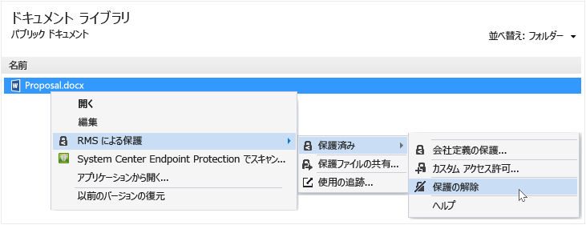

# Rights Management 共有アプリケーションの使用によるファイルからの保護の削除
RMS 共有アプリケーションを使用して、保護されていたファイルから保護を削除する (つまり、ファイルの保護を解除する) には、エクスプローラーの [**保護の削除**] を使用します。

> [!IMPORTANT]
> 保護を削除するには、ファイルの所有者である必要があります。

### ファイルから保護を削除する

1.  エクスプローラーで、ファイル (たとえば、Sample.ptxt) を右クリックし、[**RMS による保護**] を選択して、[**保護済み**] をクリックしてから、[**保護の削除**] をクリックします。

    

    資格情報の入力が求められる場合があります。

元の保護されたファイル (たとえば、Sample.ptxt) が削除され、同じ名前を持つが、保護されていないファイル名拡張子の付いたファイル (たとえば、Sample.txt) で置き換えられます。

## 例とその他の説明
Rights Management 共有アプリケーションの使用方法の例と操作手順については、Rights Management 共有アプリケーション ユーザー ガイドの次のセクションをご覧ください。

-   [RMS 共有アプリケーションの使用例](../Topic/Rights_Management_sharing_application_user_guide.md#BKMK_SharingExamples)

-   [作業内容](../Topic/Rights_Management_sharing_application_user_guide.md#BKMK_SharingInstructions)

## 参照
[Rights Management 共有アプリケーション ユーザー ガイド](../Topic/Rights_Management_sharing_application_user_guide.md)

