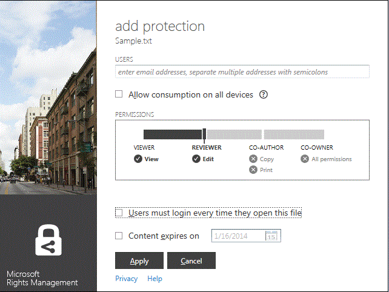

# 改訂バージョン 3:Microsoft Rights Management 共有アプリケーション ガイド
このガイドでは、Windows 用 Microsoft Rights Management (RMS) 共有アプリケーションで、重要な文書や画像を、たとえそれが電子メールで送信されたり別のデバイスに保存されたりした場合であっても、見るべきでない人に見られるのを防ぐ方法について説明します。同様に、このアプリケーションを使用すると、他のユーザーが同じ Rights Management テクノロジを使用して保護したファイルを開いたり使用したりできます。

この共有アプリケーションは、次の方法で、ファイルに対するこの保護を提供します。

-   フォルダー内のファイルを管理するときに、1 つのファイルの保護、複数ファイルの一括保護、フォルダー内の全ファイルの保護を簡単に行えるように、ファイル エクスプローラー (Windows 7 以前のバージョンでは Windows エクスプローラーと呼ばれていたもの) に機能を追加します。

-   すべてのファイルの種類の保護を提供し、一般的に使用されるテキストおよびイメージ ファイルの種類用の組み込みビューアーを備えています。

-   Word、PowerPoint、および Excel 用の Microsoft Office ツールバーに [**保護ファイルの共有**] ボタンが追加されます。

必要なのは、Windows 7 または Windows 8 を搭載しているコンピューターと、RMS 共有アプリケーションをインストールするためのローカル管理者アカウントだけです。その後、この無料アプリケーションを Microsoft からダウンロードしてインストールします。

このガイドで取り上げられていない質問がある場合は、「[Windows 用 Microsoft Rights Management 共有アプリケーションに関してよく寄せられる質問](http://go.microsoft.com/fwlink/?LinkId=303971)」を参照してください。

## RMS 共有アプリケーションの使用例
RMS 共有アプリケーションを使用してファイルを保護する例をいくつか示します。

|通信の種類|RMS 共有アプリケーションを使用するソリューション|
|---------|------------------------------|
|**会社の機密文書を別のデバイスに安全にコピーする必要があります**<br /><br />PC を使用して社外秘である戦略紙の仕事をしており、それを USB ドライブにコピーして、オフィス外で会社のネットワークにアクセスできない場合でも作業できるようにする必要があります。|RMS 共有アプリケーションを PC とラップトップの両方にインストールしてあります。社外の人がアクセスできないように、PC のファイル エクスプローラーでテンプレートを使用してファイルを保護します。ファイルを USB ドライブにコピーし、それをラップトップに装着して、文書の作業を続けます。USB ドライブを落としたり、ラップトップを盗まれたりした場合、社外の人間が文書にアクセスできないようにします。|
|**組織外の信頼できる人と財務情報を安全に共有する必要があります**<br /><br />パートナー会社と仕事をしていて、予想売り上げの値が含まれる Excel スプレッドシートを電子メールで送る必要があります。相手は情報を見ることはできても、変更できないようにします。|Excel のリボンで [**保護ファイルの共有**] ボタンを使用し、パートナー企業で働いている 2 人のユーザーの電子メール アドレスを入力して、スライダーの [**ビューアー**] を選択し、[**送信**] をクリックします。<br /><br />パートナー企業に電子メールが到着すると、電子メールの受信者のみがスプレッドシートを表示できますが、保存、編集、印刷、転送することはできません。|
|**iOS デバイスを使用しているだれかにエンジニアリング図を電子メールで安全に送信する必要があります**<br /><br />会社はカスタム エンジニア リング アプリケーションを使用しており、機密性の高い図を既知の同僚に電子メールで送信し、相手は定期的に iOS デバイスで電子メールを確認します。|ファイル エクスプローラーでファイルを右クリックし、[**保護ファイルの共有**] を選択します。RMS 共有アプリケーションは、ファイルの拡張子が RMS をネイティブでサポートするアプリケーションからのものではないことを認識し、電子メール メッセージにファイルを添付するときに、一般的に保護されたファイルに自動的に変換し、[**すべてのデバイスで使用を許可する**] オプションを自動的に選択します。<br /><br />受信者は、iOS デバイスで電子メールを受信し、RMS 共有アプリケーションをダウンロードする方法を示す電子メールのリンクをクリックして、iOS デバイス用のバージョンをインストールしてから、図を表示します。|
|**受信者の会社は Rights Management を使用していませんが、RMS で保護されているファイルが添付された電子メール メッセージを受け取りました**<br /><br />電子メールの送信者は、これまで取引を行ったことがある信頼できる人であり、新しいビジネス チャンスに関する情報を送ってきたものと思われます。|受信者はコンピューターに RMS 共有アプリケーションをダウンロードする方法を通知する電子メールのリンクをクリックし、インストールして、個人用に RMS にサインアップします。Microsoft は、受信者の組織が Office 365 へのサブスクリプションを持っていないことを確認し、受信者に無料サインアップ処理を完了するための電子メールを送信して、受信者は新しいアカウントでサインインします。受信者は、電子メールの添付ファイルを開き、新しいビジネス チャンスについての情報を読むことができます。|

## <a name="BKMK_Install"></a>RMS 共有アプリケーションをダウンロードしてインストールする方法
> [!IMPORTANT]
> RMS 共有アプリケーションをインストールするには、ローカル管理者アカウントが必要です。ローカル管理者としてログインしていない場合は、手順 3 で Setup.exe を実行するときに [**管理者として実行**] オプションを使用できます。

RMS 共有アプリケーションをインストールするには次の手順に従います。

1.  Microsoft Web サイトの「[Microsoft Rights Management](http://go.microsoft.com/fwlink/?LinkId=303970)」ページに移動します。

2.  [**コンピューター**] セクションで、[**Windows 用 RMS アプリケーション**] のアイコンをクリックし、Microsoft Rights Management 共有アプリケーションのインストール パッケージをコンピューターに保存します。

3.  ダウンロードした圧縮ファイルをダブルクリックし、[**setup.exe**] をダブルクリックします。続行を確認するメッセージが表示されたら、[**はい**] をクリックします。

4.  [**Microsoft RMS のセットアップ**] ページで、[**次へ**] をクリックし、インストールが完了するまで待ちます。

5.  インストールが完了したら、[**再起動**] をクリックしてコンピューターを再起動し、インストールを完了します。または、[**閉じる**] をクリックし、後でコンピューターを再起動してインストールを完了します。

これでファイルの保護、または他のユーザーが保護したファイルを読み取る準備ができました。

## <a name="BKMK_UsingMSRMSApp"></a>一般的なタスク
保護されたファイルを処理するには次の手順を使用します。

### <a name="BKMK_CreatePTXT"></a>保護されたテキスト ファイルを作成する
通常のテキスト (.txt) ファイルをファイル拡張子が .ptxt の保護されたファイルに変換できます。

##### 保護されたテキスト (.ptxt) ファイルを作成するには

1.  ファイル エクスプローラーで、フォルダーを右クリックし、[**新規**] をクリックし、[**テキスト ドキュメント**] をクリックします。

2.  ファイルの名前を変更します (例: Sample.txt)。

3.  ファイルをダブルクリックし、メモ帳で開きます。

4.  メモ帳で、ファイルにいくつかテキスト行を追加してから保存します。次をテキストの例として使用できます。

    ```
    This is a sample text file.
    This is a sample text file.
    This is a sample text file.
    This is a sample text file. 
    This is a sample text file.
    This is a sample text file.
    ```

5.  ファイルを右クリックし、[**保護済み**] をクリックして、一覧からテンプレートを選択します。RMS 共有アプリケーションを使用したのは今回が始めである場合、まず、[**会社の保護**] を選択して、組織用のテンプレートをダウンロードする必要があります。

6.  [**Microsoft Rights Management 共有アプリケーション**] 画面で、適用するポリシーを確認し、[**適用**] をクリックし、ファイルが保護されたら、[**閉じる**] をクリックします。

### <a name="BKMK_ViewPTXT"></a>保護されたテキスト ファイル (.ptxt) または保護されたイメージ ファイルを表示する
保護されたテキスト (.ptxt) ファイルを表示するには、ファイル エクスプローラーで、ファイル (例: Sample.ptxt) をダブルクリックします。資格情報を求められる場合があります。ファイルが開くと、ファイルの上部にファイルの保護のポリシーが表示されます。

保護されたイメージも同じ方法で開いて表示できます。

### <a name="BKMK_CreatePFILE"></a>一般的な保護ファイルを作成する
RMS 共有アプリケーションまたは組み込みの RMS タイプ保護を提供する他のアプリケーションによって直接サポートされないファイルの種類に対して一般レベルの保護を提供するには、一般保護 (.pfile) ファイル形式を使用します。Microsoft Web サイトの [Microsoft Rights Management](http://go.microsoft.com/fwlink/?LinkId=303970) ページを使用すれば、アプリケーションでサポートされている RMS の組み込み保護をすばやく確認できます。

たとえば、Microsoft Visio は RMS の組み込み保護を正しくサポートしないため、Microsoft Visio で作成する .vsd ファイルには一般保護を使用できます。

> [!TIP]
> 組み込み (ネイティブ) 保護と一般保護は何が違うのですか?
> 
> -   一般に、ファイルを保護すると、承認されていないユーザーはファイルを開くことができません。しかし、承認されたユーザーがファイルを開いた後、このファイルを保護されていない状態で他のユーザーに転送したり、他のユーザーがアクセスできる場所に保存したりすることはできます。ただし、ファイルの上部にファイルに対するアクセス許可を示すメッセージが表示され、それを適用するかどうか確認されますが、この保護を強制することはできません。また、ファイルを汎用的に保護する場合、承認以外にアクセス許可を制限することはできません。たとえば、カスタム アクセス許可を使用する場合、RMS 共有アプリケーションのスライダーでは自動的に [**共同所有者**] が選択されていて、これを [**表示者**] や [**共同作成者**] など、より制限の厳しいアクセス許可に変更することはできません。
> -   一方、RMS をサポートするアプリケーション (Office ファイルなど) で RMS の組み込み保護を使用すると、ファイルが後で誰かに送信される場合や、別の場所に保存される場合であっても、ファイルに保護が適用されます。また、このようなファイルを保護する場合、読み取り専用などの厳しいアクセス許可を使用したり、編集はできても印刷やコピーができないアクセス許可を使用したりできます。たとえば、カスタム アクセス許可を使用する場合、RMS 共有アプリケーションのアクセス許可のスライダーでは自動的に [**レビュー担当者**] が選択されますが、これは後で厳しいものや緩いものに変更できます。

##### 例:Visio 図面 (.vsd) ファイルから一般的な保護ファイル (.pfile) を作成するには

1.  ファイル エクスプローラーで、フォルダーを右クリックし、[**新規**] をクリックし、[**新しい Visio 図面**] をクリックします。

2.  ファイルの名前を変更します (例: Sample.vsd)。

3.  ファイルをダブルクリックし、Visio で開きます。

4.  Visio で図面に要素を追加し、ファイルを保存して閉じます。

5.  ファイルを右クリックし、[**保護済み**] をクリックして、一覧からポリシー テンプレートを選択します。RMS 共有アプリケーションを使用したのは今回が始めである場合、まず、[**会社の保護**] を選択して、組織用のテンプレートをダウンロードする必要があります。

6.  [**Microsoft Rights Management 共有アプリケーション**] 画面で、適用するポリシーを選択し、[**適用**] をクリックします。

7.  保護されたファイルが .pfile ファイル (例: Sample.vsd.pfile) として保存されたことを示すメッセージが表示されます。元のファイルは削除されます。

### <a name="BKMK_ViewPFILE"></a>一般保護 (.pfile) ファイルを表示する
一般的な保護 (.pfile) ファイルを表示するには、エクスプローラーで、一般的な保護 (.pfile) ファイル (例: Sample.vsd.pfile) をダブルクリックし、[**開く**] をクリックします。

### <a name="BKMK_Unprotect"></a>ファイルから保護を削除する
以前に保護したファイルから保護を削除する (つまり、ファイルの保護を解除する) には、[**保護の削除**] オプションを次のように使用します。

1.  ファイル (たとえば、Sample.ptxt) を右クリックし、[**保護済み**] をクリックし、[**保護の削除**] をクリックします。資格情報を求められる場合があります。

2.  元の保護されたファイル (たとえば Sample.ptxt) が削除され、同じ名前で保護されていないファイル名拡張子のファイル (たとえば Sample.txt) に置き換えられます。

### <a name="BKMK_ProtectCustom"></a>独自のカスタム アクセス権でファイルを保護する
ファイルを保護する最も簡単な方法はテンプレートを使用することですが、独自のアクセス許可を指定することもできます。これはユーザー作成保護と呼ばれ、次の状況に適しています。

-   電子メール アドレスによって識別される個別ユーザーの特定のリストに対してのみファイル アクセスを制限する。

-   特定の権限 (ドキュメントに対する読み取り専用権限など) に対してのみ、ファイルの使用を制限する。

ユーザーが許可したアクセス許可でファイルを保護するには、ファイルを右クリックし、[**保護済み**] をクリックし、[**カスタムのアクセス許可**] をクリックします。次の画面が表示されます。



ユーザーの電子メール アドレスを入力し、スライダーを使用してファイルのアクセス許可を選択した後、[**適用**] をクリックします。

### <a name="BKMK_UserDefined"></a>カスタム保護のファイルを使用する
開く保護ファイルのほとんどは、テンプレートを適用することで保護されています。ただし、ユーザーは独自のカスタム アクセス許可を使用してファイルを保護することもできます (ユーザー作成保護と呼ばれます)。

テキストおよびイメージ ファイル形式の場合、このレベルの保護では、ファイルの編集、保存、または制限に使用したアプリケーションが RMS 保護をサポートするように設計されていること、および AD RMS SDK で提供されている保護 API を実装していることが必要です。

ユーザー作成保護で保護されたテキスト ファイルを表示すると、次の例で示すように、ファイルに対して表示されるアクセス許可が若干異なります。

一般保護 (.pfile) ファイル形式を使用して保護されたファイルの場合、ユーザーによって指定された特定の権限またはアクセス許可が、ファイルの保護に使用されたテンプレート名の代わりに、確認画面に表示されます (次の図を参照)。


### <a name="BKMK_ShareProtected"></a>電子メールで共有するためのコンテンツの保護
電子メール メッセージを使用して共有するコンテンツを保護するには、ファイルを右クリックし、[**保護ファイルの共有**] をクリックします。次の画面が表示されます。


ユーザーの一覧の電子メール アドレスを入力します。スライダーを使用してファイルのアクセス許可を選択し、[**送信**] をクリックします。Outlook はユーザーが変更できる短いメッセージで受信者への電子メール メッセージを作成し、保護されたファイルを添付します。元のファイルは保護されていません。

保護されたファイルを Windows 以外のデバイスで表示できるようにするには、[**すべてのデバイスで使用を許可する**] をクリックします。ユーザーは RMS 共有アプリケーションをデバイスにダウンロードすることが必要な場合があり、そのためのリンクが電子メールに含まれます。

### <a name="BKMK_Multiple"></a>複数のファイルとフォルダーに保護を適用する
ファイル エクスプローラーを使用しているときは、ファイルに 1 つずつ保護を適用する必要はありません。複数のファイルを選択したり、ファイルがまだ保護されていない場合にフォルダーのすべてのファイルを選択したりできます。

##### 選択したフォルダー内の複数のファイルまたはすべてのファイルを保護するには

1.  ファイル エクスプローラーで、複数のファイルを選択するか、または保護するファイルを含むフォルダーを選択します。

2.  選択したフォルダーまたはファイルを右クリックし、[**保護済み**] をクリックして、一覧からテンプレートを選択します。RMS 共有アプリケーションを使用したのは今回が始めである場合、まず、[**会社の保護**] を選択して、組織用のテンプレートをダウンロードする必要があります。

3.  [**Microsoft Rights Management 共有アプリケーション**] 画面で、ファイルが保護されていることを確認します。

> [!TIP]
> エラーが発生している場合は、「[Windows 用 Microsoft Rights Management 共有アプリケーションの FAQ](http://go.microsoft.com/fwlink/?LinkId=303971)」を参照してください。

### <a name="BKMK_OfficeToolbar"></a>Office ツールバー アドインを使用する
Microsoft Rights Management 共有アプリケーション用の Office リボン アドインを使用することによって、Microsoft Office 内から直接 Word、PowerPoint、Excel のファイルを保護および共有できます。

[**保護**] グループの [**保護ファイルの共有**] をクリックして、Microsoft Rights Management 共有アプリケーションを開始します。


### <a name="BKMK_AccessKeys"></a>キーボード ショートカットを使用する
**Alt** キーを押して使用可能なアクセス キーを表示し、**Alt** キーを押しながらそのアクセス キーを押して、オプションを選択します。

たとえば、[**保護ファイルの共有**] ダイアログ ボックスで、**Alt** キーを押してアクセス キーを確認し、**Alt + u** を押して、[**このファイルを開くたびにユーザーにログインを求める**] チェック ボックスをオンします。


## 参照
[Microsoft Rights Management 共有アプリケーションのダウンロード](http://go.microsoft.com/fwlink/?LinkId=303970)
 [Windows 用 Microsoft Rights Management 共有アプリケーションの FAQ](http://go.microsoft.com/fwlink/?LinkId=303971)

