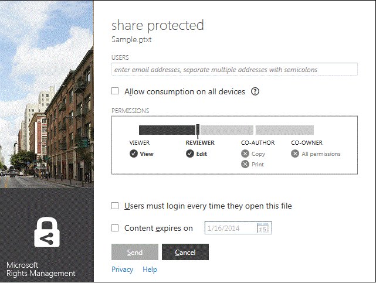
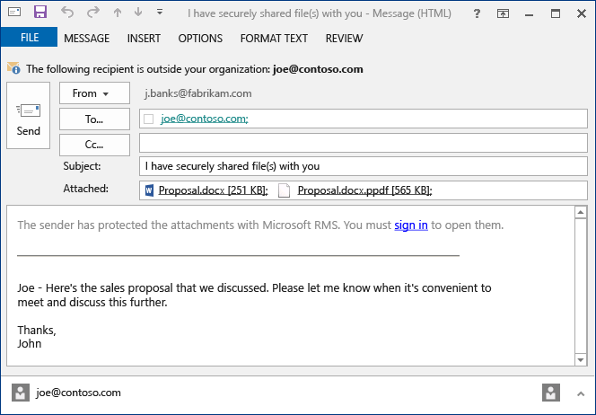

# Rights Management 共有アプリケーション ユーザー ガイド - 単一トピックに改訂
Windows 用 Microsoft Rights Management (RMS) 共有アプリケーションを使用すると、重要な文書や画像を、たとえそれが電子メールで送信されたり別のデバイスに保存されたりした場合であっても、見るべきでない人に見られるのを防ぐことができます。また、このアプリケーションを使用すると、他のユーザーが同じ Rights Management テクノロジを使用して保護したファイルを開いたり使用したりできます。

必要なのは、Windows 7 以降を搭載しているコンピューターと、RMS 共有アプリケーションをインストールするためのローカル管理者アカウントだけです。その後、この無料アプリケーションを Microsoft から[ダウンロードしてインストール](http://go.microsoft.com/fwlink/?LinkId=303970)します。

このガイドで取り上げられていない質問がある場合は、「[Windows 用 Microsoft Rights Management 共有アプリケーションに関してよく寄せられる質問](http://go.microsoft.com/fwlink/?LinkId=303971)」を参照してください。

RMS 共有アプリケーションを使用してファイルを保護する例をいくつか示します。

|目的|方法|
|------|------|
|**組織外の信頼できる人と財務情報を安全に共有する**  パートナー会社と仕事をしていて、予想売り上げの値が含まれる Excel スプレッドシートを電子メールで送る必要があります。相手は情報を見ることはできても、変更できないようにします。|[保護ファイルの共有] ボタンを使用し、パートナー企業で働いている 2 人のユーザーの電子メール アドレスを入力して、スライダーの [ビューアー] を選択し、[送信] をクリックします。  パートナー企業に電子メールが到着すると、電子メールの受信者のみがスプレッドシートを表示できますが、保存、編集、印刷、転送することはできません。  ［詳細］:このガイドの「[一般的なタスク](../Topic/Rights_Management_sharing_application_user_guide_-_revision_for_single_topic.md#BKMK_UsingMSRMSApp)」セクションで「**電子メールで共有するファイルを保護する**」を参照してください。|
|**iOS デバイス ユーザーに電子メールでドキュメントを安全に送信する**  機密性の高い Word 文書を、普段 iOS デバイスで電子メールをチェックしている同僚に電子メールで送信します。|ファイル エクスプローラーでファイルを右クリックし、[保護ファイルの共有] を選択します。RMS 共有アプリケーションで、[すべてのデバイスで使用を許可する] オプションを選択し、ファイルを添付ファイルとして同僚に送信します。  受信者は、iOS デバイスで電子メールを受信し、RMS 共有アプリケーションをダウンロードする方法を示す電子メールのリンクをクリックして、iOS デバイス用のバージョンをインストールしてから、文書を表示します。  ［詳細］:このガイドの「[一般的なタスク](../Topic/Rights_Management_sharing_application_user_guide_-_revision_for_single_topic.md#BKMK_UsingMSRMSApp)」セクションで「**電子メールで共有するファイルを保護する**」を参照してください。|
|**受信した電子メール メッセージに添付されている、セキュリティで保護された共有ファイルを読みたいが、会社で Rights Management を使用していないので読むことができない**  電子メールの送信者は、これまで取引を行ったことがある信頼できる人であり、新しいビジネス チャンスに関する情報を送ってきたものと思われます。|電子メールに記載された手順に従い、リンクをクリックして Microsoft Rights Management にサインアップします。Microsoft は、受信者の組織が Office 365 へのサブスクリプションを持っていないことを確認し、受信者に無料サインアップ処理を完了するための電子メールを送信して、受信者は新しいアカウントでサインインします。電子メールの 2 番目のリンクをクリックして Rights Management 共有アプリケーションをインストールすると、電子メールの添付ファイルを開いて新しいビジネス チャンスに関する情報を読むことができます。  ［詳細］:このガイドの「[一般的なタスク](../Topic/Rights_Management_sharing_application_user_guide_-_revision_for_single_topic.md#BKMK_UsingMSRMSApp)」セクションで「**Rights Management によって保護されたファイルを表示して使用する**」を参照してください。|
|**会社の機密ファイルをノート PC で保護し、社外の人物がアクセスできないようにする**  頻繁に出張するので、ノート PC でアクセスして更新するファイルのフォルダーを無許可アクセスから保護する必要があります。|RMS 共有アプリケーションをノート PC にインストールしてあります。ファイル エクスプローラーでテンプレートを使用してファイルを簡単に保護します。ノート PC が盗難にあっても、これらの文書に社外の人物はアクセスできないので安心できます。  ［詳細］:このガイドの「[一般的なタスク](../Topic/Rights_Management_sharing_application_user_guide_-_revision_for_single_topic.md#BKMK_UsingMSRMSApp)」セクションで「**デバイス上のファイルを保護する (保護済み)**」を参照してください。|

## 一般的なタスク
保護されたファイルを処理するには次の手順を使用します。

### Rights Management 共有アプリケーションのダウンロードとインストール

1.  Microsoft Web サイトの「[Microsoft Rights Management](http://go.microsoft.com/fwlink/?LinkId=303970)」ページに移動します。

2.  [**コンピューター**] セクションで、[**Windows 用 RMS アプリケーション**] のアイコンをクリックし、Microsoft Rights Management 共有アプリケーションのインストール パッケージをコンピューターに保存します。

3.  ダウンロードした圧縮ファイルをダブルクリックし、[**setup.exe**] をダブルクリックします。続行を確認するメッセージが表示されたら、[**はい**] をクリックします。

    > [!TIP]
    > [**setup.exe**] を表示するには、現在のフォルダーの一覧の一番下までスクロールしなければならないことがあります。

4.  [**Microsoft RMS のセットアップ**] ページで、[**次へ**] をクリックし、インストールが完了するまで待ちます。

5.  インストールが完了したら、[**再起動**] をクリックしてコンピューターを再起動し、インストールを完了します。または、[**閉じる**] をクリックし、後でコンピューターを再起動してインストールを完了します。

これでファイルの保護、または他のユーザーが保護したファイルを読み取る準備ができました。

#### 説明を見る
共有アプリケーションをインストールするには、ローカル管理者アカウントが必要です。ローカル管理者としてログインしていない場合は、手順 3 で Setup.exe を実行するときに [**管理者として実行**] オプションを使用できます。

### デバイス上のファイルを保護する (保護済み)

1.  ファイル エクスプローラーで、保護する 1 つまたは複数のファイル、またはフォルダーを選択します。右クリックし、[**保護済み**] を選択します。たとえば、

    

    > [!NOTE]
    > [**保護済み**] オプションが表示されない場合は、共有アプリケーションがコンピューターにインストールされていないか、コンピューターを再起動してインストールを完了しなければならない可能性があります。共有アプリケーションをインストールする方法の詳細については、このガイドの「[一般的なタスク](../Topic/Rights_Management_sharing_application_user_guide_-_revision_for_single_topic.md#BKMK_UsingMSRMSApp)」セクションで「**Rights Management 共有アプリケーションのダウンロードとインストール**」を参照してください。

2.  次のいずれかの操作を行います。

    -   ポリシー テンプレートを選択する: アクセスと使用を組織内のユーザーに制限する定義済みのアクセス許可があります。このコンピューターでファイルを保護したのが初めての場合は、まず [**会社定義の保護**] を選択して、テンプレートをダウンロードする必要があります。テンプレートの名前は、会社の名前で始まり、その後にアクセス許可を説明する名前が続きます。たとえば、**Contoso - Confidential View Only**

    -   [**カスタムのアクセス許可**] を選択します。必要な保護レベルがテンプレートで提供されない場合は、このオプションを選択します。たとえば、組織外の人にアクセスを許可したり、独自の保護オプションを明示的に設定したりする場合です。[**保護の追加**] ダイアログ ボックスでこのファイルに必要なオプションを指定し、[**適用**] をクリックします。

        > [!NOTE]
        > このダイアログ ボックスのオプションの詳細については、このガイドの「[一般的なタスク](../Topic/Rights_Management_sharing_application_user_guide_-_revision_for_single_topic.md#BKMK_UsingMSRMSApp)」セクションで「**[Rights Management] ダイアログ ボックスでオプションを指定する**」の説明を参照してください。

3.  ファイルが保護されていることが示すダイアログ ボックスがすぐに表示され、その後、ファイル エクスプローラーに戻ります。選択したファイルは保護されています。場合によっては (保護の追加によりファイル名拡張子が変更される場合など)、ファイル エクスプローラーの元のファイルが、Rights Management の保護ロック アイコンが付いた新しいファイルに置き換えられます。たとえば、

    

後でファイルの保護を削除する必要がある場合は、このガイドの「[一般的なタスク](../Topic/Rights_Management_sharing_application_user_guide_-_revision_for_single_topic.md#BKMK_UsingMSRMSApp)」セクションで「**ファイルから保護を削除する**」を参照してください。

#### 説明を見る
ファイルを保護すると、元の保護されていないファイルが置き換えられます。保護されたファイルは、その場所に置いたままにしても、別のフォルダーやデバイスにコピーしても、そのファイルのフォルダーを共有しても、保護されたままです。保護されたファイルを電子メールに添付することもできますが、電子メールでの保護されたファイルの共有は、ファイル エクスプローラーまたは Office アプリケーションから直接行うことをお勧めします (このガイドの「[一般的なタスク](../Topic/Rights_Management_sharing_application_user_guide_-_revision_for_single_topic.md#BKMK_UsingMSRMSApp)」セクションで「**電子メールで共有するファイルを保護する**」を参照)。

同じ方法で複数のファイルを同時に保護できます。また、フォルダーを保護することもできます。フォルダーを保護すると、そのフォルダー内のすべてのファイルが自動的に保護対象に選択されますが、そのフォルダーで作成される新しいファイルは自動的には保護されません。

ファイルを保護しようとしたときにエラーが発生する場合は、「[Windows 用 Microsoft Rights Management 共有アプリケーションに関してよく寄せられる質問](http://go.microsoft.com/fwlink/?LinkId=303971)」を参照してください。

### 電子メールで共有するファイルを保護する

1.  次のいずれかのオプションを使用します。

    -   ファイル エクスプローラーの場合: ファイルを右クリックし、[**保護ファイルの共有**] を選択します。

        

    -   Office アプリケーションの場合: 最初にファイルを保存します。次に、[**保護**] グループで [**保護ファイルの共有**] をクリックします。

        

    > [!NOTE]
    > このような保護共有オプションが表示されない場合は、共有アプリケーションがコンピューターにインストールされていないか、コンピューターを再起動してインストールを完了しなければならない可能性があります。共有アプリケーションをインストールする方法の詳細については、このガイドの「[一般的なタスク](../Topic/Rights_Management_sharing_application_user_guide_-_revision_for_single_topic.md#BKMK_UsingMSRMSApp)」セクションで「**Rights Management 共有アプリケーションのダウンロードとインストール**」を参照してください。

2.  [**保護ファイルの共有**] ダイアログ ボックスでこのファイルに必要なオプションを指定し、[**送信**] をクリックします。

    

    > [!NOTE]
    > このダイアログ ボックスのオプションの詳細については、このガイドの「[一般的なタスク](../Topic/Rights_Management_sharing_application_user_guide_-_revision_for_single_topic.md#BKMK_UsingMSRMSApp)」セクションで「**[Rights Management] ダイアログ ボックスでオプションを指定する**」の説明を参照してください。

3.  ファイルが保護されていることが示すダイアログ ボックスがすぐに表示され、その後、[**ファイルをセキュリティ保護付きで共有しました**] という件名の電子メール メッセージが表示されます。この電子メール メッセージでは、選択したファイルが添付されて保護されており、電子メールの本文には以下に対するリンクが含まれます。

    -   個人用 RMS

    -   RMS 共有アプリケーション

    -   このユーザー ガイド

    例:

    

4.  省略可能: この電子メール メッセージの内容を変更できます。たとえば、メッセージ内で件名またはテキストを追加したり変更したりできます。

    > [!WARNING]
    > この電子メール メッセージでユーザーを追加または削除できますが、これにより、[**保護ファイルの共有**] ダイアログ ボックスで指定した添付ファイルに対するアクセス許可が変更されることはありません。アクセス許可を変更する場合は (たとえば、新しいユーザーにファイルを開くアクセス許可を与える)、電子メール メッセージを保存または送信しないで閉じ、手順 1 に戻ります。

5.  電子メール メッセージを送信します。

#### 説明を見る
電子メールで共有するファイルを保護すると、元のファイルの新しいバージョンが作成されます。元のファイルは保護されないまま残り、新しいバージョンは保護されて、送信する電子メールに自動的に添付されます。

電子メール メッセージの既定の件名と本文は、送信する前に変更できます。

電子メールで共有するファイルを保護するには 2 つの方法があります。

-   ファイル エクスプローラー: この方法はすべてのファイルに使用できます。

-   Office アプリケーション: この方法は、Office アドインによってリボンに [**保護**] グループが表示されている、Rights Management 共有アプリケーションがサポートするアプリケーションに使用できます。

> [!NOTE]
> このバージョンの Rights Management 共有アプリケーションでは、Outlook 用のアドインはなく、Outlook アプリケーションから直接ファイルと電子メール メッセージを保護することはできません。代わりに、このセクションの手順を使用します。

### Rights Management によって保護されたファイルを表示して使用する

#### 保護されたファイルを表示するには
ファイル エクスプローラーまたは添付ファイルを含む電子メール メッセージを使用して、保護されたファイルをダブルクリックし、要求された場合は資格情報を入力します。ファイルを開く方法は、ファイルが保護されている方法によって異なります。

-   ファイルが一般保護されている場合 (ファイル拡張子が .pfile):

    共有アプリケーションから [**保護されたファイル**] ダイアログ ボックスが表示され、そのファイルを保護したユーザー、および共同所有者のアクセス許可に従うことを期待されていることが示されます。ファイルを開くと、その操作が監査されることが示されます。

    

    [**開く**] をクリックしてファイルを読み取ります。

-   ファイルがネイティブ保護されている場合 (ファイル拡張子が .pfile ではない):

    ファイルは元のファイル名拡張子に関連付けられているアプリケーションを使用して開き、ファイルの先頭に制限バナーが表示されます。バナーには、ファイルに適用されるアクセス許可またはファイルを表示するためのリンクが表示される可能性があります。たとえば、次が表示される可能性があります。ファイルおよびそのファイルにアクセスできるユーザーに適用されている実際のアクセス許可を確認するには、ここで [**現在、アクセスが制限されています**] をクリックします。

    

    このファイルも監査され、ファイルが保護されている間は監査されたままになります。

##### 説明を見る
保護されたファイルを表示するには、先にユーザーがファイルを表示する権限を持つことを RMS が確認する必要があります。それには、ユーザー名とパスワードを調べます。場合によっては、ユーザー名とパスワードがキャッシュに格納されていて、資格情報の入力を求められないことがあります。それ以外の場合は、資格情報を指定するように求められます。

組織が Microsoft Azure Rights Management (Microsoft Azure RMS) または AD RMS を使用していない場合は、RMS で保護されたファイルを開けるように資格情報を受け付ける無料のアカウントを要求できます。このアカウントを要求するには、リンクをクリックして、[個人用 RMS](http://go.microsoft.com/fwlink/?LinkId=309469) を要求します。

#### 保護されているファイルを使用するには (ファイルを編集して印刷する場合など)
保護されたファイルのファイル拡張子が .pfile である場合:

-   開いているファイルを保存し、使用するアプリケーションに関連付けられている新しいファイル名拡張子を付けます。

    たとえば、ファイルがファイル名 document.vsdx.pfile を使用して保護された場合、ファイルを表示し、ファイル エクスプローラーで document.vsdx としてファイルを保存します。

    新しいファイルは保護されていません。ファイルを保護する場合は、手動で行う必要があります。手順については、このガイドの「[一般的なタスク](../Topic/Rights_Management_sharing_application_user_guide_-_revision_for_single_topic.md#BKMK_UsingMSRMSApp)」で「**Rights Management 共有アプリケーションを使用してデバイス上のファイルを保護する方法 (保護済み)**」を参照してください。

もともと保護されていたファイルの拡張子が .pfile ではない場合:

-   Rights Management を認識するアプリケーションがない場合、ファイルを表示する以外のことは実行できません。このようなアプリケーションは、Rights Management 対応アプリケーションと呼ばれます。Office 2013 および Office 2010 のアプリケーション (Word、Excel、PowerPoint、Outlook など) は、Rights Management 対応アプリケーションの例です。ただし、他のソフトウェア会社のアプリケーションやユーザー独自の基幹業務アプリケーションなど、Microsoft 以外のアプリケーションも、Rights Management 対応である場合があります。

    Rights Management 対応のアプリケーションは、他の Rights Management 対応アプリケーションによって保護されているファイルを開く方法を認識しています。また、Rights Management 対応アプリケーションは、ユーザーがファイルを編集したり、別のファイル名や別の場所に保存したりしても、ファイルに適用された保護を維持します。Rights Management 対応アプリケーションを使用すると、ユーザーはファイルに現在適用されているアクセス許可に従ってファイルを使用できます。ユーザーがファイルを使用するためのアクセス許可を持っている場合、ファイルを使用できます。たとえば、ファイルが読み取り専用として保護されていた場合、ファイルを変更または印刷することはできません。

### ファイルから保護を削除する
ファイル エクスプローラーで、ファイル (たとえば、Sample.ptxt) を右クリックし、[**保護済み**]、[**保護の削除**] の順にクリックします。

資格情報を求められる場合があります。

#### 説明を見る
元の保護されたファイル (たとえば Sample.ptxt) が削除され、同じ名前で保護されていないファイル名拡張子のファイル (たとえば Sample.txt) に置き換えられます。

それまで RMS 共有アプリケーションを使用して保護されていたファイルから保護を削除する (ファイルの保護を解除する) には、ファイル エクスプローラーの [**保護の削除**] オプションを使用します。

> [!IMPORTANT]
> 保護を削除するには、ファイルの所有者である必要があります。

### Rights Management 共有アプリケーションでキーボード ショートカットを使用する
**Alt** キーを押して使用可能なアクセス キーを表示し、**Alt** キーを押しながらそのアクセス キーを押して、オプションを選択します。

#### 説明を見る
たとえば、[**保護ファイルの共有**] ダイアログ ボックスで **Alt** キーを押してアクセス キーを表示し、**Alt + u** キーを押して、[**このファイルを開くたびにユーザーにログインを求める**] チェック ボックスをオンにします。

### [Rights Management] ダイアログ ボックスでオプションを指定する

|オプション|説明|
|---------|------|
|**ユーザー**|ファイルを開くことができるようにするユーザーの電子メール アドレスを入力します。複数のアドレスはセミコロンで区切ります。組織内、または組織外の電子メール アドレスを指定できます。  たとえば、janetm@contoso.com; pdover@fabricom.com|
|**すべてのデバイスで使用を許可する**|このオプションを選択して、ユーザーが iPad などのモバイル デバイスでファイルを開けるようにすると、アクセス許可は自動的に [**共同所有者**](%E3%81%99%E3%81%B9%E3%81%A6%E3%81%AE%E3%82%A2%E3%82%AF%E3%82%BB%E3%82%B9%E8%A8%B1%E5%8F%AF) に設定されるため、そのファイルは、一般的な保護を使用して保護されます。|
|**アクセス許可**|このファイルに必要なアクセス許可までスライダーを動かします。  場合により、アクセス許可は [共同所有者] に自動的に設定され、変更できないことがあります。これは、[**すべてのデバイスで使用を許可する**] をオンにした場合に発生します。また、RMS によってネイティブに保護できないファイルを保護していて、汎用的に保護する必要がある場合にも、発生します。共有アプリケーションは、ファイル名拡張子に基づいてこの決定を行います。 **Tip:** Microsoft Web サイトの「[Microsoft Rights Management](http://go.microsoft.com/fwlink/?LinkId=303970)」ページを使用すると、組み込みの保護をサポートするアプリケーションをすばやく確認できます。|
|**このファイルを開くたびにユーザーにログインを求める**|指定するユーザーがファイルにアクセスするたびに常に認証を受ける必要があるため、ファイルに高いセキュリティが必要な場合、このオプションをオンにします。これを行うため、ユーザーの資格情報がキャッシュされていない場合は、ユーザー名とパスワードの入力が求められます。ただし、この設定を使用すると、ファイルを開くためにユーザーは常にインターネットにアクセスする必要があり、ファイルのロックを解除するように求められて、認証プロセスが終了するまで待つ必要があるため、ユーザーはストレスを感じる可能性があります。|
|**コンテンツの有効期限**|このオプションは、時間が重要なファイルに対してのみ選択します。選択されたユーザーは、指定した日付の後にこのファイルを開くことはできません。元のファイルは引き続き開くことができます。|

#### 説明を見る
表を使用して、共有アプリケーションの [**保護の追加**] ダイアログ ボックスまたは [**保護ファイルの共有**] ダイアログ ボックスでオプションを指定してください。ファイルを保護してカスタム アクセス許可を選択するとき、または共有するファイルを保護するときに、このダイアログ ボックスが表示されます。

ファイルの保護および共有するファイルの保護の詳細については、このガイドの「[一般的なタスク](../Topic/Rights_Management_sharing_application_user_guide_-_revision_for_single_topic.md#BKMK_UsingMSRMSApp)」セクションを参照してください。

## 参照
[Rights Management 共有アプリケーション管理者ガイド](../Topic/Rights_Management_sharing_application_administrator_guide.md)
 [Microsoft Rights Management 共有アプリケーションのダウンロード](http://go.microsoft.com/fwlink/?LinkId=303970)
 [Windows 用 Microsoft Rights Management 共有アプリケーションの FAQ](http://go.microsoft.com/fwlink/?LinkId=303971)

