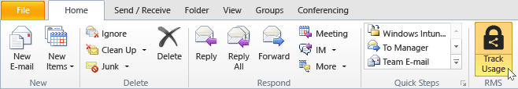
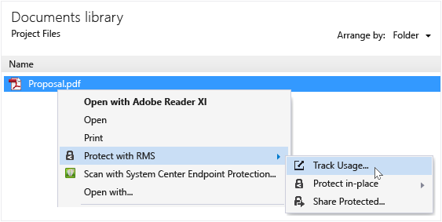
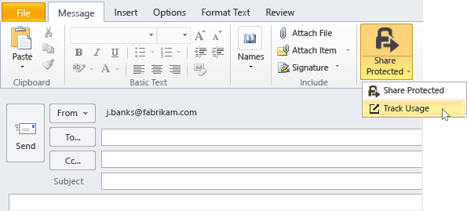

# RMS 共有アプリケーションを使用してドキュメントを追跡および取り消す
RMS 共有アプリケーションを使用してドキュメントを保護すると、組織が Active Directory Rights Management サービスではなく Azure Rights Management を使用している場合は、保護されているドキュメントをユーザーがどのように使用しているかを追跡できます。 必要に応じて、共有を停止する場合は、これらのドキュメントへのアクセスを取り消すこともできます。 これを行うには、Windows コンピューター、Mac コンピューター、タブレット、携帯電話からアクセスできる**ドキュメント追跡サイト**を使用します。

> [!TIP]
> 2 分間のビデオ:[Azure RMS のドキュメントの追跡と取り消し](http://channel9.msdn.com/Series/Information-Protection/Azure-RMS-Document-Tracking-and-Revocation)

このサイトにアクセスしたら、サインインしてドキュメントを追跡します。[ドキュメント追跡および失効をサポートするサブスクリプション](https://technet.microsoft.com/dn858608.aspx)が組織にあり、このサブスクリプションのライセンスが割り当てられている場合は、保護したファイルを開こうとしたユーザーおよび成功した (正常に認証された) かどうかを確認できます。 ユーザーがドキュメントへのアクセスを試みるたびに、その時間と場所がわかります。 さらに

-   ドキュメントの共有を停止する必要がある場合:[**アクセスの取り消し**] をクリックし、ドキュメントが引き続き使用できる期間を確認して、これまで共有されていたドキュメントへのアクセスを取り消したことをユーザーに通知するかどうかを決定し、カスタマイズしたメッセージを提供します。

-   Excel にエクスポートする場合:[**Excel で開く**] をクリックすると、データを変更して、独自のビューおよびグラフを作成できます。

-   電子メール通知を構成する場合:[**設定**] をクリックして、ドキュメントがアクセスされたときに電子メールを送信するかどうか、および送信方法を選択します。

-   ドキュメント追跡サイトについて質問がある場合、またはフィードバックを提供したい場合:[ヘルプ] アイコンをクリックして、「[ドキュメント追跡の FAQ](http://go.microsoft.com/fwlink/?LinkId=523977)」にアクセスします。

## Office を使用したドキュメント追跡サイトへのアクセス

-   Office アプリケーション、Word、Excel、PowerPoint の場合:[**ホーム**] タブの [**RMS**] グループで、[**保護ファイルの共有**] をクリックし、[**使用の追跡**] をクリックします。

    

-   Outlook の場合:[**ホーム**] タブの [**RMS**] グループで、[**使用の追跡**] をクリックします。

    

これらの RMS のオプションが表示されない場合は、RMS 共有アプリケーションがコンピューターにインストールされていない、最新バージョンがインストールされていない、インストールを完了するためにコンピューターを再起動する必要がある、などの可能性があります。 共有アプリケーションをインストールする方法について詳しくは、「[Rights Management 共有アプリケーションをダウンロードしてインストールする](../Topic/Download_and_install_the_Rights_Management_sharing_application.md)」を参照してください。

### ドキュメントを追跡して取り消すための他の方法
Windows コンピューターで Office アプリケーションを使用してドキュメントを追跡するだけでなく、以下の代替策を使用することもできます。

-   **Web ブラウザーの使用**:この方法は、サポートされているすべてのデバイスで機能します。

-   **エクスプローラーの使用**:この方法は、Windows コンピューターで機能します。

-   **Outlook 電子メール メッセージの使用**:この方法は、Windows コンピューターで機能します。

##### Web ブラウザーを使用したドキュメント追跡サイトへのアクセス

-   サポートされているブラウザーを使用して、[ドキュメント追跡サイト](http://go.microsoft.com/fwlink/?LinkId=529562)に移動します。

    サポートされているブラウザー:Internet Explorer バージョン 10 以降の使用が推奨されますが、次のいずれかのブラウザーを使用してドキュメント追跡サイトを使用することもできます。

    -   Internet Explorer:バージョン 10 以降

    -   Internet Explorer 9、MS12-037 以降:Internet Explorer 用の累積的なセキュリティ更新プログラム:2012 年 6 月 12 日

    -   Mozilla Firefox:バージョン 12 以降

    -   Apple Safari 5:バージョン 5 以降

    -   Google Chrome:バージョン 18 以降

##### エクスプローラーを使用したドキュメント追跡サイトへのアクセス

-   ファイルを右クリックし、[**RMS による保護**] を選択して、[**使用の追跡**] を選択します。

    

##### Outlook 電子メール メッセージを使用したドキュメント追跡サイトへのアクセス

-   電子メール メッセージの [**メッセージ**] タブで、[**RMS**] グループの [**保護ファイルの共有**] をクリックし、[**使用の追跡**] をクリックします。

    

## 例とその他の説明
Rights Management 共有アプリケーションの使用方法の例と操作手順については、Rights Management 共有アプリケーション ユーザー ガイドの次のセクションをご覧ください。

-   [RMS 共有アプリケーションの使用例](../Topic/Rights_Management_sharing_application_user_guide.md#BKMK_SharingExamples)

-   [作業内容](../Topic/Rights_Management_sharing_application_user_guide.md#BKMK_SharingInstructions)

## 参照
[Rights Management 共有アプリケーション ユーザー ガイド](../Topic/Rights_Management_sharing_application_user_guide.md)

