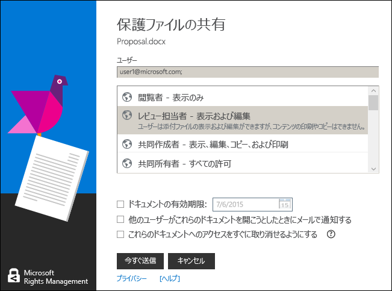

# Rights Management 共有アプリケーションでキーボード ショートカットを使用する
RMS 共有アプリケーションを使用する場合、**Alt** キーを押して使用可能なアクセス キーを確認し、**Alt** + アクセス キーを押してオプションを選択します。

たとえば、[**保護ファイルの共有**] ダイアログ ボックスで、**Alt** キーを押してアクセス キーを確認し、**Alt + m** キーを押して、[**他のユーザーがこのドキュメントを開こうとしたら電子メールで通知する**] チェック ボックスをオンにします。

## 例とその他の説明
Rights Management 共有アプリケーションの使用方法の例と操作手順については、Rights Management 共有アプリケーション ユーザー ガイドの次のセクションをご覧ください。

-   [RMS 共有アプリケーションの使用例](../Topic/Rights_Management_sharing_application_user_guide.md#BKMK_SharingExamples)

-   [作業内容](../Topic/Rights_Management_sharing_application_user_guide.md#BKMK_SharingInstructions)

## 参照
[Rights Management 共有アプリケーション ユーザー ガイド](../Topic/Rights_Management_sharing_application_user_guide.md)

