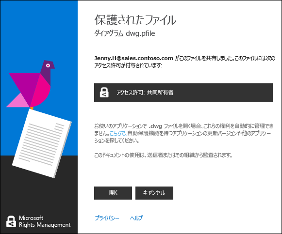

# Rights Management によって保護されたファイルを表示して使用する
[Rights Management (RMS) 共有アプリケーションがコンピューターにインストールされている場合は](https://technet.microsoft.com/library/dn574734%28v=ws.10%29.aspx)、ダブルクリックするだけで保護されたファイルを表示できます。 ファイルは電子メール メッセージの添付ファイルの場合もあれば、ファイル エクスプローラーで表示されるファイルの場合もあります。

> [!NOTE]
> 保護されたファイルを表示するには、先にユーザーがファイルを表示する権限を持つことを RMS が確認する必要があります。それには、ユーザー名とパスワードを調べます。 場合によっては、ユーザー名とパスワードがキャッシュに格納されていて、資格情報の入力を求められないことがあります。 それ以外の場合は、資格情報を指定するように求められます。
> 
> 組織が Azure Rights Management (Azure RMS) または AD RMS を使用していない場合は、RMS で保護されたファイルを開けるように資格情報を受け付ける無料のアカウントを要求できます。
> 
> -   このアカウントを要求するには、リンクをクリックして、[個人用 RMS](http://go.microsoft.com/fwlink/?LinkId=309469)を要求します。
> 
>     サインアップするときは、個人の電子メール アドレスではなく会社の電子メール アドレスを使用してください。 電子メールで保護された添付ファイルを受け取ったためにサインアップする場合は、その電子メール メッセージの送信に使用されたものと同じ電子メール アドレスを使用します。
> -   詳細については、「[個人用 RMS と Microsoft Azure Rights Management](http://technet.microsoft.com/library/dn592127.aspx)」をご覧ください。

## 保護されたファイルを表示するには
ファイル エクスプローラーまたは添付ファイルを含む電子メール メッセージを使用して、保護されたファイルをダブルクリックし、要求された場合は資格情報を入力します。

ファイル名拡張子が異なる 2 つのバージョンのファイルが表示される場合、拡張子が .ppdf のファイルは、他のファイルが開かない場合にのみ開いてください。 .ppdf バージョンを開くことができない場合は、最初に [RMS 共有アプリケーション](http://technet.microsoft.com/library/dn574734.aspx)をインストールします。このアプリケーションは、.ppdf ファイル名拡張子を持つファイルを開く方法を認識しています。

> [!NOTE]
> 詳細については、「[自動的に作成される .ppdf ファイルとは](../Topic/Dialog_box_options_for_the_Rights_Management_sharing_application.md#BKMK_PPDF)」をご覧ください。

ファイルを開く方法はファイルが保護された方法によって異なり、ファイルが保護された方法はファイル名拡張子を見るとわかります。 いずれの場合も、ファイルを開くと監査される場合があり、保護されている限り監査された状態のままになります。 さらに、ファイルが電子メールの添付ファイルとして送信された場合、ファイルを開くたびに送信者に電子メールで通知される可能性があります。

|ファイル名拡張子と保護|詳細情報|
|---------------|--------|
|ファイルの拡張子は **.pfile** です。  このファイルは一般的に保護されています。|ファイルを開くと、共有アプリケーションから **[保護されたファイル]** ダイアログ ボックスが表示され、そのファイルを保護したユーザー、および共同所有者のアクセス許可に従うことを期待されていることが示されます。**[開く]** をクリックしてファイルを読み取ります。  |
|ファイルの拡張子が **.ppdf** であるか、ファイルが保護されたテキスト ファイルまたはイメージ ファイル (**.ptxt**、**.pjpg** など) です。  ファイルは、読み取り専用コピーとしてネイティブに保護されています。|ファイルは、RMS 共有アプリケーションとともにインストールされるビューアーを使用して開きます。 このファイルは、別の場所に保存したり、名前を変更した場合でも、読み取り専用です。|
|その他のファイル名拡張子。  ファイルは、ネイティブに保護されています。|ファイルは元のファイル名拡張子に関連付けられているアプリケーションを使用して開き、ファイルの先頭に制限バナーが表示されます。 バナーには、ファイルに適用されるアクセス許可またはファイルを表示するためのリンクが表示される可能性があります。 たとえば、次が表示される可能性があります。ファイルとそのファイルにアクセスできるユーザーに適用されている実際のアクセス許可を確認するには、ここで **[現在、アクセスが制限されています]** をクリックします。  |
Rights Management でサポートされているファイル名拡張子の完全な一覧については、「[Rights Management 共有アプリケーション管理者ガイド](../Topic/Rights_Management_sharing_application_administrator_guide.md)」の「[サポートされているファイルの種類とファイル名拡張子](../Topic/Rights_Management_sharing_application_administrator_guide.md#BKMK_SupportFileTypes)」セクションを参照してください。 ファイル名拡張子が一覧にない場合は、Web 検索を使用して、別のアプリケーションでサポートされているファイル名拡張子であるかどうかを確認します。

> [!NOTE]
> Rights Management でファイルが保護されていることを確認した後、ファイルが開かない場合は、[RMS Analyzer ツール](https://www.microsoft.com/en-us/download/details.aspx?id=46437)をダウンロードして使用します。 ツールの指示に従って、保護されたドキュメントが開かない原因となっている可能性のあるコンピューターの問題を確認します。

## 保護されているファイルを使用するには (ファイルを編集して印刷する場合など)
保護されたファイルを開いた後、読み取り以外にも編集、コピー、印刷などを行う場合は、次の手順に従います。

|ファイル名拡張子|手順|
|------------|------|
|ファイルの拡張子は **.pfile** です。|開いているファイルを保存し、使用するアプリケーションに関連付けられている新しいファイル名拡張子を付けます。  たとえば、ファイルがファイル名 document.vsdx.pfile を使用して保護された場合、ファイルを表示し、ファイル エクスプローラーで document.vsdx としてファイルを保存します。  新しいファイルは保護されていません。 ファイルを保護する場合は、手動で行う必要があります。 手順については、「[Rights Management 共有アプリケーションを使用して、デバイス上のファイルを保護する &#40;インプレースの保護&#41;](../Topic/Protect_a_file_on_a_device__protect_in-place__by_using_the_Rights_Management_sharing_application.md)」を参照してください。|
|ファイルの拡張子が **.ppdf** であるか、ファイルが保護されたテキスト ファイルまたはイメージ ファイル (**.ptxt**、**.pjpg** など) です。|ファイルを表示することだけができ、ファイルの名前変更または移動を行っても、ファイルの保護は維持されます。|
|その他のファイル名拡張子。|これらのファイルを使用するには、Rights Management を認識するアプリケーションがデバイスに必要です。 これらのアプリケーションは RMS 対応アプリケーションと呼ばれます。 Office 2016、Office 2013、および Office 2010 のアプリケーション (Word、Excel、PowerPoint、Outlook など) は、Rights Management 対応アプリケーションの例です。 ただし、他のソフトウェア会社のアプリケーションやユーザー独自の基幹業務アプリケーションなど、Microsoft 以外のアプリケーションも、Rights Management 対応である場合があります。  Rights Management 対応のアプリケーションは、他の Rights Management 対応アプリケーションによって保護されているファイルを開く方法を認識しています。 また、Rights Management 対応アプリケーションは、ユーザーがファイルを編集したり、別のファイル名や別の場所に保存したりしても、ファイルに適用された保護を維持します。 Rights Management 対応アプリケーションを使用すると、ユーザーはファイルに現在適用されているアクセス許可に従ってファイルを使用できます。ユーザーがファイルを使用するためのアクセス許可を持っている場合、ファイルを使用できます。 たとえば、ファイルを編集できても印刷はできません。|

## 例とその他の説明
Rights Management 共有アプリケーションの使用方法の例と操作手順については、Rights Management 共有アプリケーション ユーザー ガイドの次のセクションをご覧ください。

-   [RMS 共有アプリケーションの使用例](../Topic/Rights_Management_sharing_application_user_guide.md#BKMK_SharingExamples)

-   [作業内容](../Topic/Rights_Management_sharing_application_user_guide.md#BKMK_SharingInstructions)

## 参照
[Rights Management 共有アプリケーション ユーザー ガイド](../Topic/Rights_Management_sharing_application_user_guide.md)

