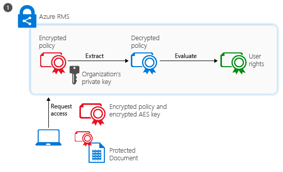

# Azure Active Directory Rights Management の概要
Azure Rights Management (Azure RMS) は、さまざまな課題が伴う現代の業務環境のなかで組織のデータを守るための情報保護ソリューションです。

この課題とはたとえば、インターネット接続の必要性、職場へのユーザー私物デバイスの持ち込み、外出先や自宅から会社データへのアクセス、重要なビジネス パートナーとの間での機密情報の共有があります。 ユーザーは日常業務の一環として電子メール、ファイル共有サイト、およびクラウド サービスを使用することで情報を共有しています。 このようなシナリオでは、企業データを保護しつつユーザーがこれまでどおり作業を効率的に行えるようにしたい場合、従来型のセキュリティ制御 (アクセス制御リストや NTFS アクセス許可など) やファイアウォールの効果は限定的です。

対照的に、Azure RMS ならば、このようなシナリオのすべてにおいて会社の機密情報を保護できます。 暗号化、ID、承認のポリシーを使用して、ファイルや電子メールを保護します。また、複数のデバイス (携帯電話、タブレット、および PC) をカバーできます。 データが組織の外に出ても継続的に保護されるので、情報を組織の内外で保護できます。 たとえば、ドキュメントはパートナー企業に電子メールで送信されたり、クラウド ドライブに保存されたりします。 Azure RMS が提供する持続的な保護により、企業データがセキュリティで保護されるだけでなく、法定コンプライアンス、法的証拠開示要件、または一般的な情報管理の効率化が促進されます。

非常な重要なことに、承認されたユーザーやサービス (検索やインデックス化) は、Azure RMS が保護するデータの読み取りおよび調査を引き続き行えます。これは、ピア ツー ピアの暗号化を使用する他の情報保護ソリューションでは簡単には実現できません。 この機能は “データに対する推論” と呼ばれることがあり、組織のデータの管理を維持する上で重要な要素です。

次の図は、Azure RMS がオンプレミスのサーバーやサービスに加えて Office 365 の Rights Management ソリューションとしても機能するしくみを示します。 この図に示しているように、エンド ユーザーの間でよく使用される Windows、Mac OS、iOS、Android のデバイスや Windows Phone もサポートします。

> [!TIP]
> ここまでわかれば、他のリソースも役に立ちます。
> 
> -   2 分間のビデオ:[Microsoft Azure Rights Management の概要](http://technet.microsoft.com/dn833005.aspx)
> -   5 ステップのチュートリアル: [Azure Rights Management のクイック スタート チュートリアル](../Topic/Quick_Start_Tutorial_for_Azure_Rights_Management.md)
> -   Azure RMS の要件。購入または評価のためのサブスクリプション オプションなど:[Azure Rights Management の要件](../Topic/Requirements_for_Azure_Rights_Management.md)

Azure RMS の詳細については、以下の各セクションをご覧ください。

-   [Azure RMS が解決する問題の種類](../Topic/What_is_Azure_Rights_Management_.md#BKMK_RMSrequirements)

    -   [セキュリティ、コンプライアンス、および規制の要件](../Topic/What_is_Azure_Rights_Management_.md#BKMK_RMScompliance)

-   [Azure RMS の動作:管理者およびユーザーに対する表示](../Topic/What_is_Azure_Rights_Management_.md#BKMK_RMSpictures)

    -   [Rights Management のアクティブ化と構成](../Topic/What_is_Azure_Rights_Management_.md#BKMK_Example_ManagementPortal)

    -   [Windows Server およびファイル分類インフラストラクチャを実行しているファイル サーバー上のファイルの自動的な保護](../Topic/What_is_Azure_Rights_Management_.md#BKMK_Example_FCI)

    -   [Exchange Online とデータ損失防止ポリシーによる電子メールの自動的な保護](../Topic/What_is_Azure_Rights_Management_.md#BKMK_Example_DLP)

    -   [SharePoint Online と保護されたライブラリでのファイルの自動保護](../Topic/What_is_Azure_Rights_Management_.md#BKMK_Example_SharePoint)

    -   [ユーザーによるモバイル ユーザーとの添付ファイルの安全な共有](../Topic/What_is_Azure_Rights_Management_.md#BKMK_Example_SharingApp)

-   [Azure RMS の機能の 詳細](../Topic/What_is_Azure_Rights_Management_.md#BKMK_HowRMSworks)

    -   [Azure RMS で使用される暗号化の制御:アルゴリズムとキーの長さ](../Topic/What_is_Azure_Rights_Management_.md#BKMK_RMScrytographics)

    -   [Azure RMS の動作のチュートリアル:初めての使用、コンテンツ保護、コンテンツ消費](../Topic/What_is_Azure_Rights_Management_.md#BKMK_Walthrough)

-   [次のステップ](../Topic/What_is_Azure_Rights_Management_.md#BKMK_NextSteps)

## Azure RMS が解決する問題の種類
次の表を使用して、組織が抱えるビジネス上の要件や問題を特定し、Azure RMS による対処方法を説明します。

|要件または問題|Azure RMS による解決方法|
|-----------|---------------------|
|あらゆる種類のファイルを保護する|√ 以前の Rights Management の実装では、ネイティブ保護を使用して、Office ファイルのみを保護できました。 現在は、あらゆる種類のファイルに対応した[全般的保護](https://technet.microsoft.com/library/dn574738%28v=ws.10%29.aspx)を提供しています。|
|あらゆる場所のファイルを保護する|√ ファイルをある場所に保存する場合 ([protect in-place](https://technet.microsoft.com/library/dn574733%28v=ws.10%29.aspx) (インプレースの保護))、ファイルがクラウド ストレージ サービスなど IT 部門の制御下にないストレージに保存されたとしても、ファイルは引き続き保護されます。|
|電子メールによるファイル共有をセキュリティで保護する|√ ファイルが電子メールで共有されると ([保護された共有](https://technet.microsoft.com/library/dn574735%28v=ws.10%29.aspx))、ファイルは電子メール メッセージの添付ファイルとして保護され、保護された添付ファイルを開く手順が付加されます。 電子メール テキストは暗号化されないので、受信者は常にこの手順を読むことができます。 ただし、添付されたドキュメントは保護されているので、電子メールまたはドキュメントが他の人に転送されたとしても、承認済みのユーザーのみがドキュメントを開くことができます。|
|監査と監視|√ 保護されたファイルが組織外部に出た後も、ファイルの[使用状況を監査および監視](https://technet.microsoft.com/library/dn529121.aspx)できます。  たとえば、Contoso, Ltd の社員が Fabrikam, Inc. の 3 人の社員と共同プロジェクトに携わっていて、読み取り専用の保護ドキュメントをこの 3 人に電子メールで送信するとします。 Azure RMS の監査機能は次の情報を提供できます。  -   Fabrikam 社内の指定されたユーザーがドキュメントを開いたかどうか、および開いた日時。 -   ドキュメントが転送されたり他のユーザーがアクセスできる共有場所に保存されたりして、指定外のユーザーがドキュメントを開こうとしたかどうか (試みは失敗します)。 -   指定されたユーザーがドキュメントを印刷または変更しようとしたかどうか (試みは失敗します)。|
|Windows コンピューターに限らず、広く使用されるデバイスをすべてサポートする|√ [サポートされるデバイス](https://technet.microsoft.com/library/dn655136.aspx)には次のものが含まれます。  -   Windows コンピューターと携帯電話 -   Mac コンピューター -   iOS タブレットと携帯電話 -   Android タブレットと携帯電話|
|企業間のコラボレーションをサポートする|√ Azure RMS はクラウド サービスであるため、保護されたコンテンツを他の組織と共有する前に、信頼関係を明示的に構成する必要がありません。 相手組織が Office 365 または Azure AD ディレクトリを既に導入している場合、組織間のコラボレーションは自動的にサポートされます。 未導入の場合、ユーザーは無料の[個人用 RMS](https://technet.microsoft.com/library/dn592127.aspx) サブスクリプションにサインアップできます。|
|オンプレミスのサービスや Office 365 をサポートする|√  [Office 365 とシームレスに](https://technet.microsoft.com/library/jj585004.aspx)連携するだけでなく、[RMS コネクタ](https://technet.microsoft.com/library/dn375964.aspx)をデプロイすると、Azure RMS を次のオンプレミス サービスと使用することもできます。  -   Exchange Server -   SharePoint Server -   ファイル分類インフラストラクチャを実行する Windows Server|
|簡単なアクティブ化|√ ユーザーに対して [Rights Management サービスをアクティブ化](https://technet.microsoft.com/library/jj658941.aspx)するために必要なのは、Azure クラシック ポータルで 2 回クリックすることだけです。/Azure ポータルでのわずか 2 回のクリックだけです。|
|必要に応じて組織全体でスケーリングする能力|√ Azure RMS はクラウド サービスとして動作し、Azure の柔軟性を活かしてスケールアップおよびスケールアウトするため、追加のオンプレミス サーバーをプロビジョニングまたはデプロイする必要がありません。|
|シンプルで柔軟なポリシーを作成する能力|√ [権限ポリシーのカスタム テンプレート](https://technet.microsoft.com/library/dn642472.aspx)を使用すると、管理者はポリシーを簡単に適用でき、ユーザーは適切なレベルの保護を各ドキュメントに適用してアクセスを組織内のユーザーに制限できます。  たとえば、全社的戦略が記載された書類を全従業員が共有する場合、社内の全従業員に読み取り専用ポリシーを適用することが考えられます。 また、財務報告など、より機密性の高いドキュメントについては、アクセスを経営幹部にのみ制限することが考えられます。|
|広範なアプリケーションのサポート|√ Azure RMS は Microsoft Office のアプリケーションやサービスと緊密に統合されており、RMS 共有アプリケーションを使用することで他のアプリケーションにもサポートを広げることができます。  √ [Microsoft Rights Management SDK](https://msdn.microsoft.com/library/hh552972%28v=vs.85%29.aspx) は、Azure RMS をサポートするカスタム アプリケーションを作成するための API を社内開発者やソフトウェア ベンダーに提供します。  詳細については、「[アプリケーションで Azure Rights Management をサポートする方法](../Topic/How_Applications_Support_Azure_Rights_Management.md)」を参照してください。|
|IT 部門がデータの制御を維持する必要がある|√ 組織は、独自のテナント キーを管理し、“BYOK ([Bring Your Own Key](https://technet.microsoft.com/library/dn440580.aspx))” ソリューションを使用して、独自のテナント キーをハードウェア セキュリティ モジュール (HSM) に保存することを選択できます。  √ 監査と[使用状況のログ記録](https://technet.microsoft.com/library/dn529121.aspx)をサポートするので、ビジネスの洞察を分析したり、不正使用を監視したり、(情報漏えいがある場合は) 予測分析を行ったりすることができます。  √ [スーパー ユーザー機能](https://technet.microsoft.com/library/mt147272.aspx)を使用した委任アクセスにより、退職者によって保護されたドキュメントであっても、IT 部門は保護されたコンテンツに常にアクセスできます。 これに対し、ピア ツー ピアの暗号化ソリューションでは、企業データにアクセスできなくなるおそれがあります。  √ Azure AD Connect などの[ディレクトリ同期ツール](https://azure.microsoft.com/documentation/articles/active-directory-aadconnect-get-started-tools-comparison/)を使用して、オンプレミスの Active Directory アカウントに対して共通の ID をサポートするために [Azure RMS が必要とするディレクトリの属性のみ](https://azure.microsoft.com/documentation/articles/active-directory-aadconnectsync-attributes-synchronized/)を同期します。  √ AD FS を使用して、パスワードをクラウドにレプリケートすることなくシングル サインオンを有効にします。  √ 組織は、以前に Azure RMS によって保護されていたコンテンツへのアクセスを失わずに、Azure RMS の使用をいつでも停止できます。 使用停止オプションの詳細については、「[Azure Rights Management の使用停止と非アクティブ化](../Topic/Decommissioning_and_Deactivating_Azure_Rights_Management.md)」を参照してください。 さらに、Active Directory Rights Management Services (AD RMS) をデプロイした組織は、以前に AD RMS によって保護されていたデータへのアクセスを失わずに [Azure RMS に移行](https://technet.microsoft.com/library/dn858447.aspx)できます。|
> [!TIP]
> オンプレミス版の Rights Management である Active Directory Rights Management Services (AD RMS) の知識がある場合は、「[Azure Rights Management と AD RMS を構成する](../Topic/Comparing_Azure_Rights_Management_and_AD_RMS.md)」の比較表も参照してください。

### セキュリティ、コンプライアンス、および規制の要件
Azure RMS は、セキュリティ、コンプライアンス、規制に関する次の要件をサポートします。

√ 業界標準の暗号化を使用し、FIPS 140-2 をサポートします。 詳細については、このトピックの「[Azure RMS で使用される暗号化の制御:アルゴリズムとキーの長さ](../Topic/What_is_Azure_Rights_Management_.md#BKMK_RMScrytographics)」セクションを参照してください。

√ Thales ハードウェア セキュリティ モジュール (HSM) をサポートし、テナント キーを Microsoft Azure データ センターに保存します。 自社の地域でのみキーを使用できるように、Azure RMS では北米、EMEA (欧州、中東、およびアフリカ)、およびアジアのデータ センターで独立したセキュリティ ワールドを使用しています。

√ 次の認定を受けています。

-   ISO/IEC 27001:2013 ([ISO/IEC 27018](http://azure.microsoft.com/blog/2015/02/16/azure-first-cloud-computing-platform-to-conform-to-isoiec-27018-only-international-set-of-privacy-controls-in-the-cloud/) を含む)

-   SOC 2 SSAE 16/ISAE 3402 認証

-   HIPAA BAA

-   EU モデル条項

-   Office 365 認証の Azure Active Directory の一部としての FedRAMP (HHS によって FedRAMP Agency Authority to Operate を発行)

-   PCI DSS レベル 1

これらの外部認証の詳細については、[Azure トラスト センター](http://azure.microsoft.com/support/trust-center/compliance/)を参照してください。

## Azure RMS の動作:管理者およびユーザーに対する表示
このセクションでは、管理者とユーザーが機密情報を保護するために Azure RMS を使用する方法の例を示します。

> [!NOTE]
> Azure RMS がデータを保護するこれらすべての例で、適用される保護によって所有者がメンバーではないグループにアクセス許可が付与される場合、または適用される保護に有効期限が含まれる場合であっても、コンテンツの所有者は引き続きデータ (ファイルまたは電子メール) に完全にアクセスできます。
> 
> 同様に、IT 部門は、管理者が指定する許可されたユーザーやサービスに委任されたアクセス権を付与する Rights Management のスーパー ユーザー機能を使用することで、制限なく保護されたデータに常にアクセスできます。 さらに、IT 部門は保護されているデータの使用状況を追跡および監視できます (だれがいつデータにアクセスしているかなど)。

動作している RMS の他のスクリーンショットやビデオについては、[Microsoft Rights Management サービス ポータル](http://www.microsoft.com/rms)、[Microsoft Rights Management (RMS) チーム ブログ](http://blogs.technet.com/b/rms)、[Curah! サイトの Azure RMS に関する精選コンテンツ](http://curah.microsoft.com/Search?query="Azure%20RMS")を参照してください。

### Rights Management のアクティブ化と構成
Windows PowerShell を使用して Azure RMS をアクティブ化および構成できますが、管理ポータルを使用する法が簡単です。 サービスをアクティブ化するとすぐに、2 つの既定のテンプレートが作成されます。管理者とユーザーはこれを選択して迅速かつ簡単にファイルに情報保護を適用できます。 ただし、追加のオプションと設定用に独自のカスタム テンプレートを作成することもできます。

|||
|-|-|
|  [大きい図](http://technet.microsoft.com/98d53a12-3b19-4622-bb1e-75ef56df5438) (既定では、同じブラウザー ウィンドウ)|Office 365 管理センター (1 番目の画像) または Azure クラシック ポータル (2 番目の画像) を使用して、RMS をアクティブ化できます。  ワンクリックでアクティブ化し、さらにワンクリックで確認すると、組織内の管理者とユーザーに対する情報の保護が有効になります。|
|  [大きい図](http://technet.microsoft.com/596e4fec-124c-41b1-8efd-63d5179193fb) (既定では、同じブラウザー ウィンドウ)|アクティブ化の後、2 つの権限ポリシー テンプレートが自動的に組織で使用可能になります。 1 つのテンプレートは読み取り専用 (名前に「**社外秘、表示のみ**」が含まれるもの) で、もう 1 つは読み取りおよび変更アクセス用 (**社外秘**) です。  これらのテンプレートをファイルまたは電子メールに適用すると、アクセスは組織内のユーザーに制限されます。 部外者に会社のデータがリークするのを防ぐにはこれが非常に迅速かつ簡単な方法です。 **Tip:** これらの既定テンプレートは、自動的に前に組織名が付くので簡単にわかります。 この例では **VanArsdel, Ltd** です。 ユーザーにこれらのテンプレートを見せたくない場合、または独自のテンプレートを作成したい場合は、Azure クラシック ポータルから設定できます。 この図が示すように、ウィザードではカスタム テンプレートの作成プロセスが示されます。|
|  [大きい図](http://technet.microsoft.com/f5df80e5-efc9-4c0f-91be-060225977356) (既定では、同じブラウザー ウィンドウ)|オフライン アクセス、有効期限の設定、およびそのテンプレートをすぐに発行する (Rights Management をサポートするアプリケーションで表示されるようにする) かどうかは、独自のテンプレートを作成する場合に使用可能な構成設定の一部です。|
|  [大きい図](http://technet.microsoft.com/597a3402-fd5a-4bcf-b5e6-5c983dbde697) (既定では、同じブラウザー ウィンドウ)|これらのテンプレートを発行すると、ユーザーはファイル エクスプローラーや Microsoft Word などのアプリケーションでそれを選択できます。  -   ユーザーは、既定のテンプレート [**VanArsdel, Ltd – 社外秘**] を選択できます。 その後は、後で組織外のユーザーに電子メールで送信したり、パブリックな場所に保存したりする場合であっても、このドキュメントを開いて使用できるのは VanArsdel 組織の従業員のみです。 -   ユーザーは、管理者が作成したカスタム テンプレート [**Sales and Marketing - 読み取りと印刷のみ**] を選択できます。 ファイルは組織外のユーザーから保護されるだけでなく、営業およびマーケティング部門の従業員に限定されます。 さらに、これらの従業員はドキュメントに対して完全な権限はなく、読み取りと印刷のみです。 たとえば、ドキュメントを変更したりコピーしたりはできません。|
詳細については、「[Rights Management をアクティブにする](../Topic/Activating_Azure_Rights_Management.md)」および「[Azure Rights Management のカスタム テンプレートを構成する](../Topic/Configuring_Custom_Templates_for_Azure_Rights_Management.md)」を参照してください。

重要な企業のファイルをユーザーが保護する方法は、「[ユーザーに Azure Rights Management でファイルを保護するためのヘルプを提供する](../Topic/Helping_Users_to_Protect_Files_by_Using_Azure_Rights_Management.md)」を参照してください。

次に、管理者がテンプレートを適用してファイルやメディアの情報保護を自動的に構成する方法の例を示します。

### Windows Server およびファイル分類インフラストラクチャを実行しているファイル サーバー上のファイルの自動的な保護
この例では、少なくとも Windows Server 2012 を搭載し、ファイル分類インフラストラクチャを使用するように構成されているファイル サーバー上のファイルを、Azure RMS を使用して自動的に保護する方法を示します。

ファイルに分類の値を適用する方法は複数あります。 たとえば、ファイルの内容を検査し、それに応じて機密性や個人情報などの組み込みの分類を適用できます。 ただし、この例では、**Marketing Promotions** フォルダーに保存されるすべてのユーザー ドキュメントに自動的に適用されるカスタム分類 **Marketing** を作成します。 このフォルダーは、Marketing グループのメンバーにアクセスを制限する NTFS アクセス許可で保護されていますが、そのグループのだれかがファイルを移動または電子メールで送信すると、アクセス許可が失われることがわかっています。 その後は、承認されていないユーザーがファイル内の情報にアクセスできます。

|||
|-|-|
|  [大きい図](http://technet.microsoft.com/cf18c56b-c301-4640-8d9e-9e677e494091) (既定では、同じブラウザー ウィンドウ)|管理者は、Rights Management (RMS) コネクタをインストールして構成します。これは、オンプレミス サーバーと Azure RMS との間のリレーとして機能します。|
|  [大きい図](http://technet.microsoft.com/ba3e247d-ea5e-4009-8eac-74f70270ece0) (既定では、同じブラウザー ウィンドウ)|ファイル サーバーで、管理者は **Marketing Promotions** フォルダーのすべてのユーザー ファイルが **Marketing** として自動的に分類されて RMS 暗号化によって保護されるように分類ルールとタスクを構成します。  最初の例で作成したカスタム RMS テンプレートを選択します。これは、Sales and Marketing 部門のメンバーにアクセスを制限します。[**Sales and Marketing - 読み取りと印刷のみ**]。  その結果、そのフォルダー内のすべてのドキュメントは自動的に Marketing 分類で構成され、Sales and Marketing RMS テンプレートで保護されます。|
|  [大きい図](http://technet.microsoft.com/ad666594-68df-4289-835a-235b2af9bf4b) (既定では、同じブラウザー ウィンドウ)|機密情報へのアクセス権のない人へのリークを防ぐ RMS の方法:  -   Marketing の Janet は Marketing Promotions フォルダーの機密レポートを電子メールで送信します。 このレポートは新製品の機能と広告計画を含み、現在ビジネスで移動中の共同作業者によって要求されたものです。 ただし、Janet は誤って電子メールを間違った相手に送りました。彼女は、別の会社の似た名前の受信者を誤って選んだことに気付きませんでした。     受信者は Sales and Marketing グループのメンバーではないため、機密情報のレポートを読むことができません。|
詳細については、「[Azure Rights Management コネクタを展開する](../Topic/Deploying_the_Azure_Rights_Management_Connector.md)」を参照してください。

### Exchange Online とデータ損失防止ポリシーによる電子メールの自動的な保護
前の例では、機密情報が含まれるファイルを自動的に保護する方法を示しました。では、情報がファイルではなく電子メール メッセージに含まれる場合はどうでしょうか。 今度は、Exchange Online のデータ損失防止 (DLP) ポリシーの出番です。この機能は、情報の保護を適用するようにユーザーに促すか (ポリシーのヒントを使用)、または自動的に適用します (トランスポート ルールを使用)。

この例では、管理者は個人情報データの保護に関する米国の規制への準拠を組織が維持するのに役立つポリシーを構成しますが、他のコンプライアンス規制または管理者が定義するカスタム ルースに対して構成することもできます。

|||
|-|-|
|  [大きい図](http://technet.microsoft.com/58461319-3981-4b7f-a195-956a1778e907) (既定では、同じブラウザー ウィンドウ)|管理者は、**U.S.Personally Identifiable Information (PII) Data** という名前の Exchange テンプレートを使用して、新しい DLP ポリシーを構成します。 このテンプレートは、社会保障番号や免許証番号などの情報を電子メール メッセージで検索します。  この情報が含まれている電子メール メッセージが組織の外部に送信されると、会社の従業員のみにアクセスを制限する RMS テンプレートを使用して権限保護を自動的に適用するように、ルールを構成します。  ここでは、ルールは最初の例の既定のテンプレート **VanArsdel, Ltd – Confidential** のいずれかを使用するように構成されます。 ただし、作成したカスタム テンプレートも選択でき、Exchange に固有の [**転送不可**] オプションもあります。|
|  [大きい図](http://technet.microsoft.com/bfb0762d-06fb-42e4-beff-eb391f4bedf0) (既定では、同じブラウザー ウィンドウ)|採用担当マネージャーは最近採用された従業員の社会保障番号を含む電子メール メッセージを書きます。 彼は人事部門の Sherrie にこの電子メール メッセージを送信します。|
|  [大きい図](http://technet.microsoft.com/59e3b68e-4bed-4962-bb1e-e82d82f8000a) (既定では、同じブラウザー ウィンドウ)|この電子メール メッセージが組織の外部に送信または転送された場合、DLP ルールが権限保護を自動的に適用します。  電子メールは組織のインフラストラクチャを離れるときに暗号化されるため、電子メール メッセージの社会保障番号は送信中または受信者の受信トレイで読み取ることができません。 受信者は、VanArsdel の従業員でない限り、メッセージを読み取ることはできません。|
詳細については、以下のセクションを参照してください。

-   「[Exchange Online と Exchange Server](../Topic/How_Applications_Support_Azure_Rights_Management.md#BKMK_ExchangeIntro)」トピックの「[アプリケーションで Azure Rights Management をサポートする方法](../Topic/How_Applications_Support_Azure_Rights_Management.md)」。

-   「[Exchange Online: IRM 構成](../Topic/Configuring_Applications_for_Azure_Rights_Management.md#BKMK_ExchangeOnline)」トピックの「[Azure Rights Management 用にアプリケーションを構成する](../Topic/Configuring_Applications_for_Azure_Rights_Management.md)」。

### SharePoint Online と保護されたライブラリでのファイルの自動保護
SharePoint Online と保護されたライブラリを使用してドキュメントを簡単に保護する方法を示します。

この例では、Contoso の SharePoint 管理者が、編集とバージョン管理のためにドキュメントを集中的に保管してチェックアウトするライブラリを各部署に対して作成しています。 たとえば、Sales 用、Marketing 用、Human Resources 用などのライブラリがあります。 これらの保護されたライブラリのいずれかで新しいドキュメントをアップロードまたは作成すると、そのドキュメントはライブラリの保護を継承し (権限ポリシー テンプレートを選択する必要はありません)、SharePoint ライブラリの外に移動された場合であっても自動的に保護が維持されます。

|||
|-|-|
|  [大きい図](http://technet.microsoft.com/2fc90989-9289-4431-9e6a-07740b7f6e5a) (既定では、同じブラウザー ウィンドウ)|管理者は、SharePoint サイトに対して Information Rights Management を有効にします。|
|  [大きい図](http://technet.microsoft.com/a18f2e99-5ac4-4103-a88c-527846374091) (既定では、同じブラウザー ウィンドウ)|次に、ライブラリの Rights Management を有効にします。 その他のオプションはありますが、通常、必要なのはこの単純な設定のみです。  このライブラリからドキュメントがダウンロードされると、ライブラリ用に構成された保護を継承して、Rights Management によって自動的に保護されます。|
|  [大きい図](http://technet.microsoft.com/0ebd6806-0190-441e-84db-72ac4b97e4a2) (既定では、同じブラウザー ウィンドウ)|営業部門のユーザーがライブラリからこの営業レポートをチェックアウトするときは、それがアクセス制限で保護されたドキュメントであることが、上部の情報バナーではっきりと示されます。  ユーザーが名前を変更しても、別の場所に保存しても、または電子メールで共有しても、ドキュメントの保護は維持されます。 ファイルがどのような名前に変更されても、どこに格納されても、電子メールで共有されたとしても、それを読むことができるのは営業部門のメンバーだけです。|
詳細については、以下のセクションを参照してください。

-   「[SharePoint Online と SharePoint Server](../Topic/How_Applications_Support_Azure_Rights_Management.md#BKMK_SharePointIntro)」トピックの「[アプリケーションで Azure Rights Management をサポートする方法](../Topic/How_Applications_Support_Azure_Rights_Management.md)」。

-   「[SharePoint Online と OneDrive for Business:IRM 構成](../Topic/Configuring_Applications_for_Azure_Rights_Management.md#BKMK_SharePointOnline)」トピックの「[Azure Rights Management 用にアプリケーションを構成する](../Topic/Configuring_Applications_for_Azure_Rights_Management.md)」。

### ユーザーによるモバイル ユーザーとの添付ファイルの安全な共有
前の例では、管理者が機密データに情報保護を自動的に適用する方法を説明しました。 ただし、ユーザーが自分でこの保護を適用する必要がある場合があります。 たとえば、別の組織のパートナーと共同作業を行っている場合、前の例では取り上げられていない状況または特別な状況において、カスタム アクセス許可またはテンプレートで定義されていない設定が必要になります。 このような場合、ユーザーは RMS テンプレートを自分で適用したり、カスタムのアクセス許可を構成したりできます。

この例では、ユーザーが共同作業している別の会社のユーザーとドキュメントを簡単に共有し、それでもドキュメントを保護し、一般的なモバイル デバイスで受信者がドキュメントを読めるようにする方法を示します。 このシナリオでは、組織の Windows コンピューターに自動的にデプロイできる Rights Management 共有アプリケーションを使用します。 または、ユーザーが自分でインストールできます。

この例では、Contoso の Alice が、機密の Word 文書を Fabrikam の Bob に電子メールで送信します。 Bob は iPad でドキュメントを読みますが、iPhone、Android タブレットまたはフォン、Mac コンピューター、Windows Phone またはコンピューターでも同じように簡単に読むことができます。

|||
|-|-|
|  [大きい図](http://technet.microsoft.com/feeef78d-3c2e-432b-817d-d06f784be226) (既定では、同じブラウザー ウィンドウ)|Alice は、Windows PC で標準の電子メール メッセージを作成し、ドキュメントを添付します。  リボンの [**保護ファイルの共有**] をクリックすると、RMS 共有アプリケーションから [**保護ファイルの共有**] ダイアログ ボックスが読み込まれます。  Alice は、Bob にドキュメントの表示と編集だけを許可し、コピーと印刷は許可したくないので、[**レビュー担当者 – 表示および編集**] を選択します。 また、ドキュメントをだれかが開こうとしたら電子メールを受け取るようにし、必要に応じて後でドキュメントを取り消し、それが直ちに有効になったことを知ることができます。|
|  [大きい図](http://technet.microsoft.com/e748fd78-8bba-4168-96cf-f96def078283) (既定では、同じブラウザー ウィンドウ)|Bob は、電子メールを iPad で見ます。  Alice のメッセージと添付ファイルに加えて、サインアップして RMS 共有アプリを iPad にインストールする指示があります。|
|  [大きい図](http://technet.microsoft.com/7dba5ff9-a61d-4a83-8adc-d6ffb0e85df6) (既定では、同じブラウザー ウィンドウ)|Bob は添付ファイルを開けるようになります。 Bob は最初に、彼が目的の受信者であることを確認するサインインを求められます。  Bob がドキュメントを表示すると、ドキュメントの表示と編集はできてもコピーと印刷はできないことを伝える制限付きアクセス情報も表示されます。|
|  [大きい図](http://technet.microsoft.com/9f642a2e-58ad-44ab-9f81-f890d15380f9) (既定では、同じブラウザー ウィンドウ)|Bob が送信されたドキュメントを正常に開いてアクセスすると、Alice はそのことを伝える電子メール メッセージを受け取ります。  Bob が電子メールと添付ファイルを転送した場合、他のユーザーがアクセスできる場所に保存した場合、または電子メールがネットワーク上で傍受された場合でも、他のユーザーはドキュメントを読むことができません。|
詳細については、「[Rights Management 共有アプリケーション ユーザー ガイド](https://technet.microsoft.com/library/dn574735.aspx)」の「[電子メールで共有するファイルの保護](https://technet.microsoft.com/library/dn574741.aspx)」および「[保護されているファイルの表示と使用](https://technet.microsoft.com/library/dn339006.aspx)」を参照してください。

さらに、「[Azure Rights Management のクイック スタート チュートリアル](../Topic/Quick_Start_Tutorial_for_Azure_Rights_Management.md)」にはこのシナリオの詳細な手順が含まれています。

Azure RMS の機能の例をいくつか説明しましたが、そのしくみに関心があるかもしれません。 Azure RMS の動作の技術情報については、次のセクションを参照してください。

## Azure RMS の機能の 詳細
Azure RMS の動作について理解しておく 1 つの重要な点は、Rights Management サービス (および Microsoft) は情報保護プロセスの一部としてユーザーのデータを見たり保存したりしないことです。 ユーザーが保護した情報は、ユーザーが Azure に明示的に保存したり、Azure に情報を保存する別のクラウド サービスを使用しない限り、Azure に送信されたり保存されたりすることはありません。 Azure RMS は、単純に、承認されたユーザーおよびサービス以外のものが文書のデータを読めないようにします。

-   データは、アプリケーション レベルで暗号化されており、そのドキュメントの承認済みの使用を定義するポリシーが含まれています。

-   保護されたドキュメントが、正当なユーザーによって使用されるとき、または承認されたサービスによって処理される場合は、ドキュメント内のデータの暗号化が解除され、ポリシーで定義されている権利が適用されます。

大まかに言えば、次の図でこのプロセスのしくみを確認できます。 秘密の調合が含まれるドキュメントは保護されていて、権限を持つユーザーまたはサービスは正常に開くことができます。 ドキュメントは、コンテンツ キー (この図で緑のキー) によって保護されています。 コンテンツ キーはドキュメントごとに一意であり、RMS テナント ルート キー (この図で赤色のキー) によって保護されているファイル ヘッダーに配置されます。 マイクロソフトがテナント キーを生成して管理することも、ユーザーが独自のテナント キーを生成して管理することもできます。

Azure RMS が暗号化および復号化、承認、制限の適用を行う保護プロセス全体を通じて、秘密の調合は Azure に送信されません。

処理の詳細については、このトピックの「[Azure RMS の動作のチュートリアル:初めての使用、コンテンツ保護、コンテンツ消費](../Topic/What_is_Azure_Rights_Management_.md#BKMK_Walthrough)」セクションを参照してください。

Azure RMS が使用するアルゴリズムおよびキー長に関する技術的詳細については、次のセクションを参照してください。

### Azure RMS で使用される暗号化の制御:アルゴリズムとキーの長さ
自分で RMS がどのように機能するかを知る必要がなくても、セキュリティ保護が業界標準であることを確認するために、使用している暗号化制御に関してたずねられることがあります。

|||
|-|-|
|ドキュメント保護の方法:|アルゴリズム:AES  キーの長さ:128 ビットと 256 ビット1|
|キーの保護方法:|アルゴリズム:RSA  キーの長さ:2048 ビット|
|証明書の署名:|アルゴリズム:SHA-256|
1 ファイルの拡張子が .ppdf のとき、またはファイルが保護されたテキスト ファイルまたはイメージ ファイル (.ptxt や .pjpg など) のときは、汎用保護およびネイティブ保護のために Rights Management 共有アプリケーションは 256 ビットを使用します。

### Azure RMS の動作のチュートリアル:初めての使用、コンテンツ保護、コンテンツ消費
Azure RMS の動作方法をさらに詳しく理解するため、[Azure RMS サービスがアクティブ化](https://technet.microsoft.com/library/jj658941.aspx)された後、ユーザーが初めて Windows コンピューターで RMS を使用し (**ユーザー環境の初期化**とも呼ばれます)、**コンテンツ (ドキュメントまたは電子メール) を保護**し、他のユーザーによって保護されているコンテンツを**消費する** (開いて使用する) ときの、一般的なフローを説明します。

ユーザー環境が初期化された後、ユーザーはそのコンピューターでドキュメントを保護したり、保護されているドキュメントを消費したりできます。

> [!NOTE]
> このユーザーが別の Windows コンピューターに移動する場合、または別のユーザーがこの同じ Windows コンピューターを使用する場合は、初期化プロセスが繰り返されます。

#### ユーザー環境の初期化
ユーザーが Windows コンピューターでコンテンツを保護したり保護されているコンテンツを消費したりできるためには、その前にデバイスでユーザー環境を準備する必要があります。 これは 1 回限りのプロセスであり、ユーザーがコンテンツの保護または保護されたコンテンツの消費を行おうとしたときに、ユーザーの介入なしに自動的に行われます。

|||
|-|-|
||コンピューターの RMS クライアントは、最初に Azure RMS に接続し、Azure Active Directory アカウントを使用してユーザーを認証します。  ユーザーのアカウントが Azure Active Directory と統合されている場合、この認証は自動的に行われ、ユーザーが資格情報の入力を求められることはありません。|

|||
|-|-|
||ユーザー認証の後、接続は組織の RMS テナントに自動的にリダイレクトされます。RMS テナントは、保護されたコンテンツの消費およびコンテンツのオフライン保護のためにユーザーが Azure RMS の認証を受けられるように証明書を発行します。  ユーザーの証明書のコピーは Azure RMS に保存され、ユーザーが別のデバイスに移動した場合は、同じキーを使用して証明書が作成されます。|

#### コンテンツの保護
ユーザーがドキュメントを保護するとき、RMS クライアントは保護されていないドキュメントに対して次の操作を実行します。

|||
|-|-|
||RMS クライアントは、ランダムなキー (コンテンツ キー) を作成し、このキーを使用して、AES 対称暗号化アルゴリズムでドキュメントを暗号化します。|

|||
|-|-|
||その後、RMS クライアントは、テンプレートに基づき、またはドキュメントに特定の権限を指定することにより、ドキュメントのポリシーを含む証明書を作成します。 このポリシーには、異なるユーザーまたはグループに対する権限、および有効期限などのその他の制限が含まれています。  RMS クライアントは、ユーザー環境の初期化時に取得した組織のキーを使用して、ポリシーおよび対称コンテンツ キーを暗号化します。 また、RMS クライアントは、ユーザーの環境が初期化されたときに取得したユーザーの証明書でポリシーに署名します。|

|||
|-|-|
||最後に、RMS クライアントは前に暗号化したドキュメントの本文と共にポリシーをファイルに埋め込みます。これらすべてが、保護されたドキュメントを構成します。  このドキュメントは、任意の場所に保存することも任意の方法を使用して共有することもでき、ポリシーは常に暗号化されたドキュメントと共にあります。|

#### コンテンツの消費
ユーザーが保護されたドキュメントを消費しようとすると、RMS クライアントは最初に Azure RMS サービスにアクセスを要求します。

|||
|-|-|
||認証されたユーザーは、ドキュメントのポリシーとユーザーの証明書を Azure RMS に送信します。 サービスはポリシーを復号化して評価し、ユーザーがドキュメントに対して設定している権限のリストを作成します (ある場合)。|

|||
|-|-|
||その後、サービスは、復号化されたポリシーから AES コンテンツ キーを抽出します。 このキーは、要求で取得されたユーザーの公開 RSA キーで暗号化されます。  再暗号化されたコンテンツ キーは、ユーザー権利のリストと共に暗号化された使用ライセンスに埋め込まれて、RMS クライアントに返されます。|

|||
|-|-|
||最後に、RMS クライアントは暗号化された使用ライセンスを取得し、独自のユーザー秘密キーで暗号化を解除します。 これにより、RMS クライアントは必要に応じてドキュメント本文の暗号化を解除し、画面に表示できます。  また、クライアントは権限のリストを復号化してアプリケーションに渡します。アプリケーションはユーザー インターフェイスにそれらの権限を適用します。|

#### バリエーション
前のチュートリアルでは標準的なシナリオをカバーしましたが、いくつかのバリエーションがあります。

-   **モバイル デバイス**: モバイル デバイスが Azure RMS でファイルを保護または消費するときのプロセス フローはとても簡単です。 モバイル デバイスでは、コンテンツを保護または消費するための各トランザクションは独立しているので、ユーザー初期化プロセスは行われません。 Windows コンピューターと同じように、モバイル デバイスは Azure RMS サービスに接続して認証します。 コンテンツを保護する場合、モバイル デバイスはポリシーを送信し、Azure RMS は発行ライセンスとドキュメントを保護する対称キーをモバイル デバイスに送信します。 コンテンツを消費する場合、モバイル デバイスは、Azure RMS サービスに接続して認証するときに、ドキュメントのポリシーを Azure RMS に送信し、ドキュメントを消費するための使用ライセンスを要求します。 応答として、Azure RMS は必要なキーと制限をモバイル デバイスに送信します。 どちらのプロセスも、TLS を使用してキーの交換およびその他の通信を保護します。

-   **RMS コネクタ**: Azure RMS を RMS コネクタで使用するときのプロセス フローは同じです。 唯一の違いは、コネクタがオンプレミス サービス (Exchange Server や SharePoint Server など) と Azure RMS の間のリレーとして機能することです。 コネクタ自体は、ユーザー環境の初期化や暗号化または復号化などのいかなる操作も実行しません。 コネクタは、通常は AD RMS サーバーに送られる通信をリレーするだけであり、両側で使用されているプロトコルの変換を処理します。 このシナリオでは、オンプレミス サービスで Azure RMS を使用できます。

-   **一般的な保護 (.pfile)**: Azure RMS がファイルを一般的に保護するときは、RMS クライアントがすべての権限を許可するポリシーを作成する点を除けば、フローは基本的にコンテンツ保護と同じです。 ファイルを消費するときは、対象のアプリケーションに渡される前に暗号化が解除されます。 このシナリオでは、RMS をネイティブにサポートしない場合であっても、すべてのファイルを保護できます。

-   **保護された PDF (.ppdf)**:Azure RMS は、Office ファイルをネイティブに保護するときは、そのファイルのコピーも作成して同じ方法で保護します。 唯一の違いは、ファイルのコピーが PPDF ファイル形式であり、RMS 共有アプリケーションは表示するために開く方法だけを認識していることです。 このシナリオでは、保護された添付ファイルを電子メールで送信できます。モバイル デバイスの受信者は、モバイル デバイスに保護された Office ファイルをネイティブにサポートするアプリがない場合であっても、常にファイルを読むことができます。

## 次のステップ
Azure RMS の詳細については、「[Azure Rights Management の概要](../Topic/Getting_Started_with_Azure_Rights_Management.md)」セクションの他のトピックを使用してください。たとえば、既存のアプリケーションが Azure RMS と連携して情報保護ソリューションを提供する方法については、「[アプリケーションで Azure Rights Management をサポートする方法](../Topic/How_Applications_Support_Azure_Rights_Management.md)」を参照してください。 「[Azure Rights Management の用語](../Topic/Terminology_for_Azure_Rights_Management.md)」を確認して、Azure RMS の構成や使用で目にする用語を理解できるようにします。また、デプロイを開始する前に、「[Azure Rights Management の要件](../Topic/Requirements_for_Azure_Rights_Management.md)」も確認しておいてください。 自分で詳細を学習して試してみたい場合は、「[Azure Rights Management のクイック スタート チュートリアル](../Topic/Quick_Start_Tutorial_for_Azure_Rights_Management.md)」を使用してください。

Azure RMS を組織にデプロイする準備ができたら、「[Azure Rights Management の展開ロードマップ](../Topic/Azure_Rights_Management_Deployment_Roadmap.md)」で、デプロイメントの手順と具体的な操作手順へのリンクを参照してください。

> [!TIP]
> その他の情報やヘルプについては、「[Azure Rights Management の情報とサポート](../Topic/Information_and_Support_for_Azure_Rights_Management.md)」のリソースやリンクを参照してください。

## 参照
[Azure Rights Management の概要](../Topic/Getting_Started_with_Azure_Rights_Management.md)

